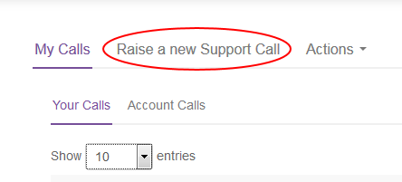
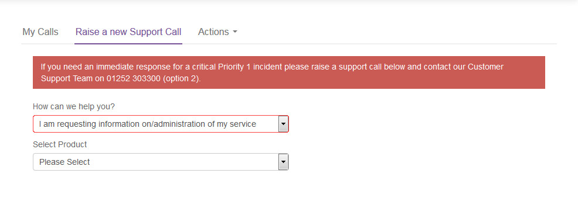

# How to create new UKCloud for OpenStack users in the UKCloud Portal

## Overview

You can create users in the UKCloud Portal and grant them access to OpenStack projects so that they need to remember only one lot of credentials and can also take advantage of two-factor authentication (2FA) that is provided via the Portal.

## Creating a new OpenStack user

To create a new user:

1. Log in to the UKCloud Portal

    For more detailed instructions, see the [*Getting Started Guide for the UKCloud Portal*](../portal/ptl-gs.md).

    > [!NOTE]
    > You must log in as a Portal administrator for the account that includes the OpenStack project.

2. If necessary, switch to the account that includes the OpenStack project.

3. In the navigation panel, expand **Contacts**, then select **All Contacts**.

    

4. From the **Actions** menu, select **Add new contact**.

    

5. On the *New Contact* page, provide the user's name and contact information, then click **Save**.

    

6. After you've created the user account, you must raise a Service Request to grant the user access to the OpenStack project.

    a. In the navigation panel, expand **Support**, then select **My Calls**.

    

    b. Select the **Raise a new Support Call** tab.

    

    c. From the **How can we help you?** list, select **I am requesting information on/administration of my service**.

    

    d. From the **Select Product** list, select the **Cloud Native Infrastructure (OpenStack)**.

    e. From the **What is the nature of your query?** list, select **Uncategorised**.

    f. In the **Request Summary** field, enter `Add Portal users to OpenStack project`.

    g. In the **Please provide any further details regarding your request** field, enter the name(s) of the user(s), and their username(s), that you want to add to the OpenStack project, along with the URL of the project that the user(s) should be added to. If there are multiple projects the user(s) need adding to, then specify all of the project URLs here and it can be completed in one task.

    h. When you're done, click **Submit**.

7. When the Service Request is resolved, the identified users can log in to the OpenStack Horizon dashboard and CLI using their UKCloud Portal credentials.

    If you've enabled two-factor authentication (2FA) in the account that includes the OpenStack project, and users have set up 2FA for their user accounts, they will be prompted to provide a 2FA code when logging in.

    For more information about logging in to the Horizon dashboard, see the [*Getting Started Guide for UKCloud for OpenStack*](ostack-gs.md).

## Feedback

If you find an issue with this article, click **Improve this Doc** to suggest a change. If you have an idea for how we could improve any of our services, visit [UKCloud Ideas](https://ideas.ukcloud.com). Alternatively, you can contact us at <products@ukcloud.com>.