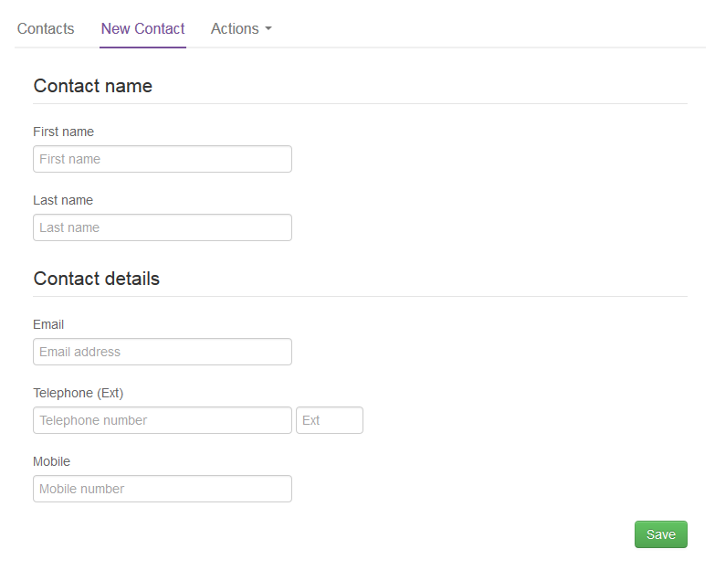

# How to create new UKCloud for OpenStack users in the UKCloud Portal

## Overview

You can create users in the UKCloud Portal and grant them access to OpenStack projects so that they need to remember only one lot of credentials and can also take advantage of two-factor authentication (2FA) that is provided via the Portal.

## Creating a new OpenStack user

To create a new user:

1. Log in to the UKCloud Portal

    For more detailed instructions, see the [*Getting Started Guide for the UKCloud Portal*](../portal/ptl-gs.md).

    > [!NOTE]
    > You must log in as a Portal administrator for the account that includes the OpenStack project.

2. If necessary, switch to the account that includes the OpenStack project.

3. In the navigation panel, expand **Contacts**, then select **All Contacts**.

    

4. From the **Actions** menu, select **Add new contact**.

    

5. On the *New Contact* page, provide the user's name and contact information, then click **Save**.

    

6. After you've created the user account, you must raise a Service Request via the [My Calls](https://portal.skyscapecloud.com/support/ivanti) section of the UKCloud Portal to grant the user access to the OpenStack project. Or you can use the self service IDAM API, for more information, see [*Understanding UKCloud's Identity & Access Management API*](../other/other-ref-idam.md).

    a. In the navigation panel, expand **Support**, then select **My Calls**.

    

    b. Click **Go to My Calls Portal**.

    c. Click **New Service Request**.

    d. Select **Generic Service Request**.

    e. From the **UKCloud Service** list, select **UKCloud for OpenStack**.

    f. In the **Additional Details** field, enter `Add Portal users to OpenStack project` and provide the following information:

      - The name(s) of the user(s), and their username(s), that you want to add to the OpenStack project.

      - The URL of the project that the user(s) should be added to. If there are multiple projects the user(s) need adding to, then specify all of the project URLs here and it can be completed in one task.

    g. When you're done, click **Review & Submit**.

7. When the Service Request is resolved, if the project is based in the Corsham region, the identified users can login to the OpenStack Horizon dashboard and CLI using their UKCloud Portal credentials.

    For a project in the Farnborough region, the users' OpenStack credentials are separate from their Portal credentials and are sent to you via SMS by UKCloud Support to the phone number associated with the account in the Portal.

    For more information about logging in to the Horizon dashboard, see the [*Getting Started Guide for UKCloud for OpenStack*](ostack-gs.md).

## Feedback

If you find a problem with this article, click **Improve this Doc** to make the change yourself or raise an [issue](https://github.com/UKCloud/documentation/issues) in GitHub. If you have an idea for how we could improve any of our services, send an email to <feedback@ukcloud.com>.
