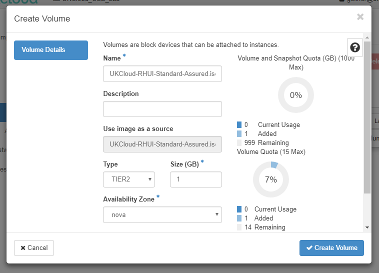

# How to install Red Hat Update Infrastructure on an existing OpenStack instance

## Overview

This article provides advice on how to update your existing Red Hat virtual machines (VMs) to target UKCloud's approved Red Hat Update Infrastructure (RHUI).

As of July 2015, UKCloud implemented an RHUI to provide automatic updates to our Red Hat customers on our Assured OFFICIAL and Elevated OFFICIAL security domains. This provides benefits such as the reliable availability of patch updates and Red Hat approved OS templates.

This update service replaces the previous repositories, which are no longer updated and were retired on the 31 August 2015.

## Prerequisites

There are two pre-requisites for performing this operation:

- The host can resolve to the RHUI DNS records (contact Customer Support for the IP addresses and domain names for these records). You can achieve this by configuring an A record on your local DNS, or configuring an `/etc/hosts` file with the appropriate information. For Internet connectivity, the required domain name is in public DNS.

- All hosts using the service must be able to access the local RHUA server on port 443 (HTTPS). Ensure that the configured Security Groups allow outbound connectivity on port 443. If you have any questions on this, contact UKCloud Support.

## Installation
 
You can find the installer RPM files in an ISO image. Before this can be mounted to an existing Instance, you will need to create a volume from the image.

1. In the Horizon Web UI, locate the image `UKCloud-RHUI-Standard-Assured.iso`, click the action button and select **Create Volume**:

	
	
2. Use the default settings presented by the dialog to copy the ISO to a 1GB TIER2 volume, and click **Create Volume**:

	
	
	
3. Locate the Red Hat Instance where you wish to install RHUI support and select **Attach Volume**:

	
	
4. Select the newly created volume and then click **Attach Volume**: 

	
	
5. Select the Instance name and check at the bottom of the Instance Overview to see that the volume is attached, and what its device name is:
 
	

6. As root, mount the volume inside the VM, using the device name from step 5:

	

7. Install the relevant RPM.

    For example, for RHEL7: `rpm -ivh IL2-Client-RHEL7-Standard-2.0-1.noarch.rpm`.

8. Clean yum:

       yum clean all

9. Test the RHUI is working:

       yum update

10. The first time you update from RHUI you may be prompted to accept the following two certificates:

    - The Red Hat entitlement certificate

    - The Client entitlement certificate

## Troubleshooting

The primary issues you may encounter are:

### DNS Failure

Check the DNS lookup is working and you have the correct entry for Assured and Elevated.

### 443 not accessible

1. Check your firewall configuration, including local firewalls (`iptables`) and edge gateway.

2. Ensure you have the correct destination IP entry for Assured or Elevated.

### Incorrect version

Ensure you have installed the correct RPM for your release.

## Feedback

If you find an issue with this article, click **Improve this Doc** to suggest a change. If you have an idea for how we could improve any of our services, visit the [Ideas](https://community.ukcloud.com/ideas) section of the [UKCloud Community](https://community.ukcloud.com).
