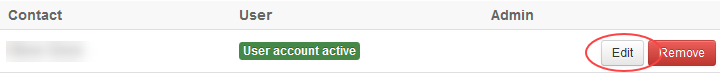
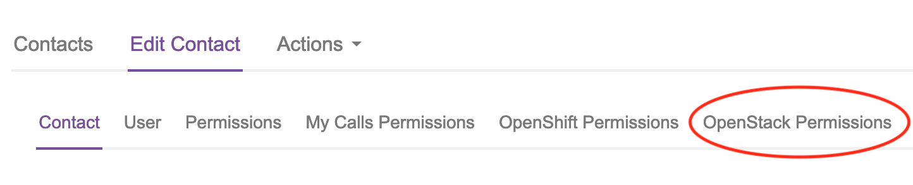
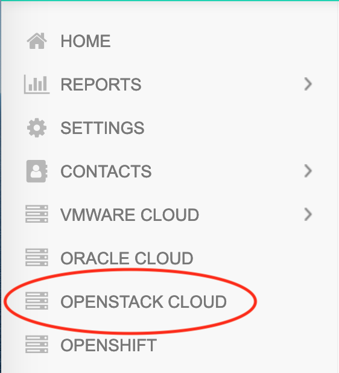
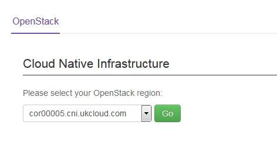
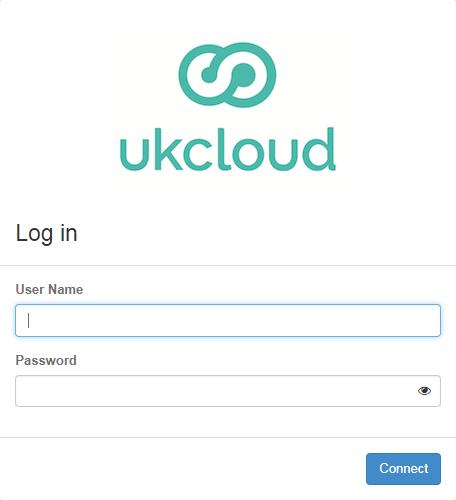
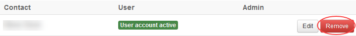

# How to manage UKCloud for OpenStack accounts in the UKCloud Portal

## Overview

This article shows how UKCloud Portal administrators can use the Portal to create user accounts for UKCloud for OpenStack and set access permissions.

### Intended audience

To create user accounts and set permissions, you must be a UKCloud Portal administrator for the account that includes the OpenStack project.

## Creating a new OpenStack user

To give a user access to an OpenStack project, you first need to create them a user account in the UKCloud Portal.

To create a new OpenStack user:

1. Log in to the UKCloud Portal.

    For more detailed instructions, see the [*Getting Started Guide for the UKCloud Portal*](../portal/ptl-gs.md).

    > [!NOTE]
    > You must log in as a Portal administrator for the account that includes the OpenStack project.

2. If necessary, switch to the account that includes the OpenStack project.

3. In the Portal navigation panel, expand the **Contacts** option and select **All Contacts**.

    

4. Select the **Actions** menu and then select **Add new contact** from the dropdown list.

    

5. On the *New contact* page, provide information about the user's name and contact information, then click **Save**.

    

6. After you've created the user account, you can grant access to OpenStack projects using the steps in [Assigning and revoking OpenStack permissions](#assigning-and-revoking-openstack-permissions). There may be a delay of a few minutes while the new user's information is synchronised around the system.

## Assigning and revoking OpenStack permissions

To enable a user to work with an OpenStack project you must assign them permission to access the project. You can also revoke permission to remove a user's OpenStack access.

To assign or revoke OpenStack permissions:

1. In the UKCloud Portal, if necessary, switch to the account that includes the OpenStack project.

2. In the Portal navigation panel, expand **Contacts** option and select **All Contacts**.

    

3. On the *Contacts* page, use the **Search** field to find the user to whom you want to assign or revoke OpenStack permissions and then click the **Edit** button.

    

4. On the *Edit contact* page, select the **OpenStack Permissions** tab.

    

5. You'll see a list of the OpenStack projects within your organisation. There's a separate entry for each region a project is in.

6. Select the check box for the project and region to which you want to grant the user access.
    Deselect the check box to revoke access permissions.

    

7. When you're done, click the **Save** button.

## Accessing OpenStack from the UKCloud Portal

After your OpenStack account has been set up, you'll see a **OpenStack Cloud** option in the Portal navigation panel. This option links through to the OpenStack Horizon dashboard.

To access OpenStack:

1. In the UKCloud Portal, if necessary, switch to the account that includes the OpenStack project.

2. In the Portal navigation panel, select **OpenStack Cloud**.

    

3. From the dropdown list, select the OpenStack region that contains the project you want to access then click **Go**.

    

4. On the OpenStack Horizon *Log in* page, enter your UKCloud Portal **User Name** and **Password** and click **Connect**.

    

5. You can now work with your OpenStack projects within the OpenStack Horizon dashboard.

## Removing an OpenStack account via the UKCloud Portal

Removing a user's account in the Portal will also remove their access to OpenStack.

1. In the UKCloud Portal, if necessary, switch to the account that includes the OpenStack project.

2. In the Portal navigation panel, expand **Contacts** option and select **All Contacts**.

    

3. On the *Contacts* page, use the **Search** field to locate the user and click the **Remove** button.

    

## Next steps

For more information about UKCloud for OpenStack, see the following articles in the Knowledge Centre:

- [*Getting Started Guide for UKCloud for OpenStack*](ostack-gs.md)

- [*UKCloud for OpenStack FAQs*](ostack-faq.md)

## Feedback

If you find a problem with this article, click **Improve this Doc** to make the change yourself or raise an [issue](https://github.com/UKCloud/documentation/issues) in GitHub. If you have an idea for how we could improve any of our services, send an email to <feedback@ukcloud.com>.
