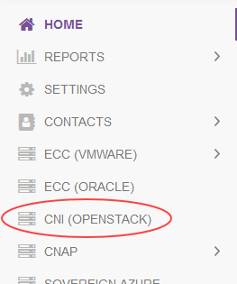

# How to manage UKCloud for OpenStack accounts in the UKCloud Portal

## Overview

This guide shows how UKCloud Portal administrators can use the Portal to create user accounts for UKCloud for OpenStack and set access permissions.

The guide also shows how OpenStack users can reset their own passwords in the Portal to activate account replication and synchronise their Portal and OpenStack passwords.

### Intended audience

To create user accounts and set permissions, you must be a UKCloud Portal administrator for the account that includes the OpenStack project. Any Portal user can reset their own password.

## Creating a new OpenStack user

To give a user access to an OpenStack project, you first need to create them a user account in the UKCloud Portal.

To create a new OpenStack user:

1. Log in to the UKCloud Portal.

    For more detailed instructions, see the [*Getting Started Guide for the UKCloud Portal*](../portal/ptl-gs.md).

    > [!NOTE]
    > You must log in as a Portal administrator for the account that includes the OpenStack project.

2. If necessary, switch to the account that includes the OpenStack project.

3. In the Portal navigation panel, expand the **Contacts** option and select **All Contacts**.

    

4. Select the **Actions** menu and then select **Add new contact** from the dropdown list.

    

5. On the *New contact* page, provide information about the user's name and contact information, then click **Save**.

    

6. After you've created the user account, you can grant access to OpenStack projects using the steps in [Assigning and revoking OpenStack permissions](#assigning-and-revoking-openstack-permissions).

## Assigning and revoking OpenStack permissions

To enable a user to work with an OpenStack project you must assign them permission to access the project. You can also revoke permission to remove a user's OpenStack access.

To assign or revoke OpenStack permissions:

1. In the UKCloud Portal, if necessary, switch to the account that includes the OpenStack project.

2. In the Portal navigation panel, expand **Contacts** option and select **All Contacts**.

    

3. On the *Contacts* page, use the **Search** field to find the user to whom you want to assign or revoke OpenStack permissions and then click the **Edit** button.

    

4. On the *Edit contact* page, select the **Permissions** tab.

    

5. In the *Permissions for UKCloud for OpenStack* section, you'll see a list of the OpenStack projects within your organisation.

    > [!TIP]
    > You may need to scroll down the **Permissions** tab to get to the *UKCloud for OpenStack* section.

6. For the project to which you want to grant the user access, select the check box for the region in which the project is located. If the project is available in both OpenStack regions (cor00005 or frn00006), you can grant access in just one region or in both.

    > [!NOTE]
    > If you grant a user access to a region in which the project is not available, the user will not be able to log in to that OpenStack region.

    Deselect the check box to revoke access permissions.

    

7. When you're done, click the **Save** button.

    > [!NOTE]
    > It takes approximately five minutes for any changes you make within the UKCloud Portal to replicate to OpenStack.

8. The first time a new OpenStack user accesses their account, they must reset their UKCloud Portal password as shown in [Synchronising your OpenStack password](#synchronising-your-openstack-password).

## Synchronising your OpenStack password

The first time you log in to UKCloud Portal to access your OpenStack projects, you must reset your password to activate account replication and synchronise your Portal and OpenStack passwords.

To synchronise your OpenStack password:

1. In the UKCloud Portal, in the top right corner of the page, click your user name and then select **Change Password**.

    

2. Enter your **Current Password** and **New password** then click **Save**.

    > [!NOTE]
    > Your password must be at least eight characters and include at least one each of: uppercase letter, lowercase letter, number and special character.

    

3. When the new password has been successfully replicated to OpenStack, you'll see a checkmark next to the region name and a **Close** button.

    

## Accessing OpenStack from the UKCloud Portal

After your OpenStack account has been set up, you'll see a **OpenStack Cloud** option in the Portal navigation panel. This option links through to the OpenStack Horizon dashboard.

To access OpenStack:

1. In the UKCloud Portal, if necessary, switch to the account that includes the OpenStack project.

2. In the Portal navigation panel, select **OpenStack Cloud**.

    

3. From the dropdown list, select the OpenStack region that contains the project you want to access then click **Go**.

    

4. On the OpenStack Horizon *Log in* page, enter your UKCloud Portal **User Name** and **Password** and click **Connect**.

    

5. You can now work with your OpenStack projects within the OpenStack Horizon dashboard.

## Removing an OpenStack account via the UKCloud Portal

If you want to remove an OpenStack user account, you must first revoke the user's permissions to all OpenStack projects before deleting the account.

To remove an OpenStack account:

1. Follow the steps in [Assigning and revoking OpenStack permissions](#assigning-and-revoking-openstack-permissions) to revoke the user's access permissions for all OpenStack projects.

    > [!NOTE]
    > It takes approximately five minutes for any changes you make within the UKCloud Portal to replicate to OpenStack.

2. After waiting five minutes for the changes to replicate to OpenStack, return to the *Contacts* list, locate the user again and click the **Remove** button.

    

## Next steps

For more information about UKCloud for OpenStack, see the following articles in the Knowledge Centre:

- [*Getting Started Guide for UKCloud for OpenStack*](ostack-gs.md)
- [*UKCloud for OpenStack FAQs*](ostack-faq.md)

## Feedback

If you have any comments on this document or any other aspect of your UKCloud experience, send them to <products@ukcloud.com>.