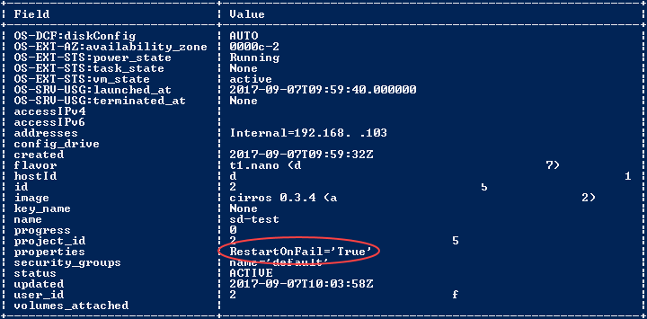
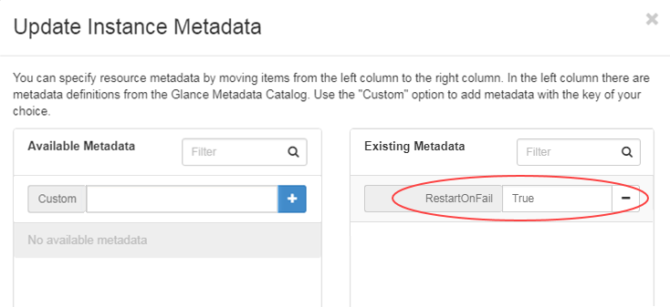
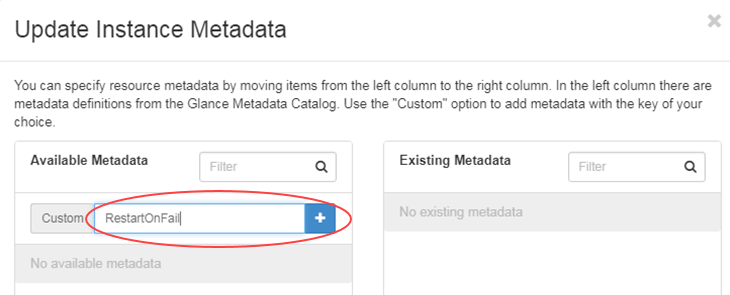
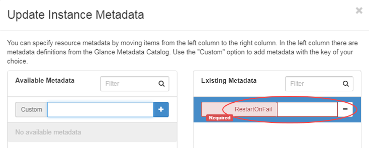
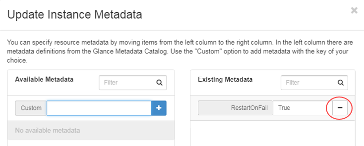

# How to manage how your instance recovers from a host failure

## Overview

UKCloud monitors UKCloud for OpenStack at regular intervals, checking for issues with the hardware or services supporting OpenStack. When a host experiences problems, our engineers will take steps to live migrate any instances on the affected host to an alternative one, however there may be cases where a host needs to be rebooted prior to any live migrations being successfully actioned.

This guide outlines UKCloud's policy for handling OpenStack instances in the event of a service interruption to the availability of a host. The guide also describes how you can control the running state instances return when a host has been recovered.

## How does instance recovery work?

If a host restarts, or if we have to reboot a host before live migrating your instances, any instances running on that host will be shut off. When we recover a host, there are two options for the recovery state of any instances that may have been affected:

- Manual restart of instance (default) - you must restart any affected instances when the host has been recovered

- Automatic restart of an instance - UKCloud will automatically restart any shut off instances on a recovered host

You can set the recovery option for each of your instances in the instance metadata.

## Using the OpenStackClient command-line interface

You can use the OpenStackClient command-line interface (CLI) to view and set the instance recovery option as follows:

### Checking the recovery option for an instance (CLI)

To use the OpenStackClient CLI to check the recovery option for an instance:

1. Run the following command from the OpenStackClient CLI:

        openstack server show <instance_ID_or_name>

2. If the `properties` field in the results includes `RestartOnFail='True'` (as shown below), then your instance is set to automatically restart when the host has been recovered.

    

3. If the `properties` field does not include `RestartOnFail`, then your instance will remain in a shut off state when the host has been recovered and you'll have to manually restart it.

### Setting the recovery option for an instance (CLI)

To use the OpenStackClient CLI to set the recovery option for an instance:

1. To set the recovery option so that the instance is automatically restarted when the host has been recovered, run the following command:

        openstack server set -- property RestartOnFail=True <instance_ID_or_name>

2. To set the recovery option so that you must manually restart the instance when the host has been recovered, run the following command:

        openstack server unset -- property RestartOnFail <instance_ID_or_name>

## Using the OpenStack Horizon dashboard

If you prefer, you can use the OpenStack Horizon dashboard to view and set the recovery option for an instance.

### Checking the recovery option for an instance (Horizon)

To use the Horizon dashboard to check the recovery option for an instance:

1. In the left side of the Horizon dashboard, expand the **Compute** menu and click **Instances**.

2. On the *Instances* page, from the **Actions** list for your instance, select **Update Metadata**.

3. In the *Update Instance Metadata* dialog box, if the *Existing Metadata* section includes the RestartOnFail='True' (as shown below), then your instance is set to automatically restart when the host has been recovered.

    

4. If the *Existing Metadata* section does not include the `RestartOnFail` tag, then your instance will remain in a shut off state when the host has been recovered and you'll have to manually restart it.

### Setting the recovery option for an instance (Horizon)

To use the Horizon dashboard to set the recovery option for an instance:

1. In the left side of the Horizon dashboard, expand the **Compute** menu and click **Instances**.

2. On the *Instances* page, from the **Actions** list for your instance, select **Update Metadata**.

3. In the *Update Instance Metadata* dialog box:

    - To set the recovery option so that the instance is automatically restarted when the host has been recovered, in the **Custom** field, enter `RestartOnFail` and click the **+** button.

        

        Then, in the **RestartOnFail** field, enter **True**.

        

    - To set the recovery option so that you must manually restart the instance when the host has been recovered, next to the **RestartOnFail** field, click the **&ndash;** button.

        

4. Click **Save**.

## Exclusions to UKCloud-managed instance recovery

Although we've designed UKCloud for OpenStack to provide a level of hardware resilience, UKCloud, like most true cloud vendors, cannot guarantee total automated recovery of virtual resources in the event of infrastructure failures.

As a result, you must ensure that the applications you deploy on OpenStack have been engineered to tolerate any infrastructure issues or failures through utilising multiple instances deployed across different zones to help ensure the overall availability of your solution.

## Next steps

For more information about UKCloud for OpenStack, see the following articles in the Knowledge Centre:

- [*Getting Started Guide for UKCloud for OpenStack*](ostack-gs.md)

- [*UKCloud for OpenStack FAQs*](ostack-faq.md)

## Feedback

If you find an issue with this article, click **Improve this Doc** to suggest a change. If you have an idea for how we could improve any of our services, visit the [Ideas](https://community.ukcloud.com/ideas) section of the [UKCloud Community](https://community.ukcloud.com).
