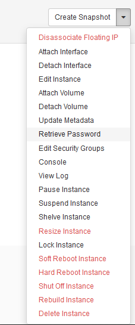
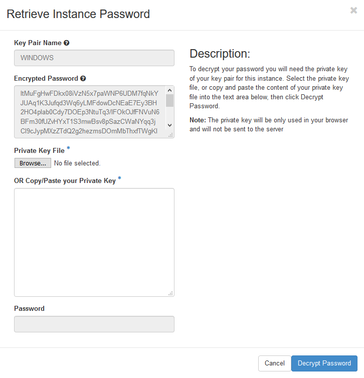

# How to retrieve your Windows password on UKCloud for OpenStack

## Overview

When you create an instance in OpenStack, its disk is cloned from an image managed by OpenStack. To get you started quickly, we publish a public catalog on our platform that provides several instance images for commonly-used instance sizes and operating systems. This catalog includes several images for Windows operating systems.

During deployment of a Windows instance, you need to provide your public key to encrypt the password. After deployment, you can retrieve the password for the instance using the nova command line interface (CLI) or Horizon dashboard.

## Retrieving your Windows password with the nova CLI

To retrieve your Windows password, use the following nova CLI command:

`nova get-password <instanceName>/<id> <pathToPrivateKey>`

For example:

`nova get-password testVM ~/.ssh/id_rsa`

## Retrieving your Windows password through the Horizon dashboard

To retrieve your Windows password via the Horizon dashboard, from the list next to the instance, select **Retrieve Instance Password**.

Now use the private key associated with the instance, and upload the file or paste the contents of the key into the box provided. Click **Decrypt Password** and the administrator password will be shown.

## Feedback

If you find a problem with this article, click **Improve this Doc** to make the change yourself or raise an [issue](https://github.com/UKCloud/documentation/issues) in GitHub. If you have an idea for how we could improve any of our services, send an email to <feedback@ukcloud.com>.
