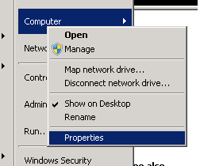
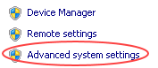
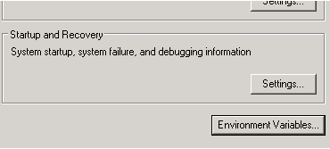
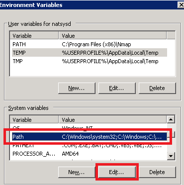
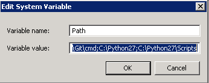
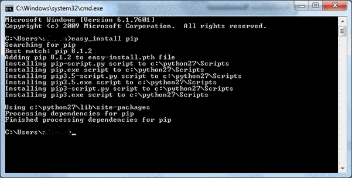
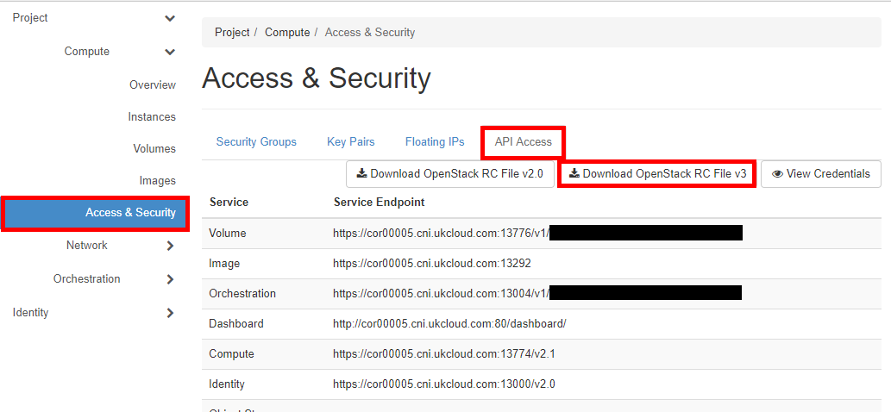
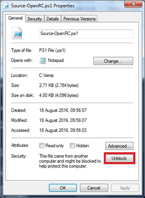

# How to use the OpenStack Command Line Client on Microsoft operating systems

## Overview

OpenStack has been designed and built specifically for the Linux community utilising the Python programming language. Despite this, it's still possible to use the OpenStack Command Line Client on a Microsoft operating system using PowerShell, and this document outlines the six simple steps to achieve this.

1. [Install Python runtime and libraries](#install-python-runtime-and-libraries)

2. [Set Windows environmental variables](#set-the-environmental-variables)

3. [Install pip - Python packaging manager](#install-pip)

4. [Install the OpenStack Command Line Client](#install-the-openstack-command-line-client)

5. [Bind your OpenStack credentials using the OpenStack RC file](#bind-your-openstack-credentials)

6. [Test your configuration](#test-your-configuration)

## Prerequisites

This document assumes you're running a version of Windows from XP upwards and that Windows PowerShell is already installed and available.

All details outlined in this document have been tested against Windows 7 SP1 Enterprise.

## Installation Steps

### Install Python runtime and libraries

1. Download the latest Python 2 release from the Python website:

    <https://python.org/downloads/windows/>

    > [!NOTE]
    > The OpenStack client currently only supports Python 2.7, Python 3+ is unsupported).

2. After clicking the most recent Python 2 release, download the Windows X86-64 MSI Installer.

3. Install Python by double-clicking the MSI package that you just downloaded and completing the installation wizard.

### Set the environmental variables

For Windows to be aware of Python you need to declare its path as follows:

1. Open the Computer settings.

    

2. Select **Advanced system settings**.

    

3. Select **Environment variables**.

    

4. In the *Environment Variables* dialog box, find the Path variable in the **System variables** list and click **Edit**.

    

5. In the *Edit System Variable* dialog box, in the **Variable** value field, add the following to the end of the value (make sure to include the semicolons):

        ;C:\Python27;C:\Python27\Scripts

6. Click **OK**

    > [!NOTE]
    > Update the above paths if you choose to change the Python installer defaults.

    

7. Close the remaining windows.

### Install pip

1. Open a command prompt with Admin rights by right-clicking on the command prompt icon (when you get a login prompt, enter your admin credentials).

2. Install pip by entering the following command:

        easy_install pip

3. If successful, you should see a screen like the following:

    

    [!IMPORTANT]
    > Leave the command prompt open for the next step.

### Install the OpenStack Command Line client

1. Install the OpenStack client with the following command:

        pip install python-openstackclient

2. Installing the client may take between 1 to 5 minutes depending upon your machine.

### Bind your OpenStack credentials

After successful installation, you'll have to download the OpenStack RC file for the project you want to manage.

1. Log in to the OpenStack Horizon dashboard.

2. Open the project you want to manage.

3. From the menu, select **Access & Security** and then select the **API Access** tab.

4. Click **Download OpenStack RC File** and save the file in a convenient place.

    

    > [!NOTE]
    > If your OpenStack user account is SSO-enabled, see [*How to use the OpenStack API using an SSO enabled user*](ostack-how-use-api-sso.md) for the changes you need to make to the RC file for SSO.

5. Download the [Source-OpenRC.ps1](https://raw.githubusercontent.com/UKCloud/PS-OpenRC/master/Source-OpenRC.ps1) PowerShell script and save it locally.

6. As the downloaded PowerShell script is unsigned, you'll need to unblock it by right-clicking the file, selecting **Properties**, then clicking the **Unblock** button and clicking **OK**.

    

7. Start Windows PowerShell from the Start menu.

8. Run the downloaded PowerShell script, and give the path to the downloaded RC file as an argument, for example:

        C:\Downloads\Source-OpenRC.ps1 C:\Downloads\project-openrc.sh

    > [!NOTE]
    > Replace `Downloads` with the directory you saved your files to and replace  `project-openrc.sh` with the `openrc.sh` filename you downloaded.

9. When prompted, enter your OpenStack project password.

### Test your configuration

Now you've installed and configured the everything, you can start using the command line tools.
> [!NOTE]
> You'll need to run the PowerShell script defined above, and provide your OpenStack project credentials every time you relaunch PowerShell.

1. Test if everything is working with a simple list command:

        openstack server list

2. If you've started with an empty project, you'll get output similar to the following:

    ```
    +----+------+--------+------------+-------------+----------+
    | ID | Name | Status | Task State | Power State | Networks |
    +----+------+--------+------------+-------------+----------+
    +----+------+--------+------------+-------------+----------+
    ```
    > [!NOTE]
    > If you enter your password incorrectly, you will see a message similar to:
    > `The request you have made requires authentication. (HTTP 401) (Request-ID: req-..)`
    
  

## Upgrading clients

The community regularly releases updates to the OpenStack CLI, therefore we suggest you check for updates to the client to ensure you have access to all the latest features; this can also help to resolve errors you experience when using the OpenStack CLI.

### Upgrade pip

1. Open a command prompt with Admin rights by right-clicking on the command prompt icon (when you get a login prompt, enter your admin credentials).

2. Upgrade pip by entering the following command:

        python -m pip install --upgrade pip

    > [!NOTE]
    > Once successfully upgraded, leave the command prompt open for the next step.

### Upgrade the OpenStack Command Line client

1. Install pip with the following command:

        pip install --upgrade python-openstackclient

2. Installing the client may take between 1 to 5 minutes depending upon your machine.

## Feedback

If you find an issue with this article, click **Improve this Doc** to suggest a change. If you have an idea for how we could improve any of our services, visit the [Ideas](https://community.ukcloud.com/ideas) section of the [UKCloud Community](https://community.ukcloud.com).
