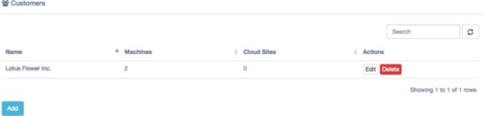
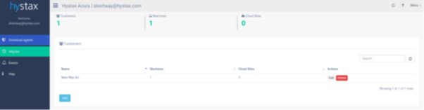
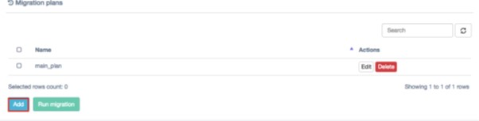
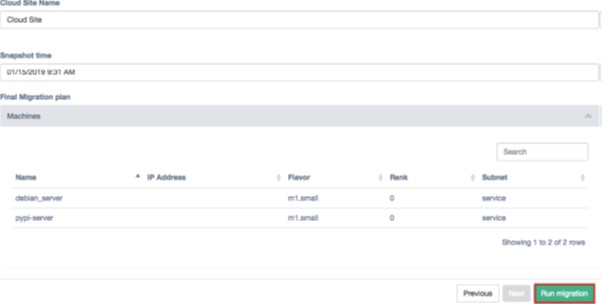
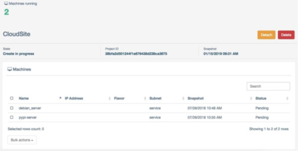

# How to migrate workloads on OpenStack using Hystax Acura

## Overview

Hystax Acura offers a fully automated and reliable way to lift-and-shift all types of OpenStack workloads without experiencing downtime or complications arising from large-scale migration. Hystax supports all popular OpenStack distributions including UKCloud's Red Hat OpenStack.

Hystax offers a sustainable solution to achieve zero downtime during the OpenStack migration process. The instance keeps running throughout the migration, which is important when it's not an option to stop the applications running on the instance. Overcome common transfer challenges like high costs, long transfer times and security concerns – all in a single product. Lifting-and-shifting workloads to a chosen OpenStack distribution is more manageable than ever before.

This article provides instructions from the [Hystax Acura Cloud Migration Step-by-Step Guide](https://hystax.com/wp-content/uploads/2019/09/Hystax-Acura-Migration-Guide.pdf) for how to migrate workloads using Hystax Acura.

## Prerequisites

To utilise Hystax Acura cloud migration services, you'll first need a Hystax user account provisioned in the Hystax Acura Control Panel. You can request a Hystax user account by raising a ticket in the [My Calls](https://portal.skyscapecloud.com/support/ivanti) section of the UKCloud Portal.

## Understanding concepts

Before starting to use Hystax Acura, it's helpful to understand a few commonly used terms and concepts.

### Hystax Acura Control Panel

Hystax Acura Control Panel is a management portal deployed and managed by UKCloud. The Hystax Acura Control Panel enables an OpenStack user to create and manage all their workload migration requirements.

> [!NOTE]
> All Hystax components are deployed and contained within UKCloud's infrastructure. No customer data is shared or transmitted to any third party.

### Hystax Acura agents

These are the agents that are installed within a guest Linux or Windows operating system, which communicate with the Hystax Acura Control Panel to coordinate and manage workload migrations.

## Migrating OpenStack workloads

To perform cloud migration you need to complete the following steps:
 
### Replication flow
 
1. Login to the Hystax Acura Control Panel and navigate to a customer dashboard for a customer you target to perform migration.

    
 
2. On a customer dashboard you can find information about replicated machines, Migration Plans and Migrations running on a target cloud. By default, no resources are available for a new customer.

    
 
3. Click **Download agents** in the main menu, select a customer for which machines need to be replicated and download a replication agent.

    
 
    For OpenStack workload migrations there are two types of replication agents:

    - **Windows agent** - an internal agent that can be deployed to any number of customer Windows virtual or physical machines. Refer to <http://docs.hystax.com/devices_protection.html#install-windows-and-linux-agents> and the [Operating Systems Compatibility Matrix](https://hystax.com/wp-content/uploads/2019/12/Hystax_Acura-Compatibility-Matrix.pdf).
    
    - **Linux agent** - an internal agent that can be deployed to any number of customer Linux virtual or physical machines. Refer to <http://docs.hystax.com/devices_protection.html#install-windows-and-linux-agents> and the [Operating Systems Compatibility Matrix](https://hystax.com/wp-content/uploads/2019/12/Hystax_Acura-Compatibility-Matrix.pdf).
 
4. When any of the agents are deployed, the machine with it (or all machines on the same ESXi host where the agent is located) will appear in Hystax Acura Control Panel under customer dashboard in the Discovered state.
   
5. To start replication of machines, select the machines and click **Start replication** under **Bulk actions** or for any of the machines specifically. After **Start replication** is performed, machines will be replicated to a target cloud, first, Hystax Acura takes full replica and, later, incremental replicas according to a schedule set globally for all the machines or for any group of machines or for any machines specifically.

    
 
6. To change the replication schedule, navigate to Replication schedule under a machine settings or bulk actions. Refer to <http://docs.hystax.com/dr_overview.html#edit-replication-schedule> for more information on configuring the settings.
 
### Run migration flow 
 
1. Migration is based on Migration Plans, which are scenarios of what needs to be migrated and in what order. Refer to <http://docs.hystax.com/dr_overview.html#disaster-recovery-plans> for more information about Migration Plans. To create a Migration Plan click Add on Migration Plans region.

    
 
2. While creating a Migration Plan, orchestration is available under Basic and Expert modes. Basic mode helps to generate a plan with standard settings, expert mode is a JSON script with more powerful settings described under http://docs.hystax.com/dr_overview.html#dr-plan-syntax.
   
3.  Add all the machines which need to be migrated, place them into ranks, set correct IP addresses, networks and boot delays.

    
 
4. When the Migration Plan is ready, you can run test or production failovers. To run a migration, select a Migration Plan and click Run Migration.

    
 
5. Select a restore point for the migration by selecting Restore point time. For all of the machines selected the closest snapshot in the past will be taken. Click Run Migration to start the process.

    
 
6. When a migration is running, you can see and control its status on the Cloud Site page available via customer dashboard.

    
 
7. When you are done with test migration you can delete it and start a new one. For the final cutover, just detach Hystax Acura from the migration and Hystax Acura will stop tracking any resources belonging to this migration.

    

## Further Support

Should you experience any issues in using Hystax Acura or with your migrations, our support team is on hand to assist via a Support Request in the [My Calls](https://portal.skyscapecloud.com/support/ivanti) section of the UKCloud Portal.

## Feedback

If you find an issue with this article, click **Improve this Doc** to suggest a change. If you have an idea for how we could improve any of our services, visit the [Ideas](https://community.ukcloud.com/ideas) section of the [UKCloud Community](https://community.ukcloud.com).
