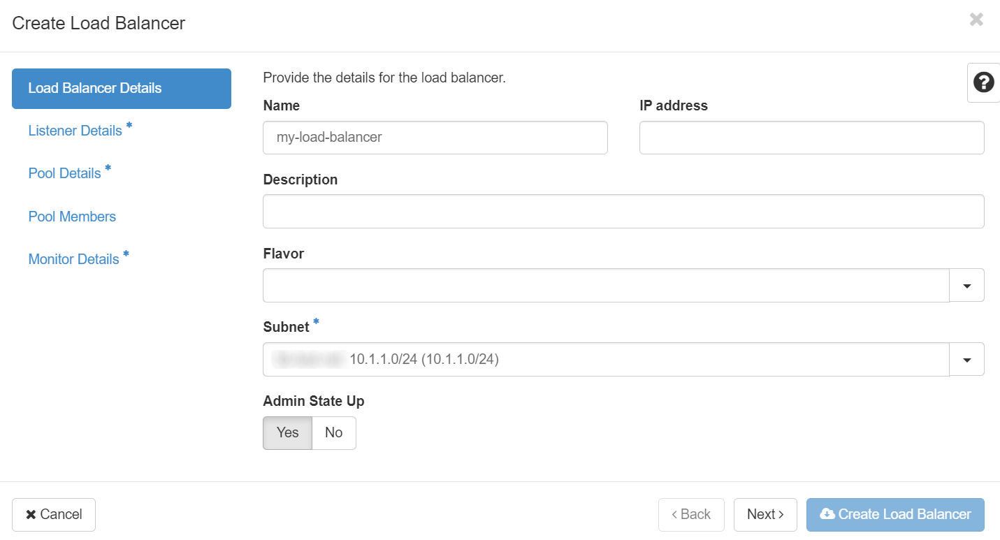
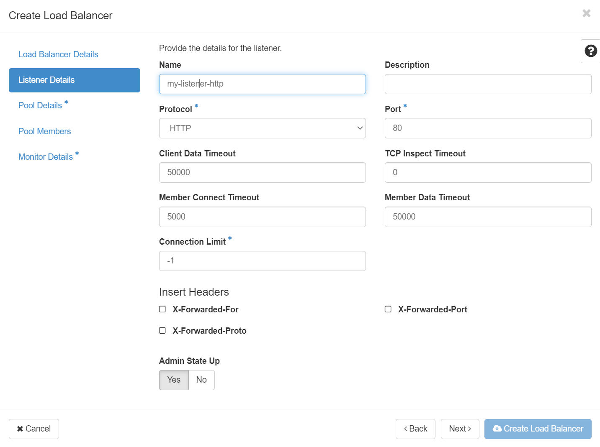
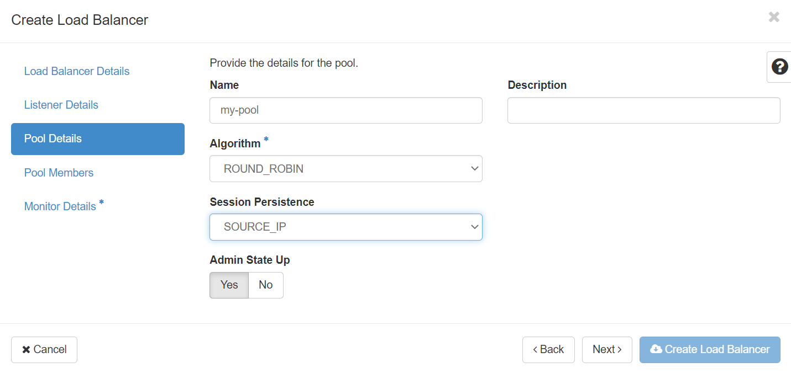
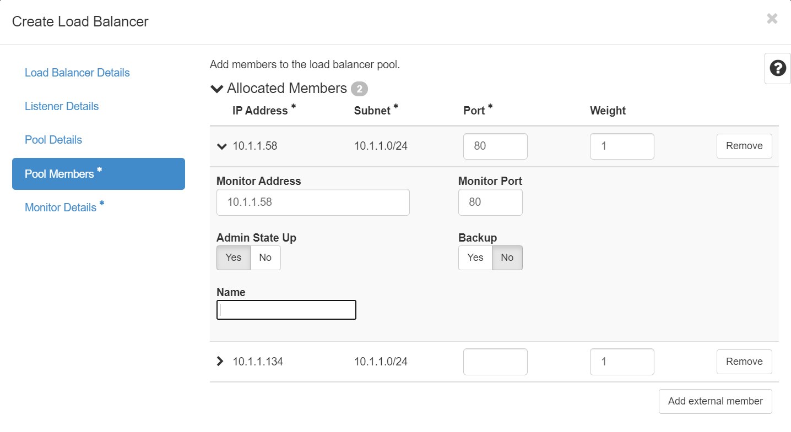
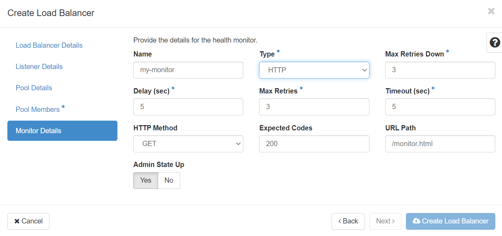
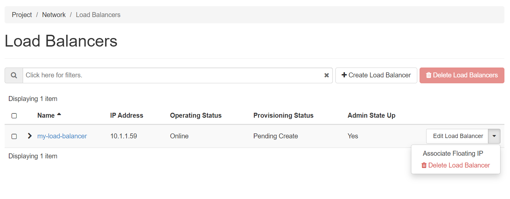
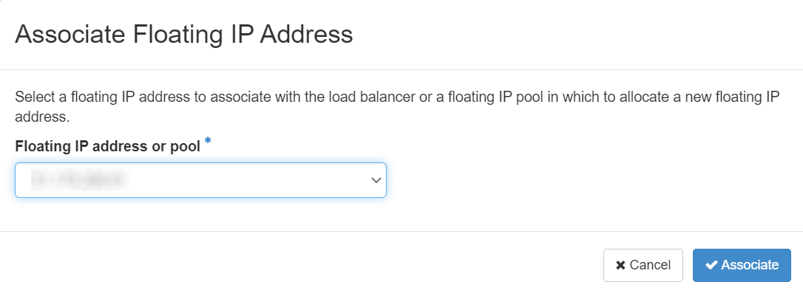

# How to use Octavia Load Balancing as a Service on UKCloud for OpenStack

## Overview

Octavia is the OpenStack Load Balancing as a Service (LBaaS) solution and forms part of the solution for availability and scaling that modern systems require.

Octavia currently supports a number of configurations:

- TCP, HTTP, HTTPS, terminated HTTP and UDP support

- Source IP, round robin and least connections balancing

- Health monitoring using ping, HTTP, TLS Hello and UDP

## Prerequisites

If you intend to manage with the OpenStackCLI, you should consider the following:

- Octavia uses port 13876 for communication. This port will need to be open to manage Octavia.

- You must be using a recent version of the OpenStackCLI.

## Use cases

Use cases for Octavia include:

- Scaling out website traffic by balancing it over multiple servers

- Increasing the availability of a service with active-standby or active-active pools

## Octavia components

Octavia consists of a number of service components that need to be configured as follows:

- **Load balancer.** The load balancer sits at the top of the Octavia component stack. The Octavia load balancer connects to an OpenStack network and provides the entry point for traffic. You may assign a load balancer a floating IP to connect it to internet traffic.

- **Listener.** An Octavia listener defines an IP protocol and service that the load balancer will accept. This can be TCP, UDP, HTTP or HTTPS (direct or terminated). Each load balancer may have multiple listeners to support more than one service (for example, HTTP and HTTPS).

- **Pool.** An Octavia pool defines a list of servers that will accept the traffic from the listener. As with the listener, you select the protocol for the pool to use.

- **Member.** Each Octavia pool needs to contain a number of members. These specify the IP address and port of the servers (or services) that will be used to service the requests. You can also define a separate monitoring IP and port distinct from the request ones if needed.

- **Health monitor.** The health monitor defines how Octavia can check that the member resources are online and available, automatically removing or re-adding from the list of members in a pool should it be required. The type of check performed is configurable, as is the frequency of checks, timeout and number of failed (or successful) checks required for the status of a member to be changed.

## Examples

### Assumptions

You must create an HTTP load balancer across existing servers.

For this example you'll need:

- An existing OpenStack router 

- An existing OpenStack network and subnet

- Two servers providing HTTP over port 80 (the servers must respond to a request for /monitor.html with a valid page)

### CLI example

#### Create a load balancer

```none
openstack loadbalancer create --name "my-lbaas" --vip-network-id NETWORK-ID-STRING
+---------------------+--------------------------------------+
| Field               | Value                                |
+---------------------+--------------------------------------+
| admin_state_up      | True                                 |
| availability_zone   |                                      |
| created_at          | 2021-07-29T09:13:40                  |
| description         |                                      |
| flavor_id           | None                                 |
| id                  | 5e815730-8cde-4d31-8761-f50422767c49 |
| listeners           |                                      |
| name                | my-lbaas                             |
| operating_status    | OFFLINE                              |
| pools               |                                      |  
....
| vip_port_id         | fa434d5d-ccd7-462a-920d-9c284420a57c |
```

#### Create a listener

```none
openstack loadbalancer listener create --name "my-lbaas-listener-http"  --protocol HTTP --protocol-port 80 5e815730-8cde-4d31-8761-f50422767c49
+-----------------------------+--------------------------------------+
| Field                       | Value                                |
+-----------------------------+--------------------------------------+
| admin_state_up              | True                                 |
| connection_limit            | -1                                   |
| created_at                  | 2021-07-29T09:17:01                  |
| default_pool_id             | None                                 |
| default_tls_container_ref   | None                                 |
| description                 |                                      |
| id                          | 20f6ceda-b77f-433f-b171-fbc93668c536 |
| insert_headers              | None                                 |
| l7policies                  |                                      |
| loadbalancers               | 5e815730-8cde-4d31-8761-f50422767c49 |
| name                        | my-lbaas-listener-http               |
```

#### Create a pool

```none
openstack loadbalancer pool create --name "my-lbaas-pool-http" --protocol HTTP --listener 20f6ceda-b77f-433f-b171-fbc93668c536 --lb-algorithm ROUND_ROBIN
+----------------------+--------------------------------------+
| Field                | Value                                |
+----------------------+--------------------------------------+
| admin_state_up       | True                                 |
| created_at           | 2021-07-29T10:23:56                  |
| description          |                                      |
| healthmonitor_id     |                                      |
| id                   | 0ca45218-23a5-44f3-8de5-50cd7984ae4d |
| lb_algorithm         | ROUND_ROBIN                          |
| listeners            | 20f6ceda-b77f-433f-b171-fbc93668c536 |
| loadbalancers        | 5e815730-8cde-4d31-8761-f50422767c49 |
| members              |                                      |
| name                 | my-lbaas-pool-http                   |
```

#### Add two members to the pool

```none
openstack loadbalancer member create --name "my-lbaas-member-1" --address 10.1.1.134 --protocol-port 80 0ca45218-23a5-44f3-8de5-50cd7984ae4d
+---------------------+--------------------------------------+
| Field               | Value                                |
+---------------------+--------------------------------------+
| address             | 10.1.1.134                           |
| admin_state_up      | True                                 |
| created_at          | 2021-07-29T10:27:20                  |
| id                  | e6cd5dc2-b44a-440e-bae0-45dfa1cd9490 |
| name                | my-lbaas-member-1                    |

openstack loadbalancer member create --name "my-lbaas-member-2" --address 10.1.1.58 --protocol-port 80 0ca45218-23a5-44f3-8de5-50cd7984ae4d
+---------------------+--------------------------------------+
| Field               | Value                                |
+---------------------+--------------------------------------+
| address             | 10.1.1.58                            |
| admin_state_up      | True                                 |
| created_at          | 2021-07-29T10:27:54                  |
| id                  | b835edce-8157-4802-bce2-33817cf9354f |
| name                | my-lbaas-member-2                    |
```

#### Create a health monitor

```none
openstack loadbalancer healthmonitor create --name "my-lbaas-monitor" --http-method GET --type HTTP  --url-path /monitor.html --delay 5 --timeout 5 --max-retries 3 0ca45218-23a5-44f3-8de5-50cd7984ae4d
+---------------------+--------------------------------------+
| Field               | Value                                |
+---------------------+--------------------------------------+
| project_id          | 665575955ea34177bb9f7105bcc9782d     |
| name                | my-lbaas-monitor                     |
| admin_state_up      | True                                 |
| pools               | 0ca45218-23a5-44f3-8de5-50cd7984ae4d |
| created_at          | 2021-07-29T10:32:15                  |
| provisioning_status | PENDING_CREATE                       |
| updated_at          | None                                 |
| delay               | 5                                    |
| expected_codes      | 200                                  |
| max_retries         | 3                                    |
| http_method         | GET                                  |
| timeout             | 5                                    |
| max_retries_down    | 3                                    |
| url_path            | /monitor.html                        |
| type                | HTTP                                 |
| id                  | d7007382-43e1-40d2-9439-ebd9b0418931 |
```

#### Assign a floating IP

If you need to, allocate a Floating IP from a network with

```none
openstack floating ip create NETWORK-ID-STRING
```

Assign the Floating IP to the Load Balancer VIP port

```none
openstack floating ip set --port LOAD-BALANCER-VIP-PORT-ID FLOATING-IP-ID
```
    
### Horizon example

#### Create a load balancer



#### Create a listener



#### Create a pool



#### Add two members to the pool



> [!NOTE]
> For each member you add, click **>** next to the IP address to open up the monitor details and enter the IP address and port for the health monitor to use (which may be the same details as the member IP and port).

#### Create a health monitor



#### Assign a floating IP

Once you've created the load balancer, you'll generally want to associate a floating IP with it. To do this you need expand the dropdown option menu next to the newly created load balancer, select **Associate Floating IP** and then on the next screen, select an existing floating IP or an IP pool to assign an address from.





## Feedback

If you find a problem with this article, click **Improve this Doc** to make the change yourself or raise an [issue](https://github.com/UKCloud/documentation/issues) in GitHub. If you have an idea for how we could improve any of our services, send an email to <feedback@ukcloud.com>.
