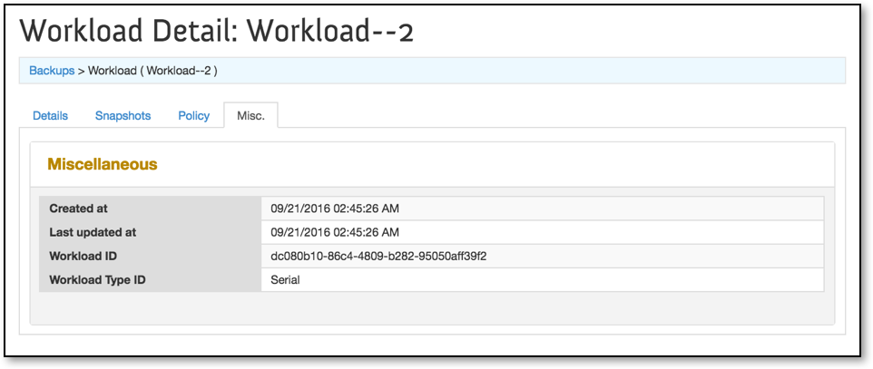
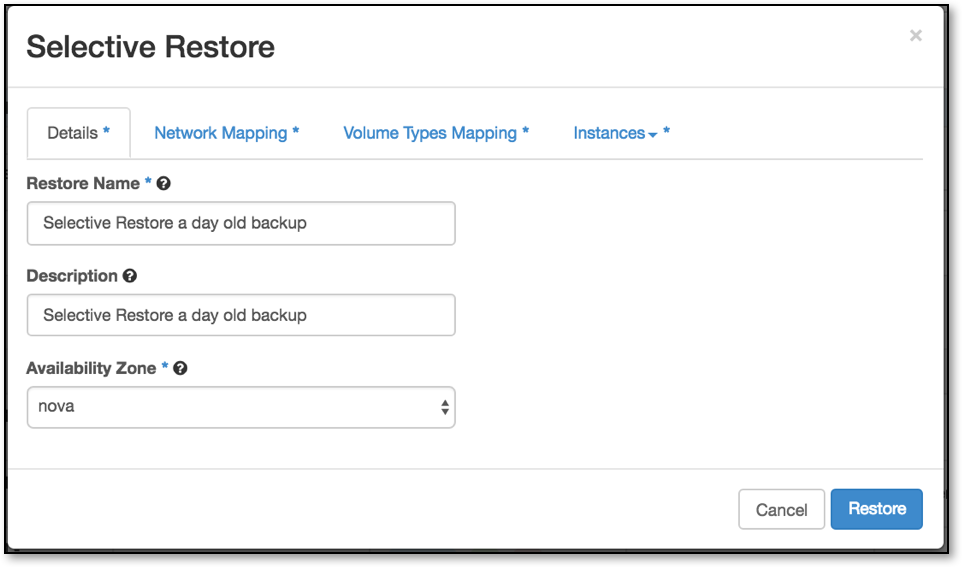

# How to use TrilioVault self-service backup and restoration within OpenStack

## Overview

TrilioVault is a tenant-driven Data Protection-as-a-Service (DPaaS) solution for OpenStack clouds. The TrilioVault solution takes point-in-time backup of workloads and supports multiple recovery options to recover your workloads in case of any outages. This article provides detailed instructions on the administration of the system from the [TrilioVault Administration Guide] relevant to UKCloud for OpenStack. The target audience of the TrilioVault are OpenStack tenants as well as OpenStack Administrators who are proficient with basic backup and recovery concepts.

Benefits of this solution include:

- Provides backup and disaster recovery solution for OpenStack.
- Provides multi-tenant, self-service and policy based solution.
- Provides point-in-time backup of data and configuration.
- Provides one-click seamless recovery.
- Provides the flexibility of selectively restoring instances on to same or different networks, different availability zones, regions or different clouds.
- Provides the flexibility of recovering backups on to different clouds.
- Recovery either a single file or a directory either through a web portal or ssh
- In-place restoring a volume or an instance
- Search for files in list of snapshots
- Results in reducing Total Cost of Operation (TCO) with excellent Return on Investment (ROI).

## Understanding Concepts

Before starting to use TrilioVault, it is necessary to know a few commonly used concepts in TrilioVault. Below are some of the important terms in OpenStack and TrilioVault.

### TrilioVault Dashboard

TrilioVault dashboard is a plug-in into horizon dashboard and allows a user to create and manage backup jobs. A dashboard is a self-managed portal to schedule and execute on-demand backups of workloads.

### Instances

Instances are the running virtual machines within an OpenStack cloud. In the context of TrilioVault, instances are members of workloads (backup-jobs). TrilioVault takes the backup of those OpenStack Instances which are members of the workloads.

### Workload

A workload is defined as a collection of instances, the interconnectivity between them, the virtual disks mapped to those machines and any metadata associated with each of these resources. The tenant can add or remove instances to/from a workload. An instance can only be a member of a single workload at any given time. If a tenant wants to move an instance from one workload to another, the instance first need to be removed from old workload and then add to the new workload.

### Workload Policy

Workload policy defines various aspects of the backup process including number of backups to retain, frequency at which backups are taken and full backups between incrementals.

### Snapshot

A snapshot is the actual copy of the data backup stored in some storage designated as backup store or respository. A snapshot can also be defined as a state of a system at a particular point-in-time. TrilioVault provides its users with the ability to take full and incremental snapshots. A Full type snapshot takes a complete backup of all instances included in the workload independent of previous snapshots. In an Incremental type snapshot, TrilioVault takes backups of only data modified since the last snapshot.

### Backup target

Backup target is the storage repository where TrilioVault keeps its backup data. 

### Restore

Restore operation recreates a selected snapshot. TrilioVault supports multiple restore options for user to choose from.

### One-click restore

One-click restore restores the selected snapshot to the exact location including the same network/subnet, volume types, security groups, IP addresses and so on. One-click Restore only works when original instances are deleted.

### Selective Restore

The selective restore method provides a significant amount of flexibility to recover instances. With the selective restore, user can choose different target networks, target volume types, include/exclude specific instances to restore, and target flavor for each instance, etc.

### In-place restore

One click and selective restores creates brand new resources when restoring virtual resources from the backup media. In some cases it is not desirable to construct new resources. Instead user may want to restore an existing volume to a particular point in time. In-place restore functionality will overwrite existing volume with the data from the backup media.

## Managing Workloads

TrilioVault can be accessed via you OpenStack Horizon dashboard from within the ***Backups --> Workloads*** menu. An example of TrilioVault's user interface is displayed in Figure 2: TrilioVault Dashboard, and is described in Tables 3 and 4.


*Figure 2: TrilioVault Dashboard.*

**Table 3: Panels in the TrilioVault Dialog Box.**

Fields      | Description
------------|------------
Top Panel   | Displays the OpenStack logo, the project you are logged into, and the role.
Left Panel  | Displays the various menu items, along with description.
Right Panel | Displays the information about the menu selected in the Left Panel.

**Table 4: Fields and Descriptions of Menus in TrilioVault.**

Menu    | Description
--------|------------
Project | Lists the Manage Compute and Other sub-menu items. Manage Compute lists the following options.<ul><li>Overview</li><li>Instances</li><li>Volumes</li><li>Images</li><li>Access & Security</li></ul>Other menu lists the following submenu<ul><li>Backups</li></ul>
Admin   | Lists the System sub-menu items.<ul><li>Overview – By default, the overview screen is displayed on the right hand section</li><li>Hypervisors</li><li>Instances</li><li>Volumes</li><li>Flavors</li><li>Image</li><li>Defaults</li><li>System Information</li></ul>
Backups | This panel is provided by the TrilioVault plugin. It is listed under the Project menu. All the above tabs are inherited from the OpenStack dashboard. Here a user can create and manage his/her backup jobs.

### Creating a Workload

A workload can be of two types:

- Serial Workload: When the selected workload type is Serial, TrilioVault executes the snapshot process of instances in the workload successively in the order they were added to the workload.

- Parallel Workload: When the selected workload type is Parallel, TrilioVault executes the snapshot operation of instances in the workload in arbitrary order.
  
Workload policy is an admin defined policy template. Cloud administrator defines these policy templates and makes them available for tenants. Each policy defines various aspects of the backup job including snapshot retention, snapshot interval etc. When one or more policies are assigned to a tenant, tenant can only choose one of those policies for their workloads.

To create workload, follow the steps.

1.	Click Project from the left panel. Navigate to Backups then click Create Workload. The Create Workload screen is displayed as shown in Figure 3.


*Figure 3: Create Workload.*

2.	Select the desired values as explained in the following table:

Field Name | Description
-----------|------------
Details tab |	Refer to Figure 3 for details.
Workload Name |	Enter the name of the workload to be created.
Workload Description |	Enter brief description.
Workload Type |	Select either Serial or Parallel.
Workload Policy |	Cloud Administrator defined workload policies to choose from.
Workload Members tab |	Refer to Figure 7 for details.
Instance checkbox |	Add the instances for your workload.
Policy tab |	Refer to Figure 13 for details.
Enabled |	This checkbox is selected by default. If it is deselected, Start Date, End Date, Start Time, Repeat Every cannot be entered.
Start Date |	The date on which backup process will start. It is in mm/dd/yyyy format and the default value is always Today’s date.
End Date |	The date until which the backup process will take place. It is in mm/dd/yyyy format and the default value is always No End Date.
Start Time |	The time when the backup process will begin. It has to be in the format hh:mm AM/PM. The default value is 09:00 PM UTC.
Repeat Every |	The time interval in which the backup process will be repeated, for example, repeat every hour/day/week. It has to be in format 24 hrs, or 1 Day, or 1 week. The default value is 24 hrs.
Snapshot Retention Type |	Can be either a Number of Snapshots to keep or Number of days to retain Snapshots.
Snapshot Retention Value |	Depending upon the Snapshot Retention Type, enter the value of Snapshot Retention Type. The default value is 30. For example, if the type is a Number of Snapshots to keep, the system will keep the last 30 snapshots and if the type is Number of days to retain Snapshots, then the Snapshots for the last 30 days will be retained. All other snapshots will be deleted.
Full Backup Interval |	Frequency at which Full Backup should be taken. The options are: * Never (The default value selected is Never). * Always (Value 0 means Always). * No. of Days (Number of incremental snapshots to take full backup between 1 and 999). If this option is selected, enter the number provided in the text box.
Pause at Snapshot |	TrilioVault will pause guest instances while snapshotting them, otherwise not. The default setting is not to pause the VM.

3.	Click Create.

4.	The created workload will be seen listed the Workload Types in Backups under Project menu as shown in Figure 4.


*Figure 4: Serial/Parallel Workload Created.*

### Edit Workload

Edit Workload allows user to change the workload name or workload details. The following steps show how an existing workload can be modified.

1.	Click Edit Workload corresponding to the workload to be edited as shown in Figure 5.

 

*Figure 5: Edit Workload Menu*

2.	Update Workload screen is displayed as shown in Figure 6.

 

*Figure 6: Edit Workload.*

You can change all the fields except:

- ID where workload ID is displayed.

- Type where workload type is displayed.

- Start Time of the workload policy.

- Also if a policy template is associated with the workload, any individual elements of the policy cannot be modified.

#### Assigning Instances to Workload

To assign an instance to a workload follow these steps:

1.	Click Edit Workload corresponding to the workload to be edited as shown in Figure 5.

2.	Select the tab Workload Members as seen in the screen diplayed in Figure 7.
 


*Figure 7: Assigning Instance to Workload.*

To assign an instance to a workload, click + (plus) sign corresponding to the instances list displayed under All Instances. The selected instances will be displayed under Workload Members. Click Update.

#### Removing Instances from a Workload

To remove an instance from a workload follow these steps.

1.	Click Edit Workload corresponding to the workload to be edited as shown in Figure 5.

2.	Select Workload Members. The screen is displayed as in Figure 7.

3.	To remove an instance from a workload click – (minus) sign corresponding to the instances list displayed under Workload Members.

4.	Click Update.

### Workload Details

To get the information about the workload details follow these steps.

1.	Using TrilioVault login, navigate to Backups.

2.	Click _**WORKLOAD NAME**_. The Workload Details screen is displayed as shown in Figure 8.
 


*Figure 8: Workload Details.*

Workload Details displays the details mentioned in Table 5.

**Table 5: Workload Details Description.**

Tabs      |	Description
----------|------------
Details   |	Displays the details of workload such as Workload Name, Workload Description, Availability Zone, VM names attached to it and its ID.
Snapshots |	Displays information of the snapshot attached to the workload. Refer to Figure 17 for details.
Policy    |	Displays information of the backup schedule and retention policy. Details such as Scheduler Enabled, Start Date, Start Time, End Date, Repeat every, Next snapshot runs at, Full Backup interval can be seen here. It also displays Number of snapshots to keep. Referto Figure 11 for details.
Misc.     |	Displays information about the workload like Created at (time of creation), Last updated at (time of last update), Workload ID and Workload type ID. Refer to Figure 9 for details.

 

*Figure 9: Workload Miscellaneous Information.*

#### Instance Details

To get the information about the Instance details follow these steps.

1.	Using TrilioVault login, navigate to Backups.

2.	Click the _**WORKLOAD NAME**_. The Workload Details screen is displayed as shown in Figure 8.

3.	Click VM RecoveryManager on workload Details page, the Instance Overview details is displayed as shown in Figure 10.

4.	To easily navigate between workload and the instance members, TrilioVault adds metadata workload_id and workload_name keys to each instance that is part of a workload.

 

*Figure 10: Instance Details.*

### Deleting Workload

A previously created workload can be deleted from TrilioVault using Delete Workloads. However, to delete a workload you must delete all the snapshots attached to it. To delete a workload follow these steps:

1.	Click Project from the left panel. Navigate to Backups under Other.

2.	Select the workload to be deleted.

3.	Click Delete Workloads. Refer to Figure 11 for details.

 

*Figure 11: Delete Workload.*

4.	A message will be displayed asking for the confirmation for deleting the workload as displayed in Figure 12.

 

*Figure 12: Delete Confirmation Message.*

5.	The workload will be deleted and will no longer appear under Workload list.

## Policy Configurations

### Configuring a Scheduling Policy

In order to utilize the available bandwidth properly and have a smooth passage of input and output data, TrilioVault allows for the configuring and scheduling of policies. To schedule a policy, follow these steps:

1.	Login to Horizon dashboard using Administrator login id and password.

2.	Click Edit Workload corresponding to the workload to be edited as shown in Figure 5.

3.	Select Policy tab. The screen as shown in Figure 13 is displayed.

### Configuring a Retention Policy

To create a persistent and automatic backup, retention policies are configurable. Follow these steps to configure a retention policy:

1.	Login to the TrilioVault dashboard using the Administrator login ID and password.

2.	Click Edit Workload corresponding to the workload to be edited as shown in Figure 5.

3.	Select Schedule tab. The Scheduling and Retaining Policy screen as shown in Figure 13 is displayed.

The Schedule details are described in the section Creating a Workload.

  

*Figure 13: Scheduling & Retention Policy.*

To view the protection policy attached to the workload, navigate to the Policy tab as mentioned in section Workload Details. The policy details screen is displayed in Figure 14.
 
 

*Figure 14: View Policy Details.*

The policy details screen is described in Table 6.

**Table 6: Policy Details.**

Fields |	Description
-------|------------
Snapshot Schedule |	<ul><li>Schedule Enabled - Displays the value True or False depending upon if it is enabled or not.</li><li>Start Date - Displays the start date of the snapshot schedule.</li><li>Start Time - Displays the start time of the snapshot schedule.</li><li>End Date - Displays the end date of the snapshot schedule.</li><li>Repeat Every - Displays the time interval of the snapshot to be taken.</li><li>Next snapshot runs at	- Displays the time in hours, minutes and seconds after which the next schedule will take place.</li><li>Full Backup interval	- Displays the value of full backup interval.</li></ul>
Retention Policy |	<ul><li>Number of snapshots to keep	- Displays the number of snapshots to be retained.</li><li>Number of Days to Retain - Displays the number of days to retain a snapshot.</li></ul>

### Workload Policy Template

TrilioVault 2.6 has introduced a new concept called workload policy template. The template defines attributes of an SLA. For example, a business critical application may have stringent SLA with hourly backups and 100 snapshots to retain. Cloud administrator can define a policy template that captures this SLA and publish it to tenants. Policy template feature also gives cloud administrator more control over what backup policies that tenants can choose for their applications.

From workflow point of view policy template is very similar to nova flavors where nova flavors are defined by cloud administrator and tenants are only limited to those flavors when creating instances. With workload policy templates, cloud administrator creates various templates and publishes to tenants and tenants are limited to only those policy templates that they are assigned. However, workload policy template is not automatically assigned to each tenant. Cloud administrator should assign each template selectively to a tenant. If a tenant is not assigned any template, that tenant has the freedom to choose/define the backup policy based on Configuring a Scheduling Policy

## Managing Snapshots

### Taking a Snapshot

TrilioVault creates a snapshot of the workload automatically as per the policy settings created as described in Policy Configurations. A snapshot can also be executed manually (on demand). To create a snapshot for a workload, follow these steps.

1.	Navigate to Backups and click Workload.

2.	Click Create Snapshot corresponding to the workload for which snapshot is to be created as shown in Figure 15.

  

*Figure 15: Creating snapshot for Workload.*

A new Create Snapshot window is displayed as shown in Figure 16.
 
 

*Figure 16: Create Full/Incremental Snapshot.*

Create Snapshot in Table 7 gives the description of the Create Snapshot window.

**Table 7: Create Snapshot.**

Field name           |	Description
---------------------|------------
Snapshot Name        |	Name of the snapshot.
Snapshot Description |	Description of the snapshot to be created.
Snapshot Type        |	Type of snapshot Full or Incremental. The default value is Incremental.

#### Full Snapshot

To create a full snapshot follow these steps.

1.	Click Create Snapshot corresponding to the workload for which snapshot is to be created.

2.	Enter Snapshot details like Snapshot Name, Snapshot Description and Snapshot Type as Full.

3.	Click Create.

4.	Click _**WORKLOAD NAME**_, click Snapshot tab. The created snapshot can be seen as displayed in Figure 17.
 
 

*Figure 17: Full Snapshot Creation.*

#### Incremental Snapshot

> [!Note]
> During the creation of an incremental snapshot, TrilioVault creates a temporary volume which is cleared after the snapshot has been completed.

An Incremental snapshot is the backup of the latest changes since the last backup. When a recovery is needed, the restoration process would need the last full backup plus all the incremental backups until the point-in-time of the restoration. Incremental backups require minimum storage space and are quick to perform. To create incremental snapshot follow these steps.

1.	Click Create Snapshot corresponding to the workload for which the snapshot is to be created.

2.	Enter the Snapshot details like Snapshot Name, Snapshot Description and Snapshot Type as Incremental.

3.	Click Create.

4.	Click _**WORKLOAD NAME**_, click Snapshot tab. The created snapshot can be seen as displayed in Figure 18.
 
 

*Figure 18: Incremental Snapshot Creation.*

#### Snapshot Details

Snapshot Details displays the information regarding instances attached to the snapshot, Security Group, Flavor, Networks, Volumes, and so on. The details are described in Table 8 and displayed in Figure 19.

**Table 8: Snapshot Details Info. & Instance details tab.**

Details       |	Description
--------------|------------
_**Info.**_   | &nbsp;
Name          |	Displays name of the snapshot.
Description   |	Displays brief description of the snapshot.
Snapshot Type |	Displays the type of snapshot. Snapshot type can be Full or Incremental.
Size          |	Displays the size of the snapshot.
Status	       | Displays the status of snapshot operation. The different statuses are as follows: Executing: Snapshot of workload instances is in progress. Uploading: Uploading data to snapshot storage. Available: Snapshot is successfully finished. Error: Snapshot failed.
Scheduled on  |	Displays the TrilioVault node on which the workload snapshot operation is scheduled.
Time taken    |	Displays the time taken for snapshot operation in seconds.
Restore Size  |	Displays size of the restore, if user wants to restore this snapshot.
Progress      |	Displays the progress of snapshot as a percentage of completed task.
VMs           |	Displays the list of VMs in the selected snapshot.
_**VMs – Instance Info.**_ | &nbsp;
Name          |	Displays the name of the Instance.
Status        |	Displays the status of the Instance.
 
 

*Figure 19: Snapshot Details – Instance Info tab.*

Security tab lists the security groups attached to the Instance. The Security tab details are displayed in Figure 20 and described in Table 9.
 
 

*Figure 20: Snapshot Details – Security Group tab.*

**Table 9: Security tab.**

Details|	Description|
-----|---|
_**Security Group</center>**_	| &nbsp;
Name |	Displays the name of the security group, which the VM is using.
Type |	Displays the type of the security group.

Flavor tab describes the flavor attached to the Instance. The Flavor tab details are displayed in Figure 21 and described in Table 10.
 
 

*Figure 21: Snapshot Details – Flavor tab.*

**Table 10: Flavor tab.**

Details      | Description
-------------|------------
Flavor VCPUs | Displays the number of VCPUs that the VM is using.
Disk         | Displays the amount of disk that the VM is using.
RAM          | Displays the amount of memory that the VM is using.

Network tab details the network on which Instance is created. The Network tab details are displayed in Figure 22 and described in Table 11.
 
 

*Figure 22: Snapshot Details – Networks tab.*

**Table 11: Network tab.**

Details             | Description
--------------------|------------
Networks IP Address | Displays the fixed IP Address of the VM.
Network             | Displays the internal/tenant network name that the VM is connected to.
Mac Address         | Displays the Mac Address of the VM.

Volume tab describes the volume attached to the instance. The Volume tab details are displayed in Figure 23 and described in Table 12.
 
 

*Figure 23: Snapshot Details – Volumes tab.*

**Table 12: Volume tab.**

Details      | Description
-------------|------------
Volumes Name | Displays the name of the attached volumes.
Type         | Displays the name of the Cinder volume type.
Size         | Displays the size of the volume.
Mount Point  | Displays the directory name where the volume is mounted on the VM.
Restore Size | Displays the size of the volume for restore.

Misc. tab gives information about the UUID of the Instance. The Misc. tab details are displayed in Figure 24.

  

*Figure 24: Snapshot Details – Misc. tab.*

### Mount a Snapshot

TrilioVault allows you to view or download a file from the snapshot. Any changes to the files or directories when a snapshot is mounted are temporary and are discarded when the snapshot is unmounted. Mounting is a faster way to restore a single or multiple files. To mount a snapshot follow these steps.

TrilioVault ships with a ubuntu based file manager image. This image includes a web based file manager application that helps with browsing and download files when snapshot is mounted. Before you create a File Manager instance, File Manager (a.k.a Recovery Manager) image needs to be uploaded to the Glance. The cloud administrator can upload the image to Glance and mark the image public so that every tenant will have access to the image. File Manager image includes a qemu guest agent. TrilioVault data mover communicates with the qemu agent to map backup images and discover file systems in the backup images. Since the file manager image includes qemu guest agent, the image should be uploaded to glance with property hw_qemu_guest_agent=yes so Nova will create a qmp channel when creating an instance from this image. TrilioVault horizon plugin uses a special property tvault_recovery_manager, when set to yes it will filter out instances that don’t have this property. If a tenant has a huge number of instances, setting this property on the image will help TrilioVault horizon plug-in present only the instances whose image has this property. In this release we only support launching File Manager instance with virtio bus so please set hw_disk_bus to virtio. 

Use the following command to upload the image to Glance and mark it as public image and set the property.

``` none
glance image-create --name tvault-file-manager \
--file <File Manager Image Path> \
--container-format bare --disk-format qcow2 \
--progress --is-public=True \
--property hw_qemu_guest_agent=yes \
--property tvault_recovery_manager=yes \
--property hw_disk_bus=virtio
```

Once the image is successfully loaded, a tenant can instantiate file manager instance as described below.

1.	Launch the File Manager Instance. Refer to Figure 25 for details.

 

*Figure 25: Launch File Manager Instance.*

2.	Assign Security Group to open port 80

3.	Associate a floating IP to the launched instance.

4.	To mount a snapshot, login to TrilioVault and Navigate to Backups. Click <B><I>WORKLOAD NAME</B></I>, then click Snapshots tab.

5.	Click More drop-down, then click Mount Snapshot. Refer to Figure 26 for details.

 

*Figure 26: Mounting Snapshot.*

6.	Assign the File Manager instance to the snapshot launched in Step 1. Refer to Figure 27 for details.

7.	Click Mount.

 

*Figure 27: Assigning File Manager Instance to snapshot.*

8.	Access File Manager using <B><I>FLOATING IP</B></I> created in step 3. Refer to Figure 28 for details.

 

*Figure 28: File Manager.*

9.	Select the preferred action and double-click the selected action.

 

*Figure 29: File Manager Options.*

10.	The web-interface displays 5 options as shown in Figure 29.

**Table 14: File Manager Options.**

Option        |	Description
--------------|------------
Parent Folder |	Allows end user to go back to parent folder of the selected file.
Download      |	Allows end user to download the file.
Rename        |	Allows end user to rename the file. (The change is local. It won’t change the backup copy.)
Delete        |	Allows end user to delete the file. (This change is local. It won’t change the backup copy.)
Replace file  |	Allows end user to replace the file with another file. (The change is local. It won’t change the backup copy.)

11.	Choose appropriate action.


File manager instance contains the metadata that describes what snapshot is currently mounted.

#### In-place restore of a file/directory

The previous section explained how to recover a file or directory from a backup by using the snapshot mount command. However, the web portal based file/directory retrieval is cumbersome and is not very friendly for scripting. With this release, the TrilioVault Recovery Manager image is shipped with cloud-init functionality so you can instantiate the recovery manager instance with a key-pair so you can do a password-less ssh session to recovery manager instance. To do an in-place restore of files or directories, the user first performs a snapshot-mount operation on a backup image and uses the recovery manager instance. Once this operation is completed successfully, the user can mount snapshot VM images using sshfs command as shown in the following figure.

```
sshfs ubuntu@172.24.4.4:/home/ubuntu/tvault-mounts/mounts mnt
```

In the above example, 172.24.4.4 is the floating IP address of recovery manager instance. mnt is the mount point. The mnt point can be browsed for VM images/file systems using standard Linux tools and copy required files.


>[!Note]
>sshfs-based mount operation is still subjected to standard Linux user permissions. For example a file that is owned by root and does not have read permissions to ssh user may not be copied

### Unmount a Snapshot

Snapshot can be unmounted when access to individual files/directories are no longer needed. To unmount the snapshot, follow these steps.

1.	To unmount a snapshot, login to Horizon dashboard and navigate to Backups. Click _**WORKLOAD NAME**_, then click Snapshots tab.

2.	Click Unmount Snapshot as shown in Figure 30.

  

*Figure 30: Unmount Snapshot.*

3.	On confirming the Unmount Snapshot action, TrilioVault will unmount the snapshot. Refer to Figure 31 for details.

  

*Figure 31: Confirm Unmount.*

4.	The snapshot gets unmounted successfully. Refer to Figure 32 for details.

  

*Figure 32: Snapshot Unmounted.*

Sometimes it becomes daunting to find the snapshot that is mounted, in particular when there are many workloads and many snapshots. When a snapshot is mounted, the file manager instance metadata includes the snapshot ID that is currently mounted with the file manager. Please see the following screen grab from the file manager instance details.

  

*Figure 33: File Manager instance metadata with mounted snapshot id.*

### Restore a Workload Snapshot

To return the workload instances to their original state, a snapshot must be restored. When a snapshot is restored, it recreates the original workload instances in the exact same state as they were in, when the snapshot was taken. A single snapshot can be restored any number of times and the existing snapshots continue to be valid even after restoring any snapshots from the list. A snapshot can be restored in three ways.

1.	One-click Restore

2.	Selective Restore

3.	In-place Restore

#### One-click Restore

One-click Restore is a single click restore of the snapshot irrespective of the size of the snapshot. The snapshot may include multiple instances, networks or Cinder volumes. One-click is a convenient way of reverting an application to a predetermined point in time. For One-click Restore to succeed, the user needs to make sure that the original workload instances are deleted before triggering the restore operation. This method will restore the selected snapshot to the exact same location same tenant, network, volume types, and so on. To restore a snapshot with One-click, follow these steps.

1.	Delete all original workload instances from the OpenStack cloud as shown in Figure 34. The Instances display the deleted workload instances.

 

*Figure 34: VM(s) to be Deleted.*

2.	Login to Horizon dashboard and navigate to Backups. Click <B><I>WORKLOAD NAME</B></I>, and then click Snapshots tab.

3.	Click One-click Restore menu option of the corresponding snapshot as shows in Figure 35.

 

*Figure 35: Snapshot Selected for One-click Restore.*

4.	One-click Restore screen as shown in Figure 36 is displayed.

 

*Figure 36: One-click Restore.*

5.	Enter the details OneClickRestore Name and OneClickRestore Description.

6.	Click Restore.

7.	It will restore all the workload instances at the same location with the same settings on OpenStack as shown in Figure 37.


*Figure 37: One-click Restore in progress.*


  
#### Selective Restore

Selective Restore allows for lot of flexibility to recover instances. With the Selective Restore method, end user can choose the target network, target volume types, include/exclude instances to restore, and change target flavor for each VM. instances will get restored as per the end user’s choice. For example, if a tenant would like to restore only selected instances and not all of the workload instances, then the tenant can do that using Selective Restore. Unlike the One-click Restore method, an end user does not need to delete the original workload instances to perform the selective restore operation. To proceed with Selective Restore, follow these steps.

1.	Login to Horizon and Navigate to Backups.

2.	Click _**WORKLOAD NAME**_, then click Snapshots tab.

3.	Click Selective Restore as shown in Figure 38.

 

*Figure 38: Snapshot Selected for Selective Restore.*

4.	Selective Restore screen will be displayed as shown in Figure 39.

 

*Figure 39: Selective Restore Details.*

5.	Enter the details and navigate to the Network Mapping tab. Refer to Figure 40 for details. Select the target network you want to restore the snapshot to.

 

*Figure 40: Selective Restore-Network Mapping.*

6.	Navigate to Volume Types Mapping tab and select the target volume type you want to restore to, as shown in Figure 41.

 

*Figure 41: Selective Restore-Volume Types Mapping.*

7.	Each of the subsequent tabs correspond to workload instances created. There is a separate tab for each VM. Using these tabs you can edit restore settings of the respective VM. Select an instance’s tab. You will see options to choose to include/exclude that VM from restore, flavor type, and instance name.

8.	Deselect the checkbox if you do not want to include that particular VM in the restore process as shown in Figure 42.

 

*Figure 42: Selective Restore-VM not included in Restore.*

 
 
9.	Select Flavor, Enter Instance Name. Instance Name if changed will restore the instance with the new name.

10.	Click Restore.

11.	It will restore all the workload instances on OpenStack as shown in Figure 43. In the figure the restored VM in target IP can be seen.


   

      

*Figure 43: Selective Restore instances.*

#### In-place restore

Both OneClick Restore and Selective Restore create brand new resources as part of the restore process. In some cases, it is not desirable to create new resources. For example, an instance may have an application data residing on a Cinder volume and user only wanted to restore Cinder volume but leave the rest of the VM intact. In-Place Restore allows users to restore selected volume without the need to recreate the whole instance. In-Place restore was introduced in TrilioVault version 2.4.

 

*Figure 44 In-place Restore Menu Item.*

The current release added a new menu item called In-place Restore which opens a new dialog.

 

*Figure 45 In-place Restore Wizard.*

 

*Figure 46 Choice of resources to restore.*

### File Search

Another important introduced in 2.4 release is the ability to search for a file or list of files within a selected list of snapshots. TrilioVault takes image level backups, yet it provides file level/directory level recovery. However, if a user doesn’t know the latest snapshot where the desired file may reside, it is a painful process to mount numerous snapshots and look for the file. With file search feature, user can quickly find the list of snapshots that the file exists. File Search feature tab is added to workload details page as show below.

 

Your workload may have more than one VM. First select the VM and then choose the file path. File path may include wildcards which allows listing of files within a directory. For example if you want to search all files with in/var/log/ directory, you can provide a search path /var/log/*.

 

By default, it searches all the snapshots available for the workload. TrilioVault file search feature directly searches the backup images. TrilioVault backup images are fully formed and are instantly accessible without the need to restore backup images. TrilioVault leverage this ability to search files and directories on the backup image itself. Though this process appears little slow compared to using some index based solutions, our file search is radically simple and easy to maintain. Also, if you were to transfer a workload from one cloud to another cloud, you can still search backup images in the new cloud. Though it supports multiple snapshots search facility, the search slows down if the number of snapshots in the search increases. Our file search facility provides various filters to narrow down the list of snapshots. From the list of snapshots in the table, user can deselect any snapshots from search. User can also narrow the search by latest number snapshots or by time range. Once user clicks ‘Search’, the results are displayed in a format that looks like `ls –la`.

 
 
#### Restore Details

To obtain Restore details information, follow these steps.

1.	Using Horizon dashboard, navigate to Backups.

2.	Click _**WORKLOAD NAME**_ on the Workload Details screen.

3.	Navigate to the Snapshots tab and click the name of snapshot. The screen as shown in Figure 47 is displayed.

 

*Figure 47: Snapshot Details.*

4.	Navigate to the Restore tab and click <B><I>RESTORE NAME</B></I>. The Restore Details screen as shown in Figure 48 is displayed.

 

*Figure 48: Restore Details.*

**Table 15: Restore Details and Description.**

Fields           |	Description
-----------------|------------
_**Info**_       | &nbsp;
Name             |	Displays the name of Selective Restore.
Description      |	Displays the description of the Selective Restore.
Restore Type     |	Displays the type of restore. Restore can be One-click or Selective.
Status      	    | Displays the status of the restore operation.
Time taken	      | Displays the time taken for restore operation in seconds.
Size             |	Displays the size of the restore.
Progress Message |	Displays the progress message of the restore.
Progress         |	Displays the status of the progress.
Host             |	Displays the host name where the restore operation is taking place.
_**VMs**_ | &nbsp;
Status           |	Displays the status of the instance.
ID              	| Displays the ID of the instance.

#### Deleting a Snapshot

Deleting the snapshot removes the snapshot from the workload. A parent or child snapshot can be deleted from the snapshot tree.
To delete a snapshot, follow these steps.

1.	Login to Horizon dashboard and navigate to Backups tab.

2.	Select the _**WORKLOAD NAME**_. click Snapshots tab.

3.	Select the snapshot to be deleted and click Delete Snapshots.
 


*Figure 49: Delete Snapshot.*

## Workload Manager API/CLI Documentation

For full documentation regarding using the Workload Manager API/CLI, see the TrilioVault [Workload Manager API/CLI Documentation](http://triliodoc.com/openstack/3.0/documentation/sphinx-doc/build/html/apicli.html).

## Feedback

If you find an issue with this article, click **Improve this Doc** to suggest a change. If you have an idea for how we could improve any of our services, visit the [Ideas](https://community.ukcloud.com/ideas) section of the [UKCloud Community](https://community.ukcloud.com).
