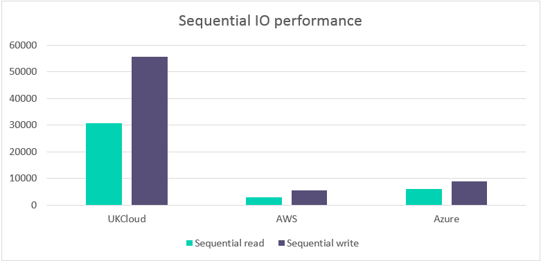

# How the UKCloud OpenStack platform outperforms hyperscalers

## The evolution of UKCloud

UKCloud has long been known for its VMware powered UKCloud for VMware service, which has enabled hundreds of UK Public Sector workloads to be moved to the cloud. In response to increasing demand from customers creating genuine cloud native (12-Factor) applications, we have developed and launched our UKCloud for OpenStack service, powered by OpenStack – the leading open-source alternative to the proprietary global public cloud platforms.

The OpenStack service that is available today has been vastly improved in terms of reliability, functionality and performance. Although there are several cloud providers available to the UK Public Sector, UKCloud maintains its position as the number one choice for security assured citizen-facing services with UK data centres and UK-based security cleared staff.

There are several factors to consider when choosing a cloud provider, such as price, performance, reliability, suitability for workloads, sovereignty and assurance. Value for money will often be at the forefront of the decision-making process. However, at UKCloud we are competitive on more than just price and believe performance is an important metric to consider.

This document will concentrate on performance benchmarking and introduces a comparison of performance on our OpenStack platform against other public cloud providers.

## Based on our innovative, next generation infrastructure

Our OpenStack platform is deployed on our innovative, next generation infrastructure. Rather than a SAN-based converged infrastructure, our next generation infrastructure is built on commodity hardware and leverages software defined data centre (SDDC) technology including software defined networking (Cisco ACI and OpenStack Neutron) and software defined storage (Red Hat Ceph).

This new infrastructure is designed to deliver much greater levels of scalability via multiple fault domains to improve availability and resilience. As bottlenecks such as the storage array and network functions are replaced with highly distributed resources, the new infrastructure is designed to deliver much greater levels of performance compared with our previous infrastructure.

## Why does performance matter?

These results are important for several reasons:

- **Cost control** – the superior performance of the UKCloud platform means that you can do more with less. To match our performance using the public cloud providers, you would need bigger instances, more instances or both – significantly increasing the cost of those platforms. A platform that appears 20% cheaper but has half the performance may mean you end up paying 60% more for the same performance.

- **Developer productivity** – our OpenStack platform has been designed specifically for agile software development projects where there is a real demand for environments to be provisioned rapidly and destroyed when no longer needed. Superior performance means that pipeline automation happens quickly and reliably so your developers aren't blocked waiting for the infrastructure to be ready.

- **User experience** – as digital systems are increasingly used directly by millions of potential users (for example, citizens), it's important that your platform can deliver superior performance when your users need it.

## Our approach to benchmarking

To validate the performance of our platform, UKCloud has been running automated tests to compare the performance of UKCloud for OpenStack against two leading proprietary public cloud platforms, Amazon Web Services and Microsoft Azure.

The benchmarking was based on the PerfKit Benchmarker tool which was originally developed by Google and made available to the open-source community. PerfKit is designed to provide a repeatable, consistent and open way of measuring cloud performance.

PerfKit was configured to specifically compare the UKCloud Region 5, Zone C UKCloud for OpenStack platform with AWS EU-West 2 (London) region and the Azure London region. The benchmarks ran throughout August 2017 and average values for the month are reported below.

## Benchmark results

UKCloud performed a suite of tests to assess the performance of various components of the platform, as well as some end-to-end system tests. The following pages provide more detail regarding each of the benchmark results.

> [!NOTE]
> For the graphs shown in this document, apart from instance boot time where a lower result is better, a higher result indicates superior performance. (UKCloud outperforms both AWS and Azure on 90% of benchmarks performed).

### Instance boot time

Instance boot time refers to the amount of time taken for an instance to boot from a powered off state. The graph below shows that UKCloud instances on the UKCloud for OpenStack platform boot 1.5 times faster than AWS and almost 7 times faster than Azure.

This means that you will benefit from reduced delay in loading the instances and the end user is able to quickly access the applications within them.

### MongoDB

MongoDB is an open-source database developed by MongoDB, Inc. Unlike relational databases, it stores data in JSON format that can vary in structure. This data model gives you the ability to represent hierarchical relationships and other complex structures easily. MongoDB was designed with high availability and scalability and therefore includes out-of-the-box replication and auto-scaling.

The performance of MongoDB running on the UKCloud for OpenStack platform is 2 times faster than AWS and almost 2 times faster than Azure meaning that MongoDB performs over twice as many operations per second on the UKCloud platform.

This results in better database performance with UKCloud and means there is higher data availability to applications, which in turn affects the service that a customer consumes, resulting in a better customer experience.

### Network performance

The networking performance test is a commonly used benchmark that can create TCP and UDP data streams and measures the throughput of a network that is carrying them. The values shown in the graph below indicate the maximum throughput of the respective networks.

UKCloud has a maximum throughput almost 12 times higher than AWS and almost 19 times higher than Azure.

This is important for customers who are moving large sets of data or need quick access to their data over the network. This results in less time spent waiting for data transfers to be completed, which allows applications to access their data more quickly. Ultimately meaning applications can run faster, giving a better user experience.

### Random IO performance

Random read is a measure of how quickly multiple small files can be read from random areas on a disk. Random read performance is measured in input-output operations per second with the number shown below an indication of the maximum number of reads. Random write uses the same disk pattern as random read but data is written to the disk rather than read.

The graph below shows that the UKCloud for OpenStack platform performs over 5 times more random read IOPs than AWS and over 34 times more than Azure. For random write, the UKCloud platform performs over 4 times more IOPs than AWS and over 27 times more than Azure.

This means that enterprise applications such as relational databases which are disk-intensive (require high I/O), perform better on the UKCloud platform.

Databases and applications that are disk intensive are often slowed down by their storage, hence the increased popularity of Solid State Drives (SSD). However, as the graph below shows, UKCloud provides fast storage access allowing applications to rapidly access and process data, resulting in faster applications compared to AWS and Azure's equivalent storage option.

### Sequential IO performance

Sequential read is a disk access pattern in which large continuous blocks of data are read from adjacent locations on the disk. Sequential write is the same pattern, but data is written to the disk rather than read. These kinds of disk access patterns are common when accessing large multimedia files such as music, video and images. They are also important for data warehouses and analytical applications.

The graph below shows that for sequential read the UKCloud platform performs almost 11 times better than AWS and over 5 times better than Azure. For sequential write, the UKCloud platform has a maximum IO over 10 times higher than AWS and over 6 times higher than Azure.

As with databases, these kinds of applications are often slowed down by their storage, hence the increased popularity of Solid State Drives (SSD). However, as the graph below shows, UKCloud provides fast storage access allowing applications to rapidly access and process data, resulting in faster applications compared to AWS and Azure's equivalent storage option. High sequential IO performance is vital for data analysis and specifically for data warehouses which are a core component of business intelligence and thus guide key management decisions.

## Where does the UKCloud OpenStack platform outperform both hyperscalers?

The data in the benchmark results section shows that the UKCloud for OpenStack platform consistently outperforms both hyperscalers across a variety of benchmarks including:

- Instance Boot Time

  - 1.5 times faster than AWS

  - Almost 7 times faster than Azure

  - **Reduced delay in loading the instances means that users are able to readily access the applications within them**

- Networking Performance

  - Almost 12 times higher than AWS

  - Almost 19 times higher than Azure

  - **Users spend less time transferring data on the network, allowing applications to access their data faster and thus running faster**

- MongoDB

  - 2 times faster than AWS

  - Almost 2 times faster than Azure

  - **Better database performance allows for higher data availability to applications, therefore resulting in a better customer experience**

- Random I/O Performance

  - Random Read is over 5 times faster than AWS and over 34 times faster than Azure

  - Random Write is over 4 times faster than AWS and over 27 times faster than Azure

  - **Faster storage access allows applications to rapidly access and process data and thus results in faster applications**

- Sequential I/O Performance

  - Sequential Read is almost 11 times better than AWS and over 4 times better than Azure

  - Sequential Write is over 10 times higher than AWS and over 6 times higher than Azure

  - **High sequential IO performance is vital for data analysis and specifically for data warehouses, it is a core component of business intelligence and thus guides key management decisions**

## Summary

Although a platform may appear cheaper, if it has half the performance this may mean you could end up paying significantly more for the same performance.

Using UKCloud's OpenStack platform means that you can do ‘more for less’ as you can save money with simple usage-based billing and benefit from the greater performance the platform offers.

While actual performance may vary based upon numerous real-world factors such as internet latency, application-tuning and a minimal risk of multi-tenant contention, we are confident that these benchmark results truly reflect the greater performance that UKCloud for OpenStack delivers over the nearest equivalent region and VM sizes of both AWS and Azure

We are continuously investigating ways to improve the performance of our UKCloud for OpenStack platform through using the latest versions of OpenStack, software-defined storage and networking, coupled with adaptive storage and network tuning as the platform is consumed. All of this will reassure our customers that the greater performance delivered today, will remain in the future.

## Feedback

If you find an issue with this article, click **Improve this Doc** to suggest a change. If you have an idea for how we could improve any of our services, visit the [Ideas](https://community.ukcloud.com/ideas) section of the [UKCloud Community](https://community.ukcloud.com).
