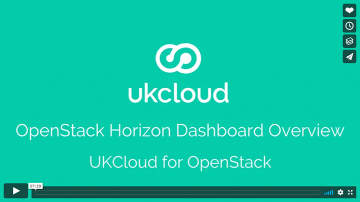

# OpenStack Horizon dashboard overview video

This video provides an overview of the OpenStack Horizon dashboard, which you can use to manage your UKCloud for OpenStack service. Click the image below to watch the video.

## Feedback

If you find an issue with this article, click **Improve this Doc** to suggest a change. If you have an idea for how we could improve any of our services, visit [UKCloud Ideas](https://ideas.ukcloud.com). Alternatively, you can contact us at <products@ukcloud.com>.
