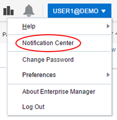
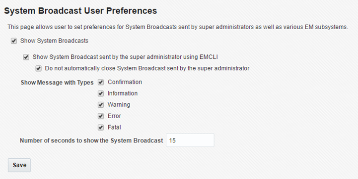

# Getting Started Guide for UKCloud for Oracle Software

## Overview

UKCloud for Oracle Software provides Infrastructure-as-a-Service (IaaS), powered by Oracle VM (OVM) technology, that is fully compliant with the compatibility and licensing requirements of Oracle-based enterprise applications.

This Getting Started Guide provides an overview of the functionality available with UKCloud for Oracle Software.

### Intended audience

This guide is intended for customers who want to get up and running with UKCloud for Oracle Software.

## Introduction to UKCloud for Oracle Software

Many applications running in the UK public sector today have a backbone powered by Oracle software. They include ERP solutions, finance systems (such as payroll), HR systems and wide variety of citizen‑supporting applications.

Oracle solutions have traditionally been subject to licensing and technical requirements that have made it challenging to carry out cloud transition projects and meet the government's Cloud First policy.

UKCloud for Oracle Software enables you to start your cloud journey with your Oracle applications. It overcomes the licensing and technical barriers, and provides the trusted, connected and flexible Assured OFFICIAL and non-internet-connected Elevated OFFICIAL cloud platforms you need to deliver your critical Oracle applications in the cloud. UKCloud for Oracle Software can help you achieve the business goals at the centre of your strategy, without risking your operational ability to execute.

The service has been designed and tested for compatibility with the most popular Oracle applications used in citizen‑facing solutions today, including:

- Oracle database (including features such as encryption and Data Guard)

- Oracle WebLogic Server

- Oracle Fusion Applications

- Oracle Enterprise Manager

- Oracle E-Business Suite

UKCloud for Oracle Software provides workloads with an uncontended infrastructure optimised for the performance and availability of Oracle workloads. You can right‑size the allocated resources to suit the changing demands of your application; ensuring performance and avoiding over‑capacity. You can specify the resource allocation of each workload independently: simply choose the appropriate CPU cores, amount of memory and required storage from the catalogue.

The service offers the following technical benefits specific to Oracle workloads:

- Use of core-pinning technology means that Oracle workloads operating on the UKCloud platform aren't subject to the types of movement that can unbalance Oracle applications running on other cloud platforms

- The scalable nature of our service enables you to add or remove cores in line with your understanding of the performance requirements of your solution

- Self-service management of your environment via our Customer Portal, which you can also use to programmatically control your Oracle environment

- Virtual firewalls to manage connectivity into and out of your environment -- self-service and free of charge

- IPsec and SSL VPN/SDN to create secure connections between users and other environments using a variety of included tunnelling technologies

- Basic load balancing to configure active/active solutions that are resilient to outages and can handle high levels of activity, using our on‑platform, out‑of‑the‑box load balancers

- Persistent storage so that your data remains, even when a virtual machine (VM) is turned off, ensuring that your application data remains consistent and available

### Oracle licensing compliance

UKCloud for Oracle Software does not include Oracle licensing but, because the platform is powered by OVM technology, you can be assured that it is compliant with Oracle's licensing requirements and you can bring your own Oracle licensing to build your solutions.

UKCloud ensures that hard partitioning is in place in all customer guest VMs in order to conform to Oracle licensing policies. When you create or modify a VM, automatic CPU pinning ensures that the VM won't use any CPUs other than the ones specifically pinned to the VM's vCPUs.

If you have any questions about Oracle licensing, contact your Cloud Architect, Customer Success Manager or Service Delivery Manager.

If you require assistance building out your Oracle solution, we can put you in contact with one or our partners who specialises in Oracle technologies.

### Your UKCloud for Oracle Software estate

The management of your Oracle estate is split between Oracle Enterprise Manager (OEM) and vCloud Director:

- Use OEM to build and manage your VMs and templates

- Use vCloud Director to create your VM networks and configure your edge gateway, including firewall rules and VPN connections

When you first purchase UKCloud for Oracle Software, your Customer Success Manager (CSM) creates an Oracle tenant to act as a top‑level container for your Oracle VMs. As your estate grows, you can add more tenants to logically organise your resources.

Within your Oracle tenant you can create the VMs that comprise your Oracle applications.

## Before you begin

You should have received your OEM login credentials, including the URL for OEM Cloud Control. You should also have received your UKCloud Portal login credentials.

## Accessing the Oracle Enterprise Manager Cloud Control console

To manage your UKCloud for Oracle Software environment, you need to log in to the Oracle Enterprise Manager Cloud Control console. The console provides a single, browser‑based interface to monitor and manage your entire Oracle infrastructure, including databases, servers, applications and hosts.

1. In your browser, go to the following URL:

    <https://ecco.r00006.frn.ukcloud.com/em>

2. On the log in page, enter your username and password and click **Login**.

## Getting to know the Cloud Control console

After you log in, you'll be taken to the *Infrastructure -- Oracle VM Cloud Services* page of the OEM Cloud Control console.

On this page, you can:

1. Click the **Home** icon at any point to return to the *Infrastructure -- Oracle VM Cloud Services* page.

2. Click the **Requests** icon to view and manage all your requests.

3. Click the **Servers** icon to view and manage all your VM instances.

    **More information!** [*How to build an Oracle virtual machine*](orcl-how-build-vm.md)

4. Click the **Storage** icon to view and manage all the storage associated with your VMs.

5. Click the **Chargeback** icon to view billing details.

6. Click the **Library** icon to view all public templates and templates that you own.

7. Click the **Policies** icon to view policies and schedules that you can apply to your VMs.

8. The *Notifications* section provides useful alerts about your UKCloud for Oracle Software environment.

9. The *Usage* section displays the currently available quotas for VMs, CPUs, memory and storage.

10. The *10 Last Requested Servers* section lists the last ten VMs that you've requested. If you own more than 10 VMs, click the **Servers** icon to view them all. You can click the **Request Servers** icon to create a new VM.

    **More information!** [*How to build an Oracle virtual machine*](orcl-how-build-vm.md)

11. The *10 Latest Requests* section lists the details and status of the last ten requests you've made. To view all requests, click the **Requests** icon.

12. Click the **All Cloud Services** icon at any point to go to the *All Cloud Services* page. On the *All Cloud Services* page, click **Infrastructure -- Oracle VM Cloud Services** to return to the *Infrastructure -- Oracle VM Cloud Services* page.

13. Click the **Notification Center** icon to access the *Notification Center* where you can view alerts about the objects within your UKCloud for Oracle Software environment.

    **More information!** [Viewing notifications](#viewing-notifications)

14. Click your username to access your account settings to, for example, change your account preferences or password.

    **More information!** [Changing your account settings](#changing-your-account-settings)

## Viewing notifications

UKCloud uses The *Notification Center* to communicate alerts about the objects in your UKCloud for Oracle Software environment.

> [!NOTE]
> For notifications about planned maintenance windows, service incidents and new features, see the UKCloud Portal.

1. In the Cloud Control console, click the notifications icon.

    

    Alternatively, you can click your username and select **Notification Center**.

    

2. The *Notification Center* lists your alerts.

    

## Changing your account settings

From the user account menu, you can:

- [Change your password](#changing-your-password)

- [Change your accessibility preferences](#changing-your-accessibility-preferences)

- [Change system broadcast preferences](#changing-system-broadcast-preferences)

- [Change your console settings](#changing-your-console-settings)

- [Log out of the console](#logging-out-of-the-cloud-control-console)

You can also access online help and display information about your version of OEM.

### Changing your password

You are required to change your password every 60 days and also if you have 3 successive failed login attempts.

If you want to change your password for any other reason, you can do so via the user account menu.

1. In the Cloud Control console, click your username and select **Change Password**.

    

2. On the *Change Password* page, enter your **Current Password** then enter and confirm your **New Password**.

    

    > [!NOTE]
    > You cannot use the same password in a 365‑day period until the password has been changed 10 times.

### Changing your accessibility preferences

You can change your accessibility preferences to indicate any assistive technology that you use.

1. In the Cloud Control console, click your username and select **Preferences** and then **Accessibility**.

    

2. In the *Accessibility Preference* dialog, select the assistive technologies that you use, for example, a screen reader, high contrast settings or large fonts.

3. Select **Show me the Accessibility Preference options after I log in** if you want the option to select accessibility options each time you log in to the console.

    

4. When you're done, click **OK**.

### Changing system broadcast preferences

System broadcasts are popup messages sent by the UKCloud administrator to immediately notify users with important information.

> [!NOTE]
> We highly recommend that you do not change these settings. If you do change these settings, you may miss important information about your UKCloud for Oracle Software environment.

1. In the Cloud Control console, click your username and select **Preferences** and then **System Broadcast**.

    

2. Change the settings as required.

    

3. When you're done, click **Save**.

### Changing your console settings

You can set various options to personalise your experience in the Cloud Control console. For example, you can choose when to receive VM request, expiry and quota notifications and specify an email address to receive selected notifications. You can also define the default values to use when creating VMs.

1. In the Cloud Control console, click your username and select **Preferences** and then **SSA Portal Settings**.

    

2. On the *General* tab of the *Preferences* dialog box, specify your notification settings.

    

3. On the *Infrastructure -- Oracle VM* tab, specify default options for new VMs.

    

4. When you're done, click **Apply**.

## Building virtual machines

Your Oracle applications will consist of one or more VMs. In the Cloud Console, you create a VM by requesting a server. You can base your VMs on assemblies or templates.

On the *Infrastructure -- Oracle VM Cloud Services* page you can view and manage all your Oracle VMs.

**More information!** [*How to build an Oracle virtual machine*](orcl-how-build-vm.md)

## Setting up your network

Before you can start using the VMs in your Oracle environment, you need to create the network that connects the VMs to each other, and potentially also to the outside world. This network enables your VMs to communicate with each other or access external networks. A single Oracle tenant can have multiple networks. When UKCloud sets up a new Oracle tenant for you, we'll usually create an edge gateway for that tenant, but the creation of any networks is your responsibility.

Networking and connectivity for UKCloud for Oracle Software is managed within vCloud Director, which you access through the UKCloud Portal rather than Enterprise Manager Cloud Control.

> [!NOTE]
> Because you create your network in vCloud Director, you'll see references to VMware terminology, such as organisations and virtual data centres (VDCs). In UKCloud for Oracle Software, an Oracle tenant is equivalent to a VDC.

There are two types of network:

- An isolated (internally connected) network provides access only to the VMs within the Oracle tenant (see [*How to create an isolated VDC network*](../vmware/vmw-how-create-isolated-network.md)).

- A routed (externally connected) network provides access to machines and networks outside the Oracle tenant via the edge gateway. You can have up to nine usable routed networks per tenant: one for each connectivity type (see [*How to create a routed VDC network*](../vmware/vmw-how-create-routed-network.md)).

## Configuring your edge gateway

An edge gateway controls how traffic from the outside world comes into and out of your environment. It is very important to make sure that your edge gateway is configured correctly to make your applications available but also secure.

The tools for configuring your edge gateway are provided within vCloud Director, which you access through the UKCloud Portal rather than Enterprise Manager Cloud Control.

Your edge gateway provides the following services:

- **Dynamic Host Configuration Protocol (DHCP)** --- The edge gateway can act as a DHCP server for VMs connected to VDC networks connected to an edge (see [*How to create a DHCP pool*](../vmware/vmw-how-create-dhcp-pool.md)).

- **Network address translation (NAT)** --- NAT rules determine where to direct inbound and outbound traffic (see [*How to create NAT rules*](../vmware/vmw-how-create-nat-rules.md)).

- **Firewall** --- The firewall controls which networks and ports can communicate through the edge gateway (see [*How to create firewall rules*](../vmware/vmw-how-create-firewall-rules.md)).

- **Static routing** --- Provides static routes from the edge gateway to other networks, for example, networks in other VDCs in your compute service (see [*How to create a static route*](../vmware/vmw-how-create-static-route.md)).

- **VPN** --- IPsec site-to-site VPN is available on the edge gateway (see [*How to configure IPsec VPN*](../vmware/vmw-how-configure-ipsec-vpn.md)).

- **Load balancing** --- The edge gateway provides simple HTTP and HTTPS load balancing using round robin (see [*How to configure a load balancer*](../vmware/vmw-how-configure-load-balancer.md)).

## Logging out of the Cloud Control console

When you're done working in the Cloud Control console, we recommend that you log out to prevent unauthorised access.

To log out of the Cloud Control console, click your user name and select **Log Out**.

## Next steps

In this Getting Started Guide, you've learned the basics about UKCloud for Oracle Software.

For more detailed information about building Oracle applications in your UKCloud for Oracle Software estate, see the following articles:

### VM networking

- [*How to create an isolated VDC network*](../vmware/vmw-how-create-isolated-network.md)

- [*How to create a routed VDC network*](../vmware/vmw-how-create-routed-network.md)

### Edge gateway services

- [*How to find your allocated external IP addresses*](../vmware/vmw-how-find-ip-addresses.md)

- [*How to create a DHCP pool*](../vmware/vmw-how-create-dhcp-pool.md)

- [*How to create NAT rules*](../vmware/vmw-how-create-nat-rules.md)

- [*How to create firewall rules*](../vmware/vmw-how-create-firewall-rules.md)

- [*How to create a static route*](../vmware/vmw-how-create-static-route.md)

- [*How to configure IPsec VPN*](../vmware/vmw-how-configure-ipsec-vpn.md)

- [*How to configure a load balancer*](../vmware/vmw-how-configure-load-balancer.md)

### Virtual machines

- [*How to build an Oracle virtual machine*](orcl-how-build-vm.md)

## Related videos

- [*Oracle Enterprise Manager Cloud Control console overview video*](orcl-vid-overview.md)

## Glossary

This section provides a glossary of terms specific to UKCloud for Oracle Software.

**assembly**&nbsp;&nbsp;A kind of infrastructure template containing a configuration of multiple virtual machines with their virtual disks and even the inter connectivity between them. Assemblies can be created as a set of .ovf (Open Virtualization Format) and .img (disk image) files, or may all be contained in a single .ova (Open Virtualization Format Archive) file.

**Assured OFFICIAL**&nbsp;&nbsp;A security domain on the UKCloud platform that provides access to public networks, such as the internet, PSN, HSCN or Janet.

**Cloud Console**&nbsp;&nbsp;System management software from Oracle that delivers centralized monitoring, administration, and life-cycle management functionality for the complete IT infrastructure, including systems running Oracle and non-Oracle technologies.

**Customer Success Manager (CSM)**&nbsp;&nbsp;A UKCloud Customer Services role aimed at providing you with any assistance you require during onboarding and the first 90 days of using a UKCloud service.

**edge gateway**&nbsp;&nbsp;A virtual router that provides VDC network services such as DHCP, firewall, NAT, static routing, VPN and load balancing.

**Elevated OFFICIAL**&nbsp;&nbsp;A security domain on the UKCloud platform that provides secure access to restricted networks such as PSN.

**Oracle Enterprise Manager (OEM)**&nbsp;&nbsp;Oracle's on-premises management platform, providing a single pane of glass for managing all of a customer's Oracle deployments, whether in their data centres or in the Oracle Cloud. OEM provides management and automation support for Oracle applications, databases, middleware, hardware and engineered systems.

**Oracle tenant**&nbsp;&nbsp;A top-level container for VMs that contains one or more VMs and owns all the virtual resources used by those VMs.

**Oracle VM (OVM)**&nbsp;&nbsp;Oracle's server virtualisation technology, used by UKCloud for Oracle Software to ensure compliance with the compatibility and licensing requirements of Oracle-based enterprise applications.

**server**&nbsp;&nbsp;A customer provisioned compute resource within Oracle Enterprise Manager Cloud Control. Similar to the virtual machine concept within VMware or instances within OpenStack.

**virtual machine (VM)**&nbsp;&nbsp;Software that emulates the functionality of a physical computer, running an operating system and applications. Customers can define a VM's
resource requirements and the UKCloud platform optimises its placement to ensure it receives the requested resources.

**virtual machine template**&nbsp;&nbsp;A fully pre-installed, pre-configured VM that can be repeatedly used to create new virtual machines.

## Feedback

If you find an issue with this article, click **Improve this Doc** to suggest a change. If you have an idea for how we could improve any of our services, visit the [Ideas](https://community.ukcloud.com/ideas) section of the [UKCloud Community](https://community.ukcloud.com).
