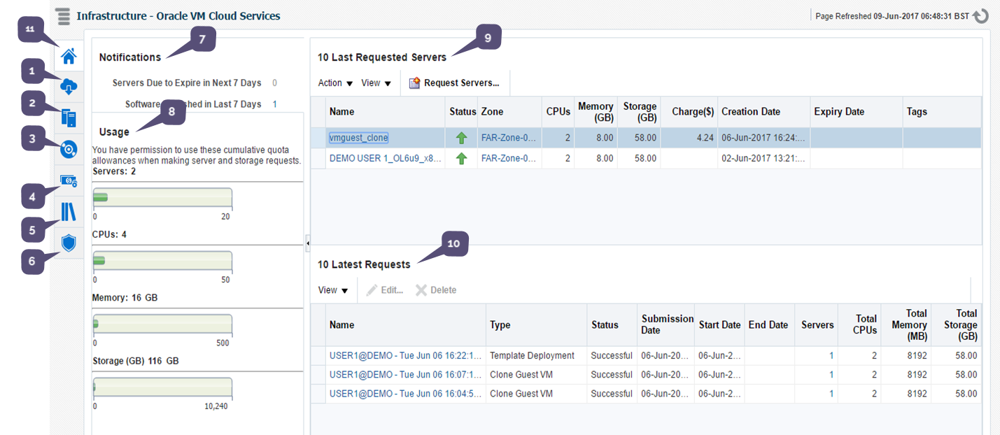
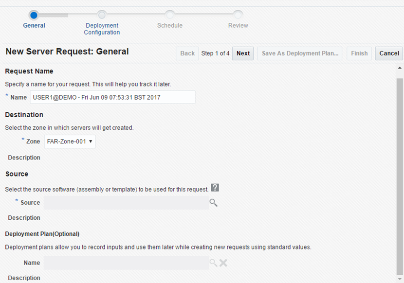
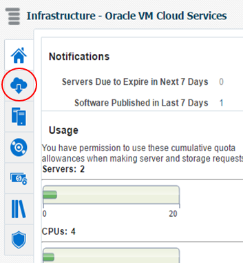

#### UKCloud Limited (“UKC”) and Virtual Infrastructure Group Limited (“VIG”) (together “the Companies”) – in Compulsory Liquidation

On 25 October 2022, the Companies were placed into Liquidation with the Official Receiver appointed as Liquidator and J Robinson and A M Hudson simultaneously appointed as Special Managers to manage the liquidation process on behalf of the Official Receiver.

Further information regarding the Liquidations can be found here: <https://www.gov.uk/government/news/virtual-infrastructure-group-limited-and-ukcloud-limited-information-for-creditors-and-interested-parties>

Contact details: 
For any general queries relating to the Liquidations please email <ukcloud@uk.ey.com> 
For customer related queries please email <ukcloudcustomers@uk.ey.com> 
For supplier related queries please email <ukcloudsuppliers@uk.ey.com>

# How to build an Oracle virtual machine

> [!IMPORTANT]
> UKCloud for Oracle Software has been retired from sale by UKCloud. We'll continue to support all existing customers who are using this service, however, we are no longer providing this service for new workloads. This article provides existing UKCloud for Oracle Software customers with access to support documentation and we'll continue to update it as required. For new Oracle requests, contact your Client Director or Service Delivery Manager.

> [!IMPORTANT]
> Due to a bug within the Oracle cloud placement engine, until further notice, customers on the Oracle cloud will be unable to perform the following tasks through the Oracle cloud portal:
>
>- Create new VMs
>
>- Modify the compute and storage resources available to existing VMs
>
> Until this issue is resolved, we ask that customers raise a Service Request via the My Calls section of the UKCloud Portal so that UKCloud can provision Oracle VMs and VM resources on your behalf.
> 
> For more information about how to raise a ticket for the creation of an Oracle VM, see [*Oracle cloud self-service functionality*](orcl-ref-bug-self-service.md).

## Overview

UKCloud for Oracle Software provides Infrastructure-as-a-Service (IaaS), powered by Oracle VM (OVM) technology, that is fully compliant with the compatibility and licensing requirements of Oracle-based enterprise applications.

### Intended audience

To complete the steps in this guide you must have access to Oracle Enterprise Manager Cloud Control.

## Viewing information about your Oracle VMs

To view information about your Oracle VMs, go to the *Oracle VM Cloud Services* page of the OEM Cloud Control console.

On the *Oracle VM Cloud Services* page you can:

1. Click the **Requests** icon to view and manage all your requests.

2. Click the **Servers** icon to view and manage all your VM instances.

3. Click the **Storage** icon to view and manage all the storage associated with your VMs.

4. Click the **Chargeback** icon to view billing details.

5. Click the **Library** icon to view all public templates and templates that you own.

6. Click the **Policies** icon to view policies and schedules that you can apply to your VMs.

7. The *Notifications* section provides useful information about what's happening in your UKCloud for Oracle Software environment.

8. The *Usage* section displays the currently available quotas for VMs, CPUs, memory and storage.

9. The *10 Last Requested Servers* section lists the last ten VMs that you've requested. If you own more than 10 VMs, click the **Servers** icon to view them all.

10. The *10 Latest Requests* section lists the details and status of the last ten requests you've made. To view all requests, click the **Requests** icon.

11. Click the **Home** icon at any point to return to the *Oracle VM Cloud Services* page.

## Building an Oracle VM

To build an Oracle VM, you need to raise a server request. Each request can include one or more VM instances.

1. Log in to the Oracle Enterprise Manager Cloud Control console at:

    <https://ecco.r00006.frn.ukcloud.com/em>

    For more detailed instructions, see the [*Getting Started Guide for UKCloud for Oracle Software*](orcl-gs.md).

2. On the *Oracle VM Cloud Services* page, click the **Servers** icon.

    

3. The *Servers* page lists all the servers you've requested, grouped by zone. You can also view template deployments.

    

4. To create a VM, click the **Request Servers** icon.

    

5. In the *New Server Request* wizard, on the *General* page:

    - Enter a **Name** for the request. This is displayed on the Requests page to help you identify your request and track its progress.

    - From the **Zone** list, select the UKCloud zone in which you want to create the VM.

    - In the **Source** field, specify the template that you want to use for the VM, for example, **OL6u9_x86_64_HVMPVOL6u9_x86_64_HVMPV**.

        > [!NOTE]
        > You can choose from public templates (provided by UKCloud) or templates that you've created yourself. Use the search icon next to the field to help locate the required template if necessary.

    - Click **Next**.

    

6. On the *Deployment Configuration* page:

    - You can create multiple VMs in a single request. From the **Number Of Servers** list, select the number of VMs that you want to create.

    - If you're creating more than one VM, click **Configure Individual Servers** if you want to configure each VM separately. If you do not click this link, the configuration you specify is applied to all VMs in the request.

    - Enter a **Name** for the VM. If there are multiple VMs in the request, a number is added to the end of each VM to ensure uniqueness

        > [!NOTE]
        > Click **Configure Individual Servers** to name each VM individually.

    - Select **Enable High Availability** to enable high availability for the VM.

    - From the **Keymap** list, select the keyboard type for the VM.

    - In the **Tags** field, enter tags to identify the VM. This helps to find VMs during searches.

    - From the **Server Size** list, select a pre-configured option or select **Custom** if you want to specify your own settings.

        If you select **Custom**, specify the **Maximum Memory**, **Memory**, **Maximum Number of CPUs** and **Number of CPUs** settings for the VM(s).

    - In the *Networks* section, click **Add** and select the network interface card to use for the VM(s).

    - The *Storage* section shows the disk used for VM storage.

    - Click **Next**.

    

7. On the *Schedule* page, you can choose to start request immediately or schedule it for a later time. You can also select to allow the request to run indefinitely or to end it by a specified time. When you're done, click **Next**.

    

8. On the *Review* page, check the details of your request and then click **Finish**. If you want to change any details, use the **Back** button to return to the previous steps of the request.

    

    You can click **Save as Deployment Plan** to save the request as deployment plan that you can use as a template for other requests.

9. A Confirmation notification lets you know that your request has been submitted. You can track the request on the *Oracle VM Cloud Services* or *Requests* pages.

    **More information!** [Monitoring your VM requests](#monitoring-your-vm-requests)

    

## Monitoring your VM requests

On the *Requests* page, you can view and edit all requests.

1. Log in to the Oracle Enterprise Manager Cloud Control console at:

    <https://ecco.r00006.frn.ukcloud.com/em>

    For more detailed instructions, see the [*Getting Started Guide for UKCloud for Oracle Software*](orcl-gs.md).

2. On the *Oracle VM Cloud Services* page, click the **Requests** icon.

    

3. On the *Requests* page, you can view the following information for each request, including:

    - The type of request

    - The current status of the request: Successful, Partially Successful, In Progress, Scheduled, Error Scheduling, Execution Error, Error Ending, Ended

    - The dates when the request was submitted, started and completed.

    - The number of servers included in the request

    - The total CPU, memory (in MB) and storage (in GB) consumed by the request across all servers

    

4. To edit a request, select the request and click the **Edit** icon. The request must have a status of **Scheduled**.

5. To delete a request, select the request and click the **Delete** icon. For auditing purposes the request must have a status of **Scheduled**, **Error Scheduling**, **Execution Error** or **Error Ending**.

## Next steps

For a general overview of UKCloud for Oracle Software, see the [*Getting Started Guide for UKCloud for Oracle Software*](orcl-gs.md).

## Related videos

- [*Oracle Enterprise Manager Cloud Control console overview video*](orcl-vid-overview.md)

## Feedback

If you find a problem with this article, click **Improve this Doc** to make the change yourself or raise an [issue](https://github.com/UKCloud/documentation/issues) in GitHub. If you have an idea for how we could improve any of our services, send an email to <feedback@ukcloud.com>.
