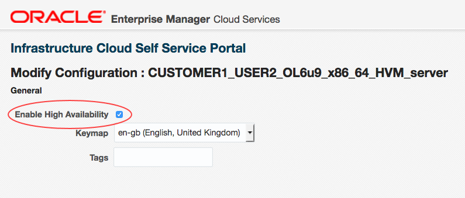

# How to enable high availability for your Oracle VMs

## Overview

Owing to the nature of Oracle workloads and the need to pin them to processor cores, workloads will be automatically moved in the event of a host failure only if you've enabled the high availability (HA) feature
on each VM.

> [!NOTE]
> If you do not enable the HA feature for your VMs, if a failure occurs, UKCloud will need to manually move the Oracle VM to a new host, at which point you'll be notified to restart your application.

This article describes how to enable HA for your Oracle VMs.

### Intended audience

To complete the steps in this guide you must have access to Oracle Enterprise Manager Cloud Control.

## Enabling high availability for a VM

To enable HA:

1. Log in to the Oracle Enterprise Manager Cloud Control console at:

    <https://ecco.r00006.frn.ukcloud.com/em>

    If you need more detailed instructions, see the [*Getting Started Guide for UKCloud for Oracle Software*](orcl-gs.md).

2. On the *Infrastructure -- Oracle VM Cloud Services* page, click the **Servers** icon.

    

3. The *Servers* page lists the servers (VMs) you've requested.

    

4. Select the VM for which you want to enable HA.

5. From the **Action** menu, select **Modify Configuration**.

    

6. On the *Modify Configuration* page, select **Enable High Availability**.

    

7. Click **OK**.

## Next steps

For more information about UKCloud for Oracle Software, see:

- [*Getting Started Guide for UKCloud for Oracle Software*](orcl-gs.md).

- [*How to build an Oracle virtual machine*](orcl-how-build-vm.md)

- [*UKCloud for Oracle Software FAQs*](orcl-faq.md)

## Feedback

If you have any comments on this document or any other aspect of your UKCloud experience, send them to <products@ukcloud.com>.
