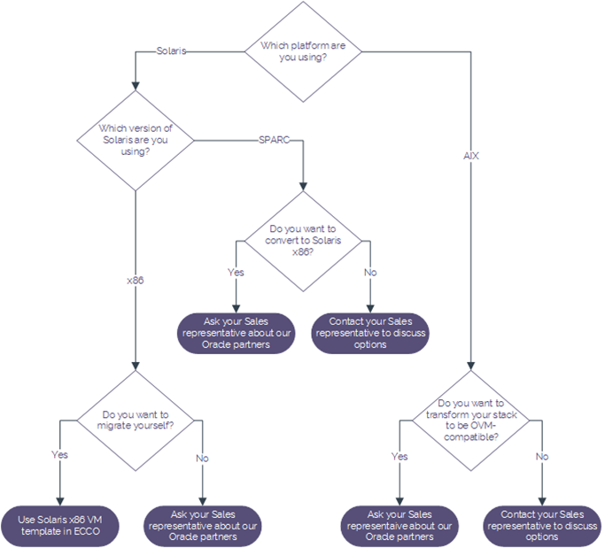

# Compatibility with Solaris and AIX

## Overview

This article provides advice about how you can migrate your applications to UKCloud for Oracle Software depending on the Oracle platform you're using.

## Solaris and AIX compatibility

Use the diagram below to determine if your current platform is compatible with our Oracle cloud.

## Solaris x86

Solaris x86 is compatible with our x86 Oracle cloud service so you can bring your Solaris workload to us. We provide a Solaris x86 template for you to use to build your Oracle virtual machines.

You may need to talk to your Service Delivery Manager or Cloud Architect to help with the specifics of the project.

## Solaris SPARC

We support Solaris on our Oracle SPARC cloud so you can bring your Solaris SPARC workloads to us without needing to transform them.

If you want to use UKCloud for Oracle Software with SPARC, contact your Service Delivery Manager or Cloud Architect to help with the specifics of the project.

## AIX

As AIX is tied to IBM hardware, it's not possible to run natively in our Oracle cloud. However, with the correct scoping and technical assistance, it may be possible to transform the application stack to be OVM-compatible.

If you want to use UKCloud for Oracle Software with AIX, contact your Service Delivery Manager or Cloud Architect to discuss how this could be achieved.

## Feedback

If you find a problem with this article, click **Improve this Doc** to make the change yourself or raise an [issue](https://github.com/UKCloud/documentation/issues) in GitHub. If you have an idea for how we could improve any of our services, send an email to <feedback@ukcloud.com>.
