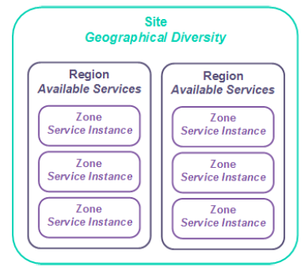

# UKCloud for Oracle Software Service Scope

## About this document

This document describes the boundaries of the UKCloud for Oracle software service, along with the division of responsibilities between UKCloud and the customer, to facilitate the provisioning and ongoing use of the service.

## About UKCloud for Oracle Software

The UKCloud for Oracle Software service provides a secure, scalable and cost-effective platform for hosting Oracle virtual machines (OVMs) of various sizes.

You can use the platform to build new services quickly and securely; and migrate, augment or transform existing Oracle-based applications. The platform is immediately available so you can provision and scale OVMs in minutes.

## Service architecture

Your UKCloud service  architecture is as follows:

**Company.** Your contract with UKCloud is associated with a company, which provides a single owner for the contract, regardless of how many accounts are created.

**Account.** We use accounts to separate financial ownership. An account could represent an organisation, a customer contract, or a specific project. An account can also have several UKCloud services associated with it, such as UKCloud for Oracle, Cloud Storage and UKCloud for OpenStack.

You can also use accounts to separate users based on access requirements or permissions.

**Organisation.** This represents your UKCloud for Oracle Software service inside Oracle Enterprise Manager and on the UKCloud Portal. There is a 1:1 mapping of service to Organisation.

**Oracle Tenant.** An Oracle Tenant is where you define your workload type and build your OVMs. You can create Oracle Tenants by raising a service request via the [My Calls](https://portal.skyscapecloud.com/support/ivanti) section of the UKCloud Portal.

## Service configuration

The UKCloud for Oracle Software infrastructure is uncontended and configured to optimise the performance and availability of Oracle workloads. There is only one service configuration on the UKCloud for Oracle Software platform, ensuring that OVMs are pinned to cores to stop OVM movement that would unbalance applications.

Customers can self-configure OVMs by the number of cores, and amount of memory and storage needed. OVMs can be reconfigured to adjust resources in line with changing performance requirements.

Self-service management is done through the Oracle Enterprise Management Portal, accessed through the UKCloud Portal.

Full details of the available service options are outlined in the [*Service Definition*](orcl-sd.md).

## Storage options

All storage is persistent and resilient to local hardware failures. Multiple storage options can be used to support different aspects of the application.

- **Tier 1.** Fast storage ideal for data warehouses, fast transactional databases or randomly executing workloads.

- **Tier 2.** General all-purpose storage, suitable for systems with human interactions or predictable work patterns.

- **Cloud Storage.** Ideal for serving media content or as a medium-term repository; can be used to store Recovery Manager (RMAN)
    backups.

## Storage policies

We provide you with access to two storage policies: tier 1 and tier 2.

We will initially provide you with a tier 2 storage policy, however you can request tier 1 storage be added to your Oracle Tenant so you can create additional disks with tier 1 storage on your OVMs.

VM templates come with a 50GiB system disk and a secondary disk (equivalent to the size of the RAM associated with the OVM - up to 16GiB). These virtual disks are mapped from the tier 2 VM repository by default.

For installations of Oracle apps on top of the OS, it's best to have separate non-OS virtual disks which are then mapped to mountpoints. The sizing requirements/recommendations for the non-OS storage can be found on the official Oracle installation guides and they can differ from version to version.

You'll need to take into consideration future data growth while planning capacity, as this would also reflect on the capacity required for backups.

- We do not guarantee storage performance, as it can be affected by many factors.

- We do not provide IOPS figures for our storage offerings.

- Workloads can use multiple storage profiles.

## Protection

UKCloud for Oracle Software does not include any infrastructure-level backup or disaster recovery functionality. However, the underpinning infrastructure supports native Oracle protection technologies such as Data Guard and RMAN.

UKCloud's Cloud Storage can be used as an S3-addressable target for Oracle protection technologies.

## Service availability

UKCloud for Oracle Software offers an SLA guarantee of 99.95% availability for VMs without high availability (HA) enabled.

VMs with HA enabled have an SLA of 99.99%. Having HA enabled will not consume any additional resource on the platform, and is therefore free-of-charge, however, as this setting is not enabled by default, you must configure this through the UI. For more information, see [*How to enable high availability for your Oracle VMs*](orcl-how-enable-ha.md).

You are entitled to claim Service Credits for outages to services that take you out of the SLA. For more about how we calculate SLAs, see the [*SLA Definition*](../other/other-ref-sla-definition.md) document.

Our SLA does not cover faults within your control, such as client application issues, or faults within external connectivity providers (for example, internet, PSN or HSCN).

## Service background

UKCloud for Oracle Software is underpinned by Oracle compute infrastructure. UKCloud manage the physical infrastructure and utilise our partner, Infomentum, to provide support and management from the hypervisor level and above.

Infomentum will provision your Oracle Tenant environment and UKCloud will present it to you through the Oracle Enterprise Manager.

VM creation is currently available via service request to ensure that the platform remains balanced &mdash; this is due to the core-pinning technology that Oracle OVM uses. You'll need to submit a service request via the [My Calls](https://portal.skyscapecloud.com/support/ivanti) section of the UKCloud Portal with the VM details, including resource allocation, and we'll create the VM. You can then manage the created VM. You must also raise a service request to change the size of a VM. For more information, see [*Oracle cloud self-service funtionality*](orcl-ref-bug-self-service.md).

All service requests will be triaged by UKCloud. We reserve the right to escalate a request to Infomentum for support. If you have not have a managed service contract with Infomentum, please do not contact them directly.

UKCloud actively capacity-manages the cloud platform to ensure you have access to the resources you request.

The UKCloud platform is designed using sites, regions and zones. The relationship between them is shown below:

You can specify Farnborough or Corsham as the site where you would like to have your service provisioned, and we will try to accommodate requests and will advise you if we are unable do so.

We control the deployed versions of technology on the platform. This covers internal platform-supporting technologies, and any technology versions available to you.

- Internally this includes, but isn't limited to, the Oracle Virtual Machine Manager and Oracle Virtual Machine Server versions, and the hardware version of the platform.

- Externally this includes the available versions of the NSX Edge and Oracle Enterprise Manager.

- You can make additional configurations inside an OVM (such as implementing third-party software technologies). We do not support customer implementations inside a VM.

## Operating systems

UKCloud for Oracle Software includes the base OVM platform licences, which provide VM containers that meet Oracle's definition of hard partitioning.

Our service does not include licences for the Oracle applications and databases you choose to run.

As the underlying platform is powered by OVM technology, you can either transfer your existing licences, or purchase new licences based on the quantity of cores you allocate within each VM. Please note that UKCloud does not have the functionality to provide Oracle licensing, and this must be sourced via an appropriate partner.

*Cores* refers to physical processor cores (excluding hyper-threading). OVM cores have two threads, or *vCPUs*. Your Oracle licensing will be based on the cores consumed by your OVM.

**Update services.** We make update repositories available for OVM containers. We don't provide software update facilities for non-UKCloud licensed software, including all Oracle applications or databases.

**Anti-virus.** We do not provide anti-virus software as part of the service.

## Networks

**Internet-facing solutions.** You are provided with 2 usable public IP addresses, but you can ask for additional public IP addresses by raising a Service Request via the [My Calls](https://portal.skyscapecloud.com/support/ivanti) section of the UKCloud Portal. We reserve the right to decline the request if you have spare capacity in your existing deployment.

**PSN-facing solutions.** You should raise a Service Request via the [My Calls](https://portal.skyscapecloud.com/support/ivanti) section of the UKCloud Portal or contact your Customer Success Manager (CSM) to be assigned your IP address. This solution also comes with shared bandwidth (uncapped).

**Janet and HSCN solutions.** You have one usable IP address, but you can request additional IP addresses by raising a Service Request via the [My Calls](https://portal.skyscapecloud.com/support/ivanti) section of the UKCloud Portal.

UKCloud for Oracle Software does not have a native external connectivity functionality. Therefore, UKCloud have enabled customers to manage connectivity rules, such as firewall, IPsec VPN and NAT functionality, through a VMware NSX Edge. This Edge is provisioned within the UKCloud for VMware environment and is managed using either the UKCloud Portal GUI or API.

This Edge can be an existing edge in a customer's UKCloud for VMware environment, or can be provisioned as a completely new entity, specific for Oracle.

## NSX Edge

By default, we assign one Edge per connectivity type. You can choose which external network you would like to enable your Oracle environment to connect to. Note that the Oracle environment does **not** have to connect to an external network, however an external network will need to be connected to the Edge.

**Site-to-site IPsec VPN.** You can create IPsec VPN tunnels to connect different environments, both internal and external, to UKCloud. There is a limit of 64 tunnels per Edge.

## Bring Your Own Firewall

Bring Your Own Firewall is currently not available for UKCloud for Oracle Software installations; however, you can have BYOF within UKCloud for VMware and connect it to the UKCloud for Oracle Software edge gateway via an IPsec VPN.

## Protective monitoring

We have implemented GPG 13-aligned Protective Monitoring across the Assured and Elevated platforms at the hypervisor level and below.

We don't provide Protective Monitoring services above the hypervisor (for example, for your VM). Components above this infrastructure are your own responsibility to provide an appropriate protective monitoring capability.

In line with UKCloud's System Interconnect and Security Policy (SISP), we provide notification of customer-impacting security incidents. It is your responsibility to report similar incidents to us.

## Platform management

Users can access, manage and view the UKCloud for Oracle Software service, accessing only those features allowed by their role, in any of the following ways:

- **Oracle Enterprise Manager.** The graphical interface for the creation and management of the Oracle environment.

- **vCloud Director API.** Enables the programmatic creation and management of the Oracle edge gateway.

- **vCloud Director Graphical UI.** Provides a graphical interface to access the vCloud Director environment to manage the Oracle NSX Edge (depending on assigned permissions).

- **UKCloud Portal.** Enables access to the vCloud Director and Oracle Enterprise Manager services. The Portal also includes an overview of actual and estimated spend, along with service configuration information. Access to service reporting and incident and request management is also possible through the Portal.

You cannot access the underlying infrastructure. This includes (but isn't limited to) the hardware and the Oracle Virtual Machine Manager environment.

## Service migration

UKCloud do not currently provide migration services, however customers are free to bring their own migration tools and utilise them within the UKCloud for Oracle Software environment.

## Service reporting

**Visibility.** We provide a monthly service report via the UKCloud Portal. This includes a summary of platform availability and a retrospective of the interactions with UKCloud support during the previous month. Maintenance notifications and Service Status reports are also delivered through the portal.

**Service reporting.** All service reporting is done via the UKCloud Portal.

**Billing.** Billing is issued on a monthly basis where you will be billed for your total monthly consumption.

## Customer service

**Customer Success Manager (CSM).** For the first 90 days of the service, you have access to a UKCloud CSM who will help you with your adoption of the UKCloud UKCloud for Oracle Software service. This includes finding relevant systems and how to use UKCloud tools and processes.

**Cloud Architects.** UKCloud Cloud Architects support you during the design of solutions for the cloud platform. UKCloud Cloud Architects are ideally placed to help reconcile your requirements with the UKCloud platform. We recommend engagement with a Cloud Architect when implementing Oracle solutions.

**Service Delivery Managers.** You will be allocated with an assigned point of contact who will provide ongoing assistance with reporting and incident escalation.

**Support.** After the initial on-boarding and design phase, you can utilise the standard UKCloud support entitlement, which is documented in the [*Customer Engagement Factsheet*](https://ukcloud.com/wp-content/uploads/2018/08/ukcloud-factsheet-customer-care.pdf).

## Customer responsibilities

- You are responsible for assessing whether the UKCloud UKCloud for Oracle Software platform can support the various requirements of your application.

- The control and management of access and responsibilities for end users including appropriate connectivity, security and accreditation if required.

    If access is required over government secure networks (HSCN, Janet, RLI or PSN), you are responsible for adhering to the relevant Code of Connection (CoCo) and for providing evidence of their CoCo to UKCloud upon request. UKCloud is unable to provide access to secure networks where such evidence has not been provided.

- Management and administration of layers above the Oracle hypervisor (OS patching, application performance monitoring, user administration).

- You are also responsible for ensuring only lawful data that supports the UK public sector is stored and processed by applications on this environment, and that they fully comply with the UKCloud Security Operating Procedures (SyOPs) and other information assurance requirements as specified in the UKCloud SISP and associated accreditation documentation sets.

## Service provisioning

Within four (4) working hours of accepting an order (shorter deployment times are typically achieved and can be prioritised upon request), UKCloud will create the customer's Primary Administrator account and send a welcome pack  which includes the URL for the UKCloud Customer Portal, and the getting started guide.

UKCloud and Infomentum will provision the Oracle Tenant environment. UKCloud will request information such as private subnets before creating the environment. Once the build is complete, UKCloud will provide you with access to provision Oracle virtual machines and Oracle networks.

UKCloud has created several videos, help guides, manuals and FAQs to help train and instruct users so that they are up and running quickly and easily. These are available within the [*UKCloud Knowledge Centre*](http://docs.ukcloud.com/).

In addition, you will be assigned a Customer Success Manager (CSM) to provide any assistance required during the first 90 days of the service. UKCloud also has a large ecosystem of partners who can deliver additional services, such as support and professional services. UKCloud would be pleased to introduce you to the right partner to suit your needs.

## Service constraints

UKCloud will adhere to the following in terms of maintenance windows:

"Planned Maintenance" means any pre-planned disruptive maintenance to any of the infrastructure relating to the service. Planned Maintenance activity may result in periods of degradation or loss of availability depending on the nature of the activity required. In such cases, if you will be affected then UKCloud shall provide you with at least fourteen (14) days' notice of the Planned Maintenance.

If during Planned Maintenance there is a loss of availability outside the scope described in the planned maintenance notification to the service, an SLA event will be triggered. For OVMs, this time will be excluded from the availability calculation but will be included in monthly service reporting related to the service.

"Emergency Maintenance" means any urgent maintenance required to prevent or mitigate against any event compromising the infrastructure relating to the service. Whenever possible, UKCloud will:

a) provide affected customers with at least six (6) hours' advanced notice and;

b) carry out the emergency maintenance between the hours of 00:00 and 06:00 (UK local time) Monday to Friday or between the hours of Saturday 00:00 to 06:00 (UK local time) on Monday, (including bank holidays) unless there is an identified and demonstrable immediate risk to customer environment(s). Emergency Maintenance may result in periods of degradation or loss of availability depending on the nature of the activity required.

If during Emergency Maintenance there is a loss of availability to the service, an SLA event will be triggered. This time will be excluded from the availability calculation but will be included in monthly service reporting related to the service.

## Supporting documents and resources

The following documents contain more information about UKCloud for Oracle Software and the service options:

- [*UKCloud for Oracle Software Service Definition*](orcl-sd.md)

- [*UKCloud Terms & Conditions for G-Cloud 11*](../other/other-ref-terms-and-conditions.md)

- [*Understanding connectivity options in UKCloud for VMware*](../vmware/vmw-ref-connectivity-options.md)

- [*UKCloud SLA Definition*](../other/other-ref-sla-definition.md)

## Feedback

If you find an issue with this article, click **Improve this Doc** to suggest a change. If you have an idea for how we could improve any of our services, visit the [Ideas](https://community.ukcloud.com/ideas) section of the [UKCloud Community](https://community.ukcloud.com).
