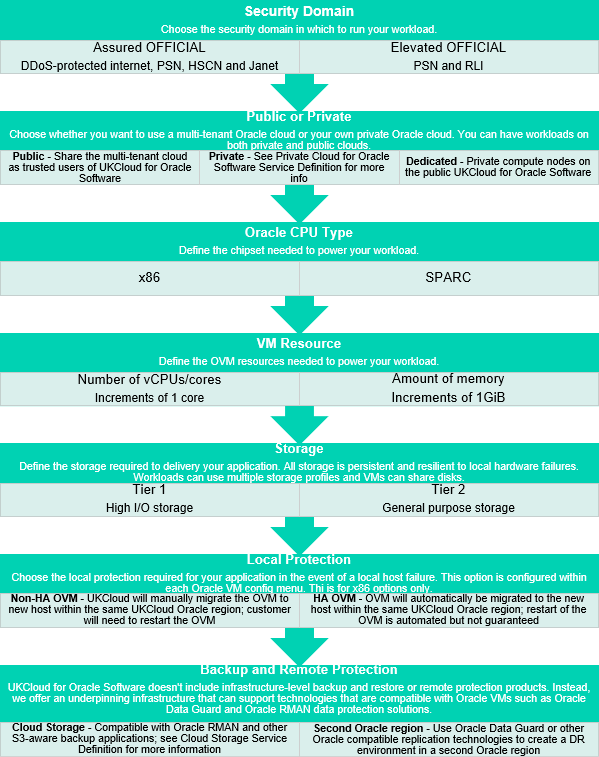

# UKCloud for Oracle Software Service Definition

## What is UKCloud for Oracle Software?

UKCloud for Oracle Software provides a proven Oracle Infrastructure as a Service that's tailor made for running your Oracle workloads in the cloud. This service enables you to move technologies such as Oracle Database, Oracle WebLogic Server, Oracle Primavera, E-Business Suite and more to our secure sovereign cloud platform quickly and easily, while enjoying the economies of scale of the cloud. You can then connect your Oracle applications to the non-Oracle workloads that you have within the rest of the multi-cloud ecosystem. It is billed hourly and supported free of charge.

## What the service can help you achieve

- Overcome licencing barriers of putting Oracle software in the cloud using Oracle hypervisor technology

- Achieve your data centre modernisation strategy by moving both legacy and modern Oracle workloads to the cloud

- Streamline Oracle licensing by adjusting VM resources to suit performance and only licence the CPU cores used

- Improve data locality by having your Oracle workloads next to your other cloud workloads

- Ensure business continuity by using UKCloud for Oracle Software as part of your disaster recovery strategy

## Product options

The service is designed to be flexible and enables you to mix and match from a range of pre-defined options for each virtual machine and change them when required.

## Pricing and packaging

UKCloud for Oracle Software VM pricing can be as low as 9p per hour. Full pricing with all options, including licensing and connectivity, is available in the [UKCloud Pricing Guide](https://ukcloud.com/pricing-guide).

## Accreditation and information assurance

The security of our platform is our number one priority. We've always been committed to adhering to exacting standards, frameworks and best practice. Everything we do is subject to regular independent validation by government accreditors, sector auditors and management system assessors. Details are available on the [UKCloud website](https://ukcloud.com/governance/).

## Connectivity options

UKCloud provides one of the best-connected cloud platforms for the UK Public Sector. We enable access to our secure platform by DDoS-protected internet, PSN, Janet, HSCN, RLI and your own leased lines via our HybridConnect or CrownConnect services. The full range of flexible connectivity options is detailed in the [UKCloud Pricing Guide](https://ukcloud.com/pricing-guide).

## An SLA you can trust

We understand that enterprise workloads need a dependable service that underpins the reliability of the application to users and other systems, which is why we offer one of the best SLAs on G-Cloud. For full details on the service SLA, including measurements and service credits, see the [*SLA definition*](../other/other-ref-sla-definition.md).

## The small print

For full terms and conditions, including onboarding and responsibilities, refer to the [*Terms and conditions documents*](../other/other-ref-terms-and-conditions.md).

For more information about this service, see the [*Service Scope*](orcl-sco.md) and [*FAQs*](orcl-faq.md).

## Why UKCloud?

UKCloud is dedicated to the digital transformation of our nation's public services through our flexible, secure and cost-effective multi-cloud platform and the expertise of our people and partners. We believe that diversity of technology drives value and innovation and so we bring together different cloud technologies, with different deployment models spanning on-premises (private cloud), on-campus (Government's Crown Campus) and off-campus global public cloud services. This enables you to choose the right cloud for creating new workloads or migrating or replacing existing applications to the cloud with specialist SaaS solutions.

We recognise the importance of public services to UK citizens and businesses, which is why we include the highest level of support to all our customers at no extra cost. This includes dedicated 24/7 UK support, a Network Operations Centre (NOC), utilising protective and proactive monitoring tools, and access to UKCloud's experts. UKCloud can also provide outcome-based professional services or managed services to help you with digital transformation.

## Feedback

If you find a problem with this article, click **Improve this Doc** to make the change yourself or raise an [issue](https://github.com/UKCloud/documentation/issues) in GitHub. If you have an idea for how we could improve any of our services, send an email to <feedback@ukcloud.com>.
