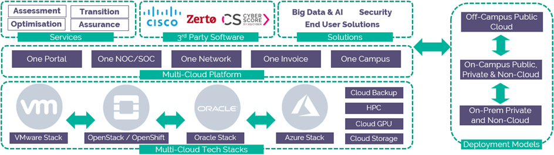

# UKCloud for Oracle Software Service Definition

## Why UKCloud?

UKCloud is dedicated to helping the UK Public Sector and UK citizens by delivering more choice and flexibility through safe and trusted cloud technology. We own and operate a UK-sovereign, industry-leading, multi-cloud platform, located within the Government’s Crown Campus, offering multiple cloud technologies, including VMware, Azure, OpenStack, OpenShift and Oracle. This enables customers to choose the right technology for creating new workloads or migrating existing applications to the cloud.

We recognise the importance of government services in making the country run smoothly, which is why we include the highest level of support to all our customers at no extra cost. This includes a dedicated 24/7 UK telephone and ticket support, and Network Operations Centre (NOC) utilising protective and proactive monitoring tools, and access to UKCloud’s technical experts.

## What is UKCloud for Oracle Software?

UKCloud for Oracle provides a proven Oracle Infrastructure as a Service that's tailor made for running your Oracle workloads in the cloud. This service enables you to move technologies such as Oracle Database, Oracle WebLogic Server, Oracle Fusion Applications, E-Business Suite and more to our secure sovereign cloud platform quickly and easily whilst enjoying the economies of scale of the cloud. You can then connect your Oracle applications to the non-Oracle workloads that you have within the rest of the multi-cloud ecosystem. It is billed hourly with no minimum contracts and supported free of charge.

For full information regarding this product, we have [Service Scopes](orcl-sco.md), [FAQs](orcl-faq.md) and other relevant documents on our [Knowledge Centre](https://docs.ukcloud.com).

## What the service can help you achieve

- Overcome licencing barriers of putting Oracle software in the cloud using Oracle hypervisor technology

- Remove reliance on on-premise Oracle infrastructure by running Oracle workloads within the cloud

- Streamline Oracle licencing by adjusting VM resources to suit performance and only licence the x86 or SPARC CPU cores used

- Improve data locality by having your Oracle workloads next to your other cloud workloads

- Ensure business continuity by using UKCloud for Oracle Software as part of your disaster recovery strategy

## Product options

The service is designed to be flexible and allows you to mix and match from a range of pre-defined options for each virtual machine and change them when required.

### Security domain

Choose the security domain in which you want to run your workload

- Assured OFFICIAL - DDoS-protected internet, PSN, HSCN and Janet

- Elevated OFFICIAL - PSN and RLI

- Above OFFICIAL - SLI and Crypto

### Public or Private

- Public - Share the multi tenant cloud as trusted users of UKCloud for Oracle Software

- Private - See [Private Cloud for Oracle Software Service Definition](../private-cloud/prc-sd-orcl.md) for more info

- Dedicated - Private compute nodes on the public UKCloud for Oracle Software

### Oracle CPU type

Define the chipset needed to power your workload

- x86

- SPARC

### VM resource

Define the OVM resources needed to power your workload

- Number of Cores - Increments of 1 core

- Amount of Memory - Increments of 1 GiB

### Storage

Define the storage required to deliver your application. All storage is persistent and resilient to local hardware failures. Workloads can use multiple storage profiles

- Tier 1 - High I/O storage

- Tier 2 - General purpose storage

### Local protection

Choose the local protection required for your application in the event of a local host failure. This option is configured within each Oracle VM config menu. This is for x86 options only.

- Non HA OVM - UKC will manually migrate OVM to new host within same UKC Oracle region (You will need to restart the the OVM)

- HA OVM - OVM will automatically be migrated to new host within same UKC Oracle region (Restart of OVM is automated but not guaranteed)

### Backup & remote protection

UKCloud for Oracle Softwatre doesn't include infrastructure level backup and restore or remote protection products. Instead we offer an underpinning infrastructure that can support technologies that are compatible with Oracle VMs such as Oracle Data Guard and Oracle RMAN data protection solutions

- Multi Cloud Backup Storage - Compatible with Oracle RMAN and other DDBoost aware backup applicatons. See [MCBS Service Definition](../mcbs/mcbs-sd.md) for more info

- Second Oracle region - Use Oracle Data Guard or other Oracle compatible replication technologies to create a DR environment in a second Oracle region

## Pricing and packaging

UKCloud for Oracle Software VMs start at 9p per hour, and full pricing with all options including licensing and connectivity available in the [*UKCloud Pricing Guide*](../other/other-ref-pricing-guide.md).

## Accreditation and information assurance

The security of our platform is our number one priority. We’ve always been committed to adhering to exacting standards, frameworks and best practice. Everything we do is subject to regular independent validation by government accreditors, sector auditors, and management system assessors. Details are available on the [UKCloud website](https://ukcloud.com/governance/).

## Connectivity options

UKCloud provides one of the best-connected cloud platforms for the UK Public Sector. We offer a range of flexible connectivity options detailed in the [*UKCloud Pricing Guide*](../other/other-ref-pricing-guide.md) which enable access to our secure platform by DDoS-protected internet, native PSN, Janet, HSCN and RLI and your own lease lines via our HybridConnect service.

## An SLA you can trust

We understand that enterprise workloads need a dependable service that underpins the reliability of the application to users and other systems, which is why we offer one of the best SLAs on G-Cloud. For full details on the service SLA including measurements and service credits, please view the [*SLA defintion article*](../other/other-ref-sla-definition.md) on the UKCloud Knowledge Centre.

<table>
  <tr>
    <th></th>
    <th>Non-HA x86</th>
    <th>HA x86</th>
    <th>SPARC / Dedicated SPARC with resilience</th>
    <th>Dedicated SPARC without resilience</th>
  </tr>
  <tr>
    <td><b>Service level agreement</b></td>
    <td>99.95%</td>
    <td>99.99%</td>
    <td>99.95%</td>
    <td>95.00%</td>
  </tr>
  <tr>
    <td><b>Portal level agreement</b></td>
    <td colspan="4">99.90%</td>
  </tr>
  <tr>
    <td><b>Measurement of SLA</b></td>
    <td colspan="4">The Service is deemed unavailable if a customer is unable to restart an VM after it becomes unresponsive due to a fault recognised at the IaaS layer or below, that is, the fault is within UKCloud-controlled components, such as the physical infrastructure availability, storage, power and internal networking such as physical firewalls and routers. As Oracle workloads are pinned to processor cores, x86 VMs will only be automatically moved in the event of a host failure if HA feature has been enabled by the customer on each x86 VM. Customers are responsible for enabling the HA feature on x86 VMs. If the x86 HA feature is not enabled, or SPARC is used, UKCloud will need to move Oracle VMs to a new host so they can be restarted. The manual movement of VMs is covered by the Non-HA x86 / SPARC SLAs. Customers are responsible for restarting VMs and should configure alerts to be notified if an Oracle VM failure occurs This will not be a live migration and an application restart will be required. Customers will be advised if an action is to be performed.</td>
  </tr>
  <tr>
    <td><b>Key exclusions</b></td>
    <td colspan="4">The following are examples of what is not covered by the SLA:<ul><li>Faults within your control, such as client application issues<li>Faults within external connectivity providers (for example DDoS-protected internet, PSN, Janet or HSCN) and components co-located at UKCloud</ul></td>
  </tr>
</table>

## The small print

For full terms and conditions including onboarding and responsibilities, please refer to the [*Terms and conditions documents*](../other/other-ref-terms-and-conditions.md).

## Feedback

If you find an issue with this article, click **Improve this Doc** to suggest a change. If you have an idea for how we could improve any of our services, visit [UKCloud Ideas](https://ideas.ukcloud.com). Alternatively, you can contact us at <products@ukcloud.com>.
