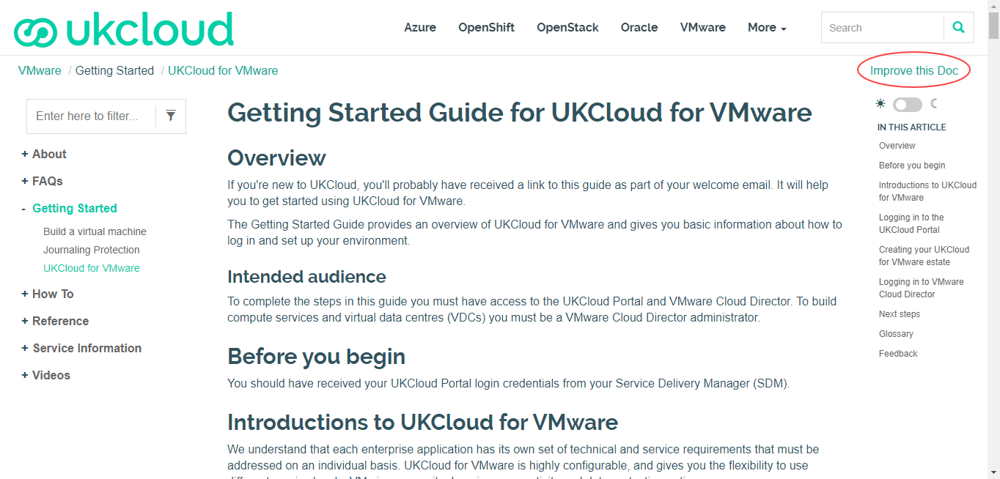
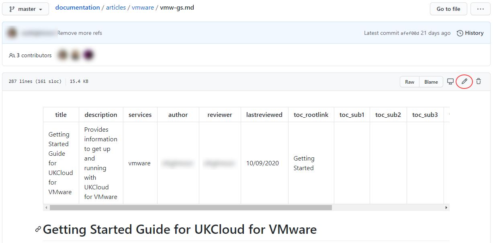
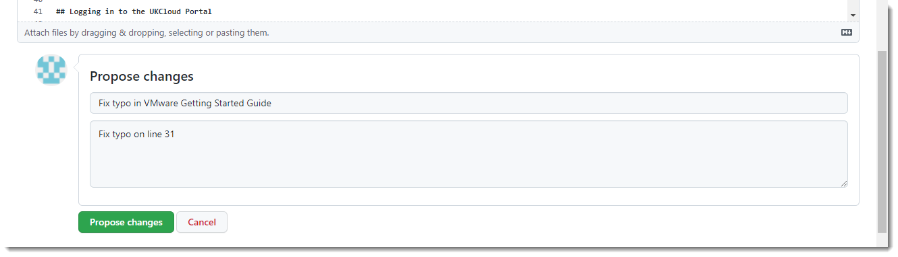
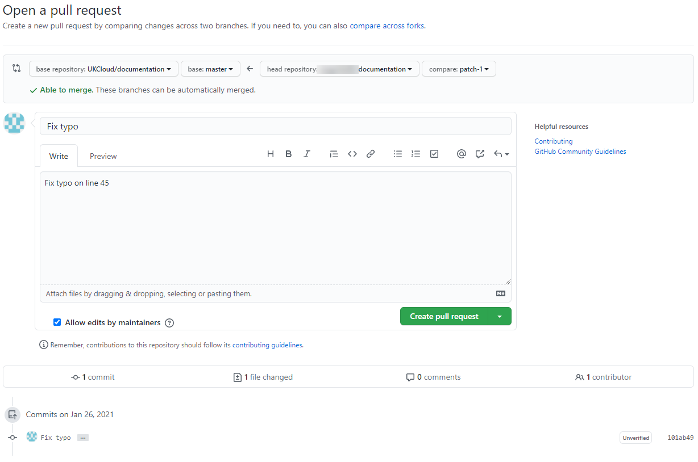

# How to contribute to the UKCloud Knowledge Centre

## Overview

Content for the UKCloud Knowledge Centre is stored in a GitHub repository, which means that anyone with a GitHub account can submit changes to articles and even add new articles.

This article explains how to submit changes to UKCloud Knowledge Centre articles.

> [!IMPORTANT]
> Before making any changes, make sure you're familiar with our [guidelines](other-ref-knowledge-guidelines.md) for contributing to Knowledge Centre articles.

### Intended audience

To submit changes or new articles you must have a GitHub account.

## Submitting minor changes to an existing article

1. Go to the UKCloud Knowledge Centre at:

    <https://docs.ukcloud.com>

2. Find the article that you want to edit.

3. Click **Improve this Doc** to open the article in GitHub.

    

4. If necessary, log in to GitHub.

5. Click the **Edit the file** (pencil) icon.

    

6. Edit the article as required.

7. When you're done, at the bottom of the page, enter a short descriptive name for your change and, optionally, a longer description to provide more detail.

8. Click **Propose file change**.

    

9. Review the changes you've made.

10. Click **Create pull request**.

11. On the **Write** tab, provide more details about the change you've made, if necessary, then click **Create pull request**.

    

    > [!NOTE]
    > You must create the Pull Request to submit your changes.

12. The Pull Request is submitted to UKCloud to review and merge into the master branch if appropriate. We may contact you to discuss the details of your changes if required.

## Submitting larger changes across multiple articles or creating new articles

If you're familiar with working in GitHub and want to submit changes to multiple articles, or even create a new article, you may find it easier to [fork the repository](https://help.github.com/articles/fork-a-repo/) and work on your changes there before creating your Pull Request.

For a template to get you started with a new article, see [*UKCloud Knowledge Centre article template*](other-ref-knowledge-template.md).

## Suggesting significant changes

If you want to suggest significant changes to the Knowledge Centre, raise an issue within GitHub or contact <products@ukcloud.com> to discuss your ideas.

## Related videos

- [*Editing Knowledge Centre articles video*](other-vid-kc-contribution.md)

## Feedback

If you find a problem with this article, click **Improve this Doc** to make the change yourself or raise an [issue](https://github.com/UKCloud/documentation/issues) in GitHub. If you have an idea for how we could improve any of our services, send an email to <feedback@ukcloud.com>.
