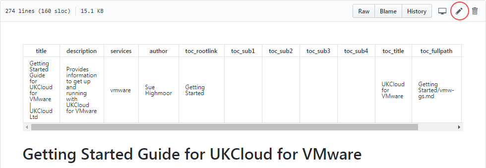
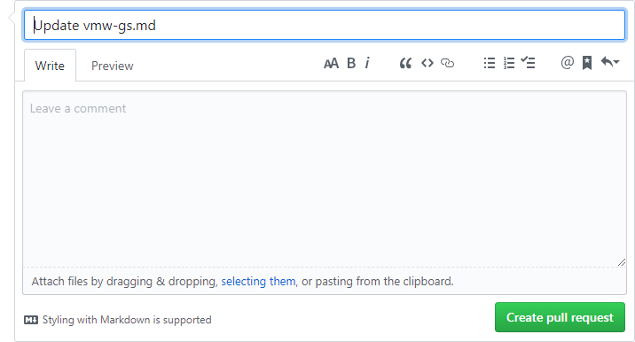

# How to contribute to the UKCloud Knowledge Centre

## Overview

Content for the UKCloud Knowledge Center is stored in a GitHub repository, which means that anyone with a GitHub account can submit changes to articles and even add new articles.

This article explains how to submit changes to UKCloud Knowledge Centre articles.

### Intended audience

To submit changes or new articles you must have a GitHub account.

## Submitting minor changes to an existing article

1. Go to the UKCloud Knowledge Center at:

    <http://docs.ukcloud.com>

2. Find the article that you want to edit.

3. Click **Improve this Doc** to open the article in GitHub.

    

4. If necessary, log in to GitHub.

5. Click the **Edit the file** (pencil) icon.

    

6. Edit the article as required.

7. When you're done, at the bottom of the page, enter a short descriptive name for your change and, optionally, a longer description to provide more detail.

8. Click **Propose file change**.

    

9. Review the changes you've made.

10. Click **Create pull request**.

10. On the **Write** tab, provide more details about the change you've made, if necessary, then click **Create pull request**.

    

12. The pull request is submitted to UKCloud to review and merge into the master branch if appropriate. We may contact you to discuss the details of your changes if required.

## Submitting larger changes to an article or creating new articles

If you're familiar with working in GitHub and want to submit more significant changes to an article, or even create a new articles, you may find it easier to [fork the repository](https://help.github.com/articles/fork-a-repo/) and work on your changes there before creating your pull request.

## Feedback

If you have any comments on this document or any other aspect of your UKCloud experience, send them to <products@ukcloud.com>.