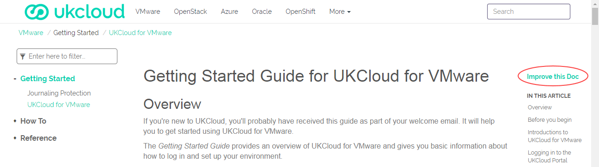

 **UKCloud Limited (“UKC”) and Virtual Infrastructure Group Limited (“VIG”) (together “the Companies”) – in Compulsory Liquidation**

On 25 October 2022, the Companies were placed into Liquidation with the Official Receiver appointed as Liquidator and J Robinson and A M Hudson simultaneously appointed as Special Managers to manage the liquidation process on behalf of the Official Receiver.

Further information regarding the Liquidations can be found here: <https://www.gov.uk/government/news/virtual-infrastructure-group-limited-and-ukcloud-limited-information-for-creditors-and-interested-parties>

Contact details: 
For any general queries relating to the Liquidations please email <ukcloud@uk.ey.com> 
For customer related queries please email <ukcloudcustomers@uk.ey.com> 
For supplier related queries please email <ukcloudsuppliers@uk.ey.com>

# How to contribute to the UKCloud Knowledge Centre

## Overview

Content for the UKCloud Knowledge Centre is stored in a GitHub repository, which means that anyone with a GitHub account can submit changes to articles.

This article explains how to submit changes to UKCloud Knowledge Centre articles.

> [!IMPORTANT]
> Before making any changes, make sure you're familiar with our [guidelines](other-ref-knowledge-guidelines.md) for contributing to Knowledge Centre articles.

### Intended audience

This article is intended for anyone who wants to update a Knowledge Centre article. To submit changes you must have a GitHub account.

## Submitting changes to an existing article

1. Go to the UKCloud Knowledge Centre at:

    <https://docs.ukcloud.com>

2. In the article that you want to edit, click **Improve this Doc** to open the article in GitHub.

    

3. If necessary, log in to GitHub.

4. Click the edit icon (pencil).

    

5. Edit the article as required, being sure to follow the appropriate [guidelines](other-ref-knowledge-guidelines.md).

6. When you're done, at the bottom of the page, enter a title for your change and, optionally, a description to provide more detail.

7. Click **Propose changes**.

    

8. On the *Comparing changes* page, scroll down and review the changes you've made.

9. If you're happy with your changes, click **Create pull request**.

    

10. On the *Open a pull request* page, you can provide more details about the change you've made, then click **Create pull request**.

    

    > [!NOTE]
    > You must click this second **Create pull request** button to actually create the pull request and submit your changes.

11. The pull request is submitted to UKCloud to review and merge into the master branch if appropriate. We may contact you to discuss the details of your changes if necessary.

    

## Suggesting significant changes or requesting new articles

If you want to suggest significant changes to the Knowledge Centre, or have a suggestion for a new article, [raise an issue](https://github.com/UKCloud/documentation/issues) within GitHub or contact <products@ukcloud.com> to share your ideas.

## Feedback

If you find a problem with this article, click **Improve this Doc** to make the change yourself or raise an [issue](https://github.com/UKCloud/documentation/issues) in GitHub. If you have an idea for how we could improve any of our services, send an email to <feedback@ukcloud.com>.
