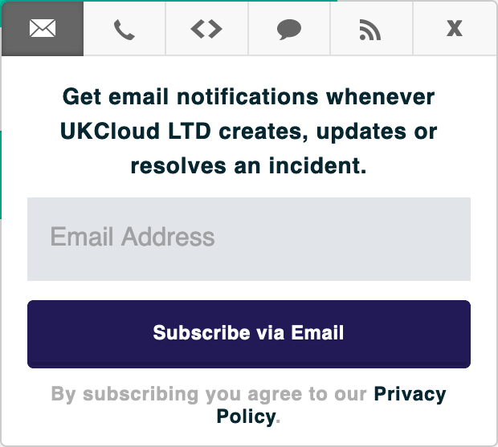
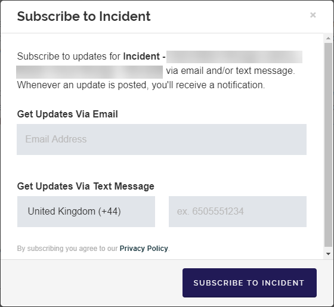

# How to subscribe to service status notifications

## Overview

The [UKCloud Service Status page](https://status.ukcloud.com) enables you to monitor the availability and overall health of the services on the UKCloud platform.

You can subscribe to the Service Status page to receive notifications to keep up to date with the latest status and maintenance information.

## Subscribing to the Service Status page

You can subscribe to the Service Status page to receive updates when information on the page is updated.

1. On the UKCloud Service Status page, click the **Subscribe to Updates** button.

    

2. To receive email notifications:

    - Click the envelope icon, enter your email address, then click **Subscribe via Email**.

        

    - Confirm your subscription by clicking the **Confirm subscription** button in the email you receive.

    - On the *Notifications Subscription* page, you can specify individual components for which you want to receive notifications.

        

3. To receive text notifications:

    - Click the telephone handset icon, enter your phone number, then click **Subscribe via Text Message**.

        

    - Click the link in the confirmation text message you receive to manage your subscriptions.

4. To receive webhook notifications, click the code icon (**<>**), enter the URL of the endpoint to send the webhook to and the email address to send any associated error messages, then click **Subscribe to Notifications**.

    

    You'll need to set up an endpoint to receive the webhook requests. For more information about webhooks, see the Atlassian Statuspage documentation: [Webhook Notifications](https://help.statuspage.io/help/webhook-notifications). For example code for setting up an endpoint, see [*How to use webhooks to receive service status notifications*](other-how-use-webhooks.md).

5. To subscribe to the Atom/RSS feed, click the RSS icon and then click the **Atom Feed** or **RSS Feed** link.

    

## Subscribing to a specific incident or maintenance window

You can also subscribe to notifications for a specific incident or maintenance window.

1. On the UKCloud Service Status page, click the **Subscribe** link in the banner for the incident or maintenance alert that you want to subscribe to.

    

2. Enter your email address or phone number, then click **Subscribe to Incident**.

    

## Subscribing to Portal notifications

Incident notifications are also reported via the UKCloud Portal. You can subscribe to receive Portal notifications via email. For more information, see [*How to sign up for Portal notifications*](../portal/ptl-how-signup-notifications.md).

## Feedback

If you find a problem with this article, click **Improve this Doc** to make the change yourself or raise an [issue](https://github.com/UKCloud/documentation/issues) in GitHub. If you have an idea for how we could improve any of our services, send an email to <feedback@ukcloud.com>.
