# How to use the UKCloud Pricing Estimation Tool

## Overview

The UKCloud Pricing Estimation Tool has been created to assist in the cost estimation of our core G-Cloud 10 services. Refer to the G-Cloud 10 Pricing Guide for information regarding service options, pricing options, any required set up fees and product rules. To achieve the most accurate estimate please consult with one of our Cloud Architects.

> [!IMPORTANT]
> You should always ensure that you're using the latest version of the Pricing Estimation Tool by checking on the [UKCloud website](https://ukcloud.com/price-estimator-tool/). Also, note that this tool provides an estimate based on the selections you make. Your actual consumption of the service may be different, resulting in higher or lower actual costs.

> [!NOTE]
> There are some known bugs in the latest versions of the tool. For more information see [Known bugs with the UKCloud Pricing Estimation Tool](other-ref-pricing-tool-bugs.md)

## Installing the tool

The Windows version of the tool is provided as a  `.exe` file and the MacOS version is packaged as a `.dmg` file.

Once you've downloaded the install file from the UKCloud web site, depending on the version of the tool you're using, you may need to install it first.

### Installing the Windows version

For Windows, the download is provided as a `.exe` file and you can open it straight from the download by double-clicking the file.

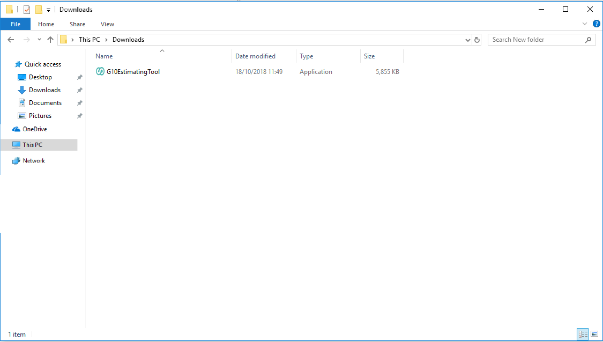

### Installing the Mac version

1. For MacOS, the download is provided as a `.dmg` file. To install the Mac version, double-click to mount the `.dmg` image file.

    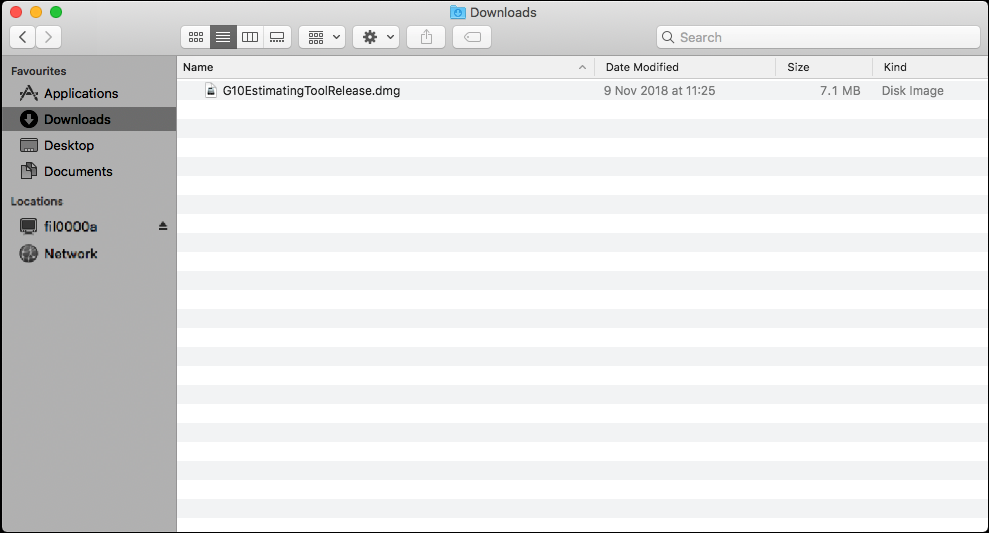

    This will open the image as a window.

    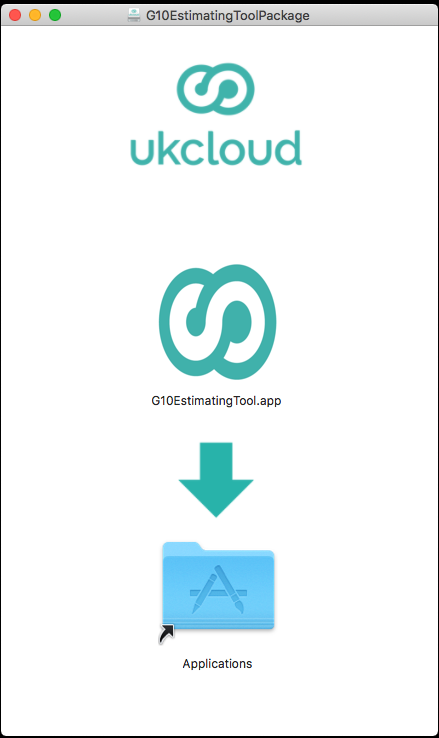

2. Drag the app into your applications folder.

    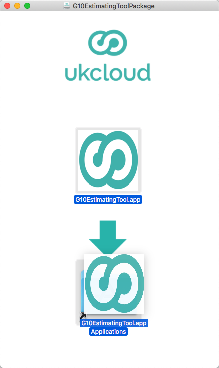

3. Open your applications folder and double-click the app **G10EstimatingTool.app**. You can identify this app by the UKCloud logo.

    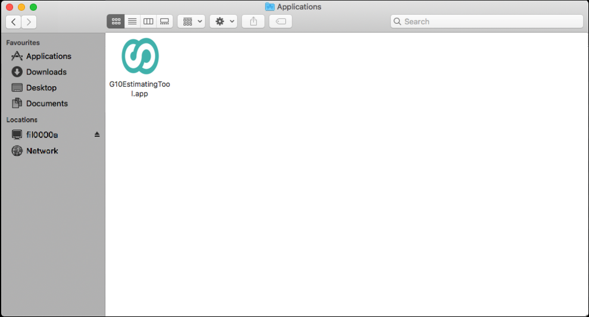

## Using the tool

Both the Mac and Windows versions of the tool operate the same way. This guide shows the Windows version, but the MacOS version is identical.

1. Open the tool and click **Add** to begin your estimate.

    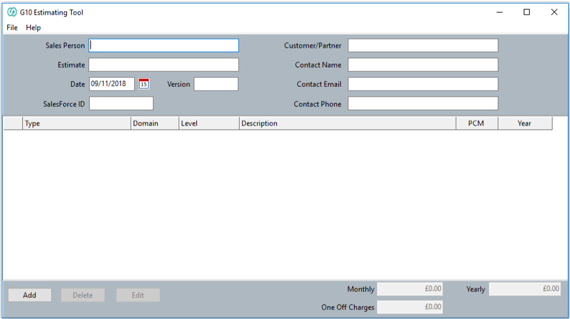

2. In the newly opened window, select the product or service you want to price using the dropdown menu.

    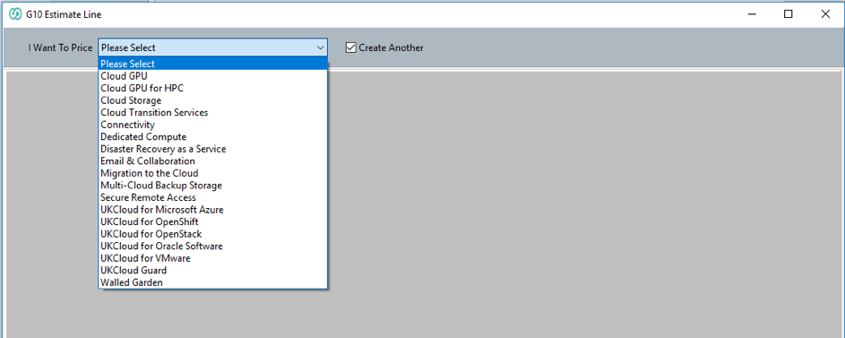

3. Choose the various features you want to include in your estimate using the dropdown menus provided.

    > [!NOTE]
    > The more detail you select, the more accurate the estimate will be. The tool will automatically update the monthly and yearly estimates as you select the various options.

    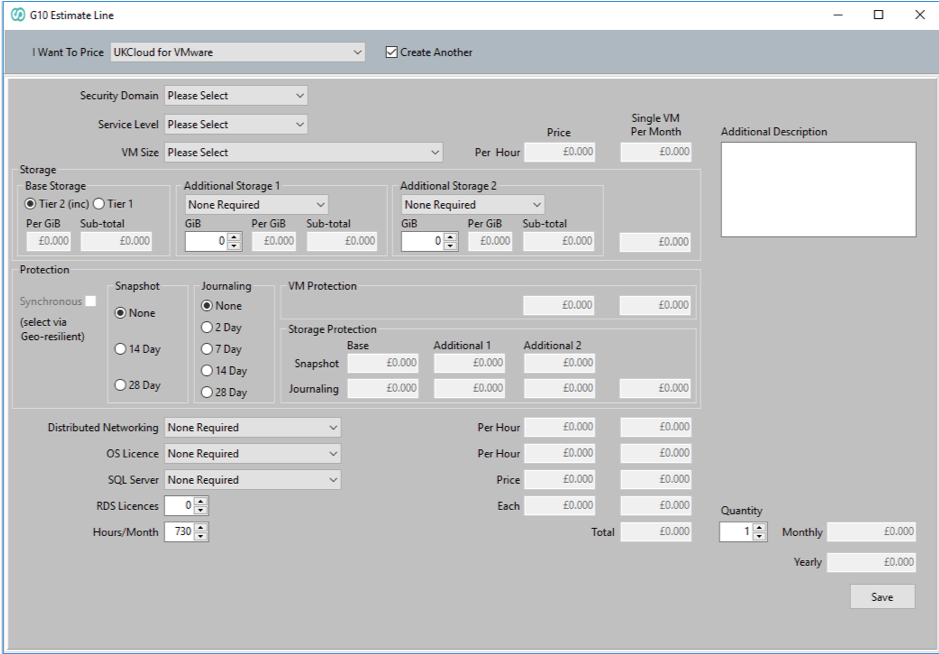

4. Any invalid selections or combinations will result in a dialogue box appearing stating why this selection is invalid. The tool will then be returned to its state prior to the selection that caused this error message to appear.

    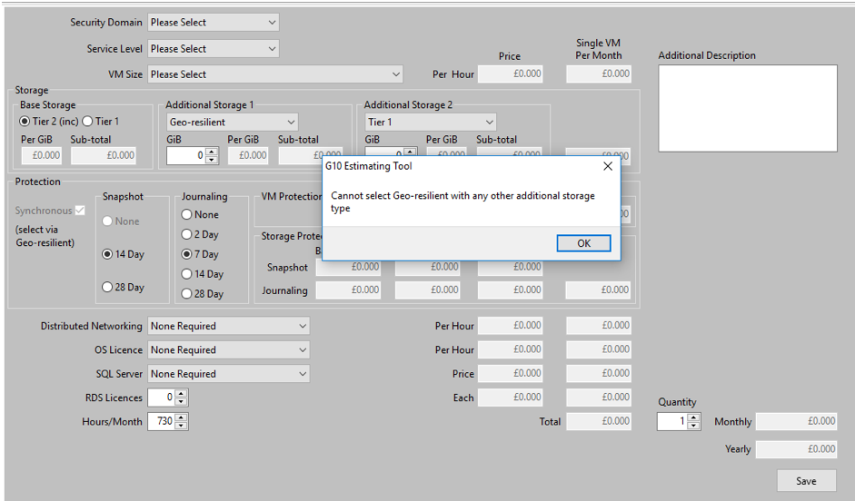

5. You can add descriptions to your estimates by entering information in the **Additional Description** field.

    This will add the description within the line item and you can use it as a label as you build up your estimate package. This is all reflected in the PDF the tool can produce.

    

6. When you're done, click **Save**. The estimate will be displayed in the original window.

    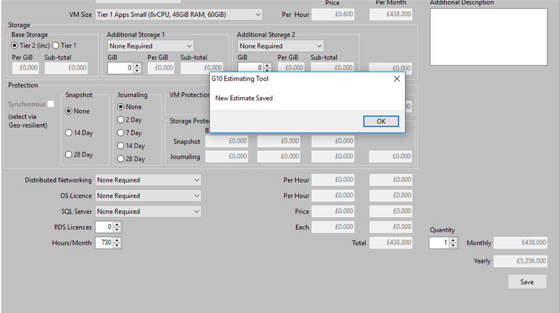

7. Your estimates will be displayed the next time you open the tool. You can use the **Edit** button to make changes to existing estimates, once the changes have been made click the **Save** button again to update the edited line. This allows for changes to an existing estimate to update the total cost, showing how changes in usage affects the total.

    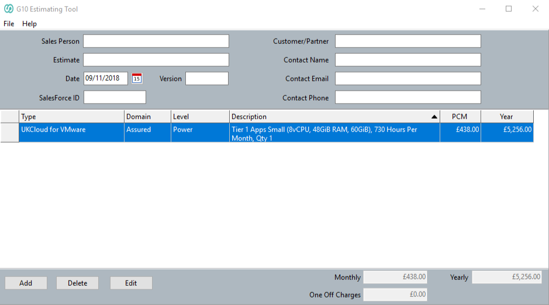

8. The tool also provides a print function. In the menu, select **File** then **Print** to print your estimates. If a PDF printer is installed, you can print estimates in PDF format.

    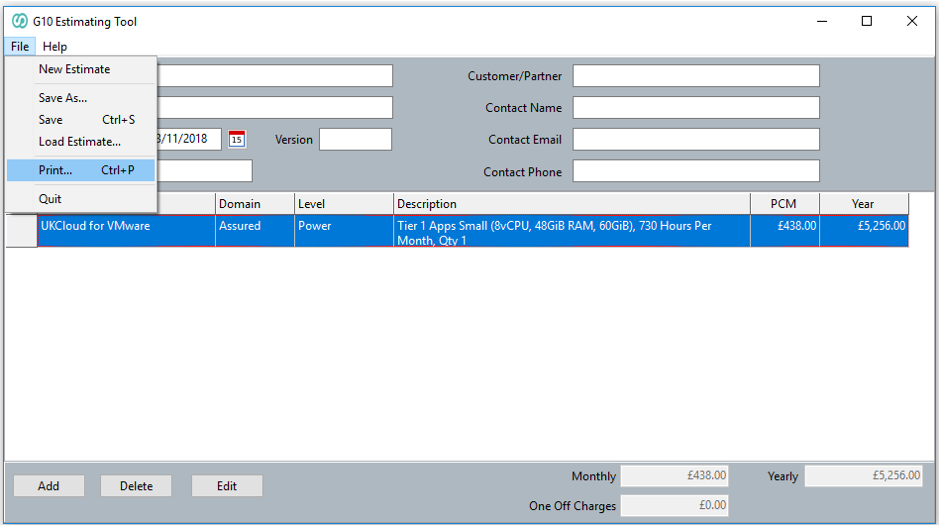

    The following image provides an example of how the printed version will look.

    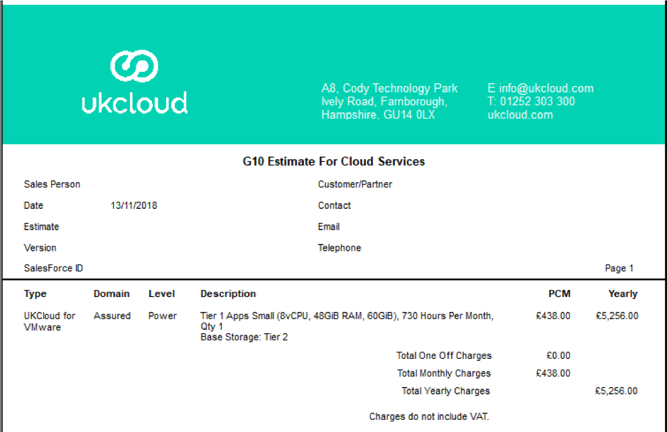

9. You can copy estimates to Excel or other office software, by right-clicking the estimate and selecting **Copy All to Clipboard**. You can then paste the information from the clipboard into your desired software.

    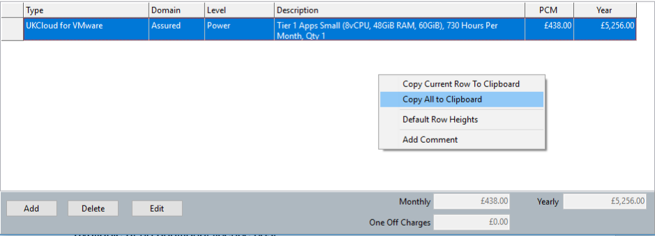

    The following image provides an example of an estimate copied into an Excel worksheet.

    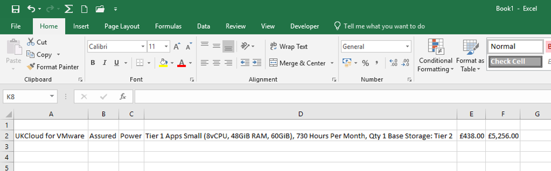

## Related videos

- [*UKCloud Pricing Estimation Tool overview video*](other-vid-pricing-tool-overview.md)

## Feedback

If you find an issue with this article, click **Improve this Doc** to suggest a change. If you have an idea for how we could improve any of our services, visit [UKCloud Ideas](https://ideas.ukcloud.com). Alternatively, you can contact us at <products@ukcloud.com>.
