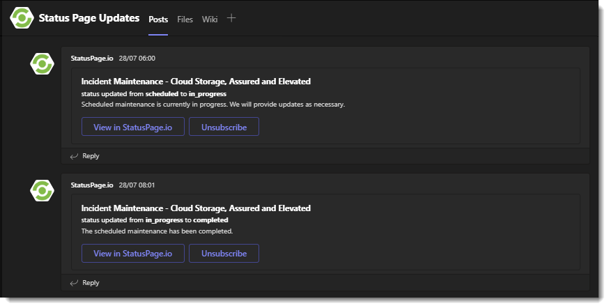

#### UKCloud Limited (“UKC”) and Virtual Infrastructure Group Limited (“VIG”) (together “the Companies”) – in Compulsory Liquidation

On 25 October 2022, the Companies were placed into Liquidation with the Official Receiver appointed as Liquidator and J Robinson and A M Hudson simultaneously appointed as Special Managers to manage the liquidation process on behalf of the Official Receiver.

Further information regarding the Liquidations can be found here: <https://www.gov.uk/government/news/virtual-infrastructure-group-limited-and-ukcloud-limited-information-for-creditors-and-interested-parties>

Contact details:<br>
For any general queries relating to the Liquidations please email <ukcloud@uk.ey.com><br>
For customer related queries please email <ukcloudcustomers@uk.ey.com><br>
For supplier related queries please email <ukcloudsuppliers@uk.ey.com>

# How to use webhooks to receive service status notifications

## Overview

The [UKCloud Service Status page](https://status.ukcloud.com) enables you to subscribe to updates using webhook notifications. To use these notifications, you need to set up an endpoint to receive and process these notifications. For more information about webhooks, see the Atlassian Statuspage documentation: [Webhook Notifications](https://help.statuspage.io/help/webhook-notifications).

This article provides sample PHP code that processes webhook HTTP POST updates from the UKCloud Service Status page in a JSON object (see [*Sample code for a webhook endpoint*](#sample-code-for-a-webhook-endpoint)).

> [!IMPORTANT]
> Input directly from the internet should never be trusted! Before implementing this code please ensure you have safely sanitized all user input and taken the relevant security precautions to prevent yourself from being hacked. UKCloud takes no responsibility for any damage caused to any system by use of this code.

After you upload the file containing your code to your public web server, you can use the endpoint to subscribe to webhook notifications on the UKCloud Service Status page. For more information, see [*Understanding the UKCloud Service Status page*](other-ref-status-page.md).


This article also shows how you can use webhooks to send status notifications to a Microsoft Teams channel (see [*Adding a webhook via Microsoft Teams*](#adding-a-webhook-via-microsoft-teams)).

## Sample code for a webhook endpoint

```php
<?php

//Input directly from the internet should never be trusted!
//Before implementing this please ensure you have safely sanitized all user input
//and taken the relevant security precautions to prevent yourself from being hacked.
//UKCloud takes no responsibility for any damage caused to any system by use of this code.

$input = file_get_contents('php://input');

$statusObject = json_decode($input);

if(json_last_error() !== JSON_ERROR_NONE){
  die('Invalid JSON');
}

if(!isset($statusObject->page->status_description)){
  die('Invalid Input');
}

//Status page general information
echo "<br><br>Status Description: " . $statusObject->page->status_description;
echo "<br>Status Indicator: " . $statusObject->page->status_indicator;

//The below if statement catches component status changes
if(isset($statusObject->component_update)){
  echo "<br><br>Component Name: " . $statusObject->component->name;
  echo "<br>Old Status: " . $statusObject->component_update->old_status;
  echo "<br>New Status: " . $statusObject->component_update->new_status;
}

//The below if statement catches incident status changes
if(isset($statusObject->incident)){
  echo "<br><br>Incident Name: " . $statusObject->incident->name;
  echo "<br>Incident Impact: " . $statusObject->incident->impact;
  echo "<br>Incident Status: " . $statusObject->incident->status;
  echo "<br>Created At: " . $statusObject->incident->created_at;
  echo "<br>Updated At: " . $statusObject->incident->updated_at;
  echo "<br>Monitoring At: " . $statusObject->incident->monitoring_at;

  echo "<br><br>Incident Updates: ";

  //The below foreach loop goes through each component status update
  foreach ($statusObject->incident->incident_updates as $indUpdate){
    echo "<br><br>Incident Update Body: <br>" . $indUpdate->body;
    echo "<br>Incident Update Created At: " . $indUpdate->created_at;
    echo "<br>Incident Update Updated At: " . $indUpdate->updated_at;
    echo "<br>Incident Update Displayed At:  " . $indUpdate->display_at;
    echo "<br>Incident Update Status: " . $indUpdate->status;
  }

  //The below switch statement allows you to perform your actions when an
  //incident notification is updated
  switch($statusObject->incident->status){
    case "investigating":
    case "identified":
    case "monitoring":
    case "resolved":
      echo "<br><br>This is an incident!";
      break;
  }

  //The below switch statement allows you to perform your actions when an
  //maintenance notification is updated
  switch($statusObject->incident->status){
    case "scheduled":
    case "in_progress":
    case "verifying":
    case "completed":
      echo "<br><br>This is a maintenance piece!";
      break;
  }
}

?>
```

## Adding a webhook via Microsoft Teams

You can also add a webhook via Microsoft Teams to send status notifications to a Teams channel.

Incidents and scheduled maintenance events each have their own payload data. The payload is sent via HTTP POST to the webhook URL.

To add a webhook via Microsoft Teams:

1. Enable the Microsoft Teams Status.io plugin from [StatusPage.io](https://appsource.microsoft.com/en-us/product/office/WA104381592?tab=Overview).

2. When you've enabled the plugin, create a new channel in Teams with a title of your choice for the status page notification updates.

3. From the channel options menu (three dots), select **Connectors**.

   

4. Add the Status.io connector to your Teams channel

   

5. Add a name for the connector and click **Create**.

   

6. Make a note of the endpoint URL provided in the **Webhook URL** field then click **Done**.

7. Go to the [UKCloud Service Status page](https://status.ukcloud.com/).

8. Click **Subscribe To Updates**.

9. Select the **<>** option.

   

10. In the **Webhook URL** field, enter the URL you noted earlier.

11. In the **Email address** field, enter an email address to use for any error messages.

12. Click **Subscribe**.

13. You will now receive notifications, similar to those shown below, in the Teams channel that you created.

    

## Feedback

If you find a problem with this article, click **Improve this Doc** to make the change yourself or raise an [issue](https://github.com/UKCloud/documentation/issues) in GitHub. If you have an idea for how we could improve any of our services, send an email to <feedback@ukcloud.com>.
