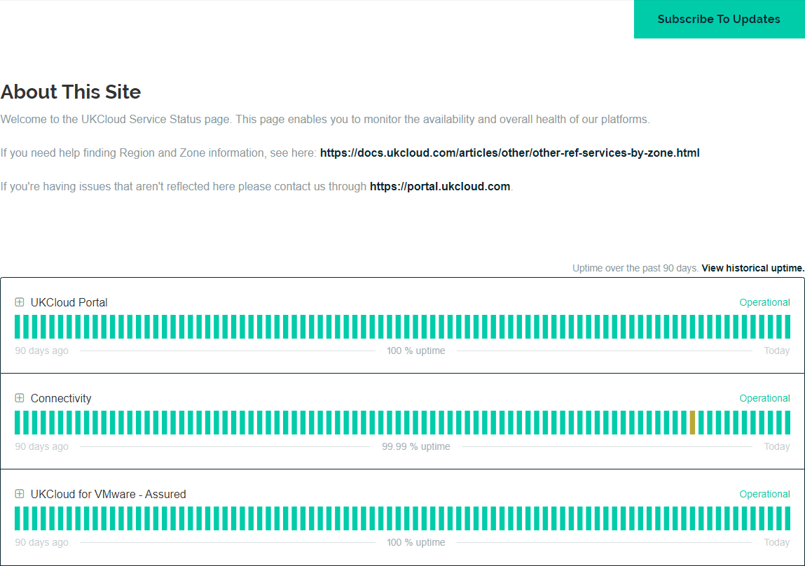

# How to view UKCloud service status information

## Overview

The [UKCloud Service Status page](https://status.ukcloud.com) enables you to monitor the availability and overall health of the services on the UKCloud platform.

## Viewing status information

### Platform status

Incidents are displayed at the top of the page and are indicated by a yellow (performance degraded) or red (outage) banner, with details of the incident and its current status.

Scheduled maintenance is indicated by a blue banner, with details of what the maintenance work involves and its current status.

If there are no incident or scheduled maintenance alerts, a green banner at the top displays `All Systems Operational`.

Below the alerts for incidents and maintenance, you can see any general information about the status of the platform.

Click **View historical uptime** to view uptime and incident information for past months.

Upcoming maintenance work and recent incidents are listed at the bottom of the status page.

### Service status

As well as the overall status of the platform, the status page also shows the status of each service on the UKCloud platform.

For each service, you can see the availability over the last 90 days, with each day represented by a bar. Hover over a bar to see a popup with details for that day. If there are no issues with a service, the status is reported as `Operational`.

The uptime figure indicates what percentage of the last 90 days the service was available for.

Click the **+** icon to expand the service to see the status of specific components within the service. For example, for Connectivity, you can see the status of each connectivity type (Internet, PSN, HSCN, Janet, RLI); for UKCloud for VMware, you can see the status for each UKCloud zone.

If service availability is impacted, the bar for that day displays in a different colour and the status is reported as `Under Maintenance`, `Degraded Performance` or `Outage`.

## Subscribing to the status page

You can subscribe to the status page to receive updates when information is updated.

1. On the UKCloud Service Status page, click the **Subscribe to Updates** button.

    

2. To receive email notifications:

    1. Click the envelope icon, enter your email address, then click **Subscribe via Email**.

        

    2. Confirm your subscription by clicking the **Confirm subscription** button in the email you receive.

    3. On the *Notifications Subscription* page, you can specify individual components for which you want to receive notifications.

        

3. To receive text notifications:

    1. Click the telephone handset icon, enter your phone number, then click **Subscribe via Text Message**.

        

    2. Click the link in the confirmation text message you receive to manage your subscriptions.

4. To receive webhook notifications, click the code icon (**<>**), enter the URL to send the webhook to and the email address to send any associated error messages to, then click **Subscribe to Notifications**.

    

5. To subscribe to the Atom/RSS feed, click the RSS icon and then click the **Atom Feed** or **RSS Feed** link.

    

6. For more information about UKCloud Support, click the speech bubble icon, then click the **support site** link.

        

7. You can also subscribe to notifications for a specific incident or maintenance:

    1. Click the **Subscribe** link in the banner for that incident or maintenance alert.

        

    2. Enter your email address or phone number, then click **Subscribe to Incident**.

        

## Feedback

If you find an issue with this article, click **Improve this Doc** to suggest a change. If you have an idea for how we could improve any of our services, visit [UKCloud Ideas](https://ideas.ukcloud.com). Alternatively, you can contact us at <products@ukcloud.com>.