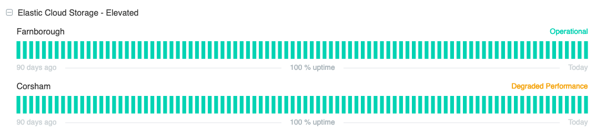

# How to view UKCloud service status information

## Overview

The [UKCloud Service Status page](https://status.ukcloud.com) enables you to monitor the availability and overall health of the services on the UKCloud platform.

## Viewing status information

### Platform status

A banner at the top of the status page indicates the general availability of the platform.

Scheduled maintenance is indicated by a blue banner, with details of what the maintenance involves and its current status.

Incidents are indicated by a yellow (performance degraded) or red (outage) banner, with details of the incident and its current status.

### Service status

As well as the overall status of the platform, the status page also shows the status of each service on the UKCloud platform.

For each service, you can see the availability over the last 90 days, with each day represented by a bar. If there are no issues with a service, the status is reported as `Operational`.

The uptime figure indicates what percentage of the last 90 days the service was available for.

If service availability is impacted, the bar for that day displays in a different colour and the status is reported as `Under Maintenance`, `Degraded Performance` or `Outage`.

Click the + icon to expand the service to see a breakdown of the service to see which specific components are affected.

Past incidents and scheduled maintenance are displayed at the bottom of the status page.

## Subscribing to the status page

You can subscribe to the status page to receive updates when information is updated.

1. On the UKCloud Service Status page, click the **Subscribe to Updates button**.

    

2. Select the method by which you want to receive notifications:

    - To receive email notifications, click the envelope icon, enter your email address, then click **Subscribe via Email**.

        

    - To receive text notifications, click the telephone handset icon, enter your phone number, then click **Subscribe via Text Message**.

        

    - To receive webhook notifications, click the code icon (**<>**), enter the URL to send the webhook to and the email address to send any associated error messages to, then click **Subscribe to Notifications**.

        

    - To subscribe to the Atom/RSS feed, click the RSS icon.

        

    - For help about the status page, click the speech bubble icon.

        

3. On the *Notifications Subscription* page, you can specify individual components for which you want to receive notifications.

    

## Feedback

If you find an issue with this article, click **Improve this Doc** to suggest a change. If you have an idea for how we could improve any of our services, visit [UKCloud Ideas](https://ideas.ukcloud.com). Alternatively, you can contact us at <products@ukcloud.com>.