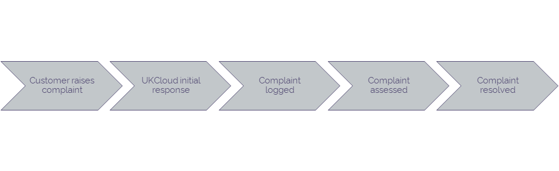

# UKCloud complaints procedure

## Overview

UKCloud is proud of its award-winning customer service and continually strives to provide you with the best possible customer service experience. If you are not completely satisfied with the level of service that you receive, you can raise a formal complaint.

Complaints should not be raised to escalate ongoing incidents, changes or requests, which should use the existing escalations process.

## Complaints procedure

To raise a complaint, send an email to <complaints@ukcloud.com>. We'll provide an initial response to you within five working days.

All complaints are logged and independently assessed by the Customer Services team, who will contact you directly to help ensure we resolve your complaint satisfactorily.

## Feedback

If you find an issue with this article, click **Improve this Doc** to suggest a change. If you have an idea for how we could improve any of our services, visit the [Ideas](https://community.ukcloud.com/ideas) section of the [UKCloud Community](https://community.ukcloud.com).
