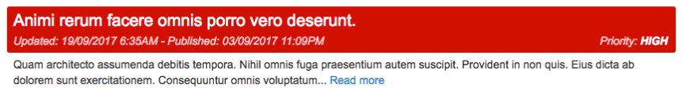
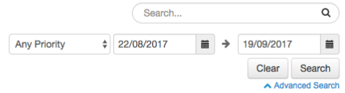
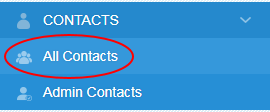
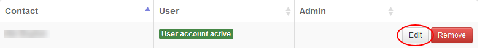
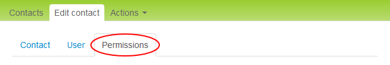
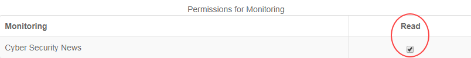

# Understanding the Cyber Security News page

## Overview

The *Cyber Security News* page in the UKCloud Portal, located under Monitoring, lets you see, at a glance, general threat briefs and security news from around the world. The page includes the ability to search and filter the different briefs, enabling you to customise the feed to better suit your interests.

## The feed

The *Cyber Security News* page includes general threat briefs and security news that has been analysed by e2e-assure. Each brief is colour coded to indicate the threat level and includes a headline sentence along with a longer description and timestamp.

### Briefs

Each brief includes a headline in bold text that sums up the threat to help you scan through the feed quickly. Briefs are also colour coded, ranging from yellow to red, to indicate the severity of the brief:  yellow indicating a low threat level and red indicating a high threat level.

A more in-depth description of the threat is included underneath the headline. This provides you with more information and recommended actions, depending on the threat.
The feed is listed in chronological order, enabling you to see which threats are most current. In addition, each brief includes two timestamps: one shows when the brief was originally published and the other shows when the brief was most recently updated.

### Searching and filtering

The *Cyber Security News* page includes searching and filtering tools to enable you to define exactly what content you want to see.

Using the search bar, you can type in any specific queries you want returned. Any word or phrase that you include in your search query will be matched by any threat brief that includes the same word or phrase.

Click **Advanced Search** to reveal the filtering options. These options enable you to edit the priority and date range you want to see in your feed. Set the fields to your choice and, if you want to, accompany them with a search query before clicking the **Search** button.

If you want to clear the search query or filter settings, click the **Clear** button before clicking the **Search** button again.

## Enabling permissions

To see the *Cyber Security News* page your Portal administrator will have to enable permissions.

1. In the Portal navigation panel, expand **Contacts** option and select **All Contacts**.

    

2. On the *Contacts* page, use the **Search** field to find the user to whom you want to assign permissions and then click the **Edit** button.

    

3. On the *Edit* contact page, select the *Permissions* tab.

    

4. In the *Permissions for Monitoring* section, you'll see the *Cyber Security News* page.

    >[!TIP]
    > You may need to scroll down the *Permissions* tab to get to the Monitoring section.

5. Select the **Read** check box to grant the user access to view the Cyber Security News page. Deselect the check box to revoke access permissions.

    

6. When you're done, click the **Save** button.

## Feedback

If you have any comments on this document or any other aspect of your UKCloud experience, send them to <products@ukcloud.com>.