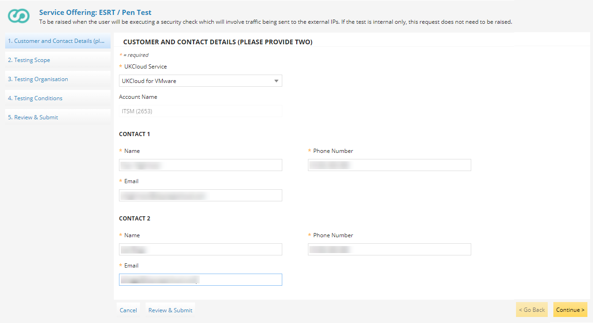

# External security review testing

## Overview

All UKCloud services, and their underlying infrastructure are suitable for supporting OFFICIAL and OFFICIAL-SENSITIVE data. We achieve this via a robust risk management system that meets stringent requirements and best practice industry standards. We also complete a comprehensive IT Security Health Check of the entire infrastructure, undertaken by an external assessment organisation, on a regular basis. UKCloud has implemented all 14 NCSC Cloud Security Principles.

However, to ensure that you're able to meet your own legislative, regulatory and/or contractual requirements, UKCloud provides a service to assist you in undertaking appropriate security reviews of the services above the underlying platform. In this way, we'll co-operate with reasonable requests in arranging, conducting and reviewing the results of such reviews and/or tests.

> [!IMPORTANT]
> Within the terms and conditions of the service, you (and any third parties or agents you engage) must treat any results or information of these tests as confidential, safeguard it accordingly and not disclose any confidential information belonging to the other party. Further, any activities or testing performed outside of the agreed scope will be treated as malicious and/or unauthorised activity, which may result in a breach of contract, service cessation and legal consequences. If you have any questions relating to UKCloud's policies and procedures in place to mitigate risk within the underlying platform, contact us for further information.
>
> Confidential information includes, but is not limited to all commercial, marketing, financial, technical, security, personnel, operational and similar information, including trade secrets, "know how", brand marks, trademarks and other proprietary information.

This article provides useful information for undertaking appropriate security reviews of your services above the underlying UKCloud platform. It highlights the notice requirement for performing penetration tests, and steps through the process for arranging the testing.

## Service scope

As above, the underlying technology platform supporting UKCloud's services and customer management tools, for example the UKCloud Portal, are fully tested for our Assured and Elevated security domains. You will therefore be testing from a cloud consumer rather than a cloud management perspective.

For example, within UKCloud for VMware, the platform extends to the perimeter of the your vCloud organisation with the edge gateway acting as the boundary. The diagram below shows that the edge gateway, along with everything to the right, is your responsibility and can be included within the scope of your security test.

## Engagement and operation of tests

UKCloud will cooperate with you to support external penetration testing requirements, subject to four (4) working days' notice being given as long as the following activities have been completed.

> [!NOTE]
> If testing is to be conducted in both Assured and Elevated security domains, you must complete separate requests for each system.

To request permission to perform a test, you must:

1. In the [My Calls](https://portal.skyscapecloud.com/support/ivanti) section of the UKCloud Portal, raise a ticket using the **ESRT / Pen Test** template.

   

   > [!TIP]
   > You can find the **ESRT / Pen Test** template under **UKCloud Generic Services** or search for it using the **Search for a Request Offering** field.

2. On the *Customer and Contact Details* page, select the **UKCloud Service** for which you want to perform the test.

3. Enter the details of two people to act as points of contact for the testing, then click **Continue**.

   

4. On the *Testing Scope* page, select the **Environment ID** of the environment in which you'll be performing the test.

   > [!TIP]
   > If the list doesn't include any IDs, you can enter the environment ID in the **Additional Details** field.

5. In the **IPs to be tested** field, enter the external IP addresses to access the environments that you want to include in the test.

6. In the **Start Date/Time** fields indicate when you plan to start your testing.

7. In the **End Date/Time** fields, indicate when you plan to complete your testing.

8. In the **Additional Details** field, enter any other information that you think would be useful, then click **Continue**.

   

9. On the *Testing Organisation* page, enter contact details for the organisation that will be completing the testing.

10. In the **Source IP Address for Tests** field, enter the IP address from which the testing will originate, then click **Continue**.

    

11. On the *Testing Conditions* page, thoroughly review the terms and conditions of the service, and if you're happy, accept the conditions and then click **Continue**.

12. Review your selections, then click **Submit**.

    > [!NOTE]
    > If you want to share any other relevant information (for example, a formal scope), you can attach this to your Service Request.

13. On receipt of the Service Request, UKCloud will review the submission at the next possible Change Advisory Board (CAB) and provide an update in the Service Request, either:

    - Where the request is approved, to convey technical authority to proceed with the test at the date and time specified, and in accordance with the documented testing scope.

    - Where the request is not approved, to convey the result and the reasons for it, enabling you to decide whether to withdraw or resubmit the request.

## Testing access points

You may test from two locations:

- **External (from outside the virtual environment)** – Tests are to be carried out external to the UKCloud data centres and offices from the perspective of the internet or government networks. For example for UKCloud for VMware, these tests will traverse UKCloud's physical network edge, and enter your vCloud organisation through the edge gateway.

- **Internal (from inside the virtual environment)** – Tests are to be carried out external to the UKCloud data centres and offices from the perspective of the internet or government networks. It is expected that you would provision a virtual machine (VM) or instance within your environment (which will be billed under as normal consumption) to act as a launch-pad for testing. Any testers would then upload relevant tools to this VM to execute tests within your organisation.

## Pricing

For a test to commence, UKCloud must complete a number of administrative tasks to facilitate the activity. This may result in a cost, chargeable as one day's work from the [SFIA Rate Card](https://ukcloud.com/sfia) (Level 4 - Enable).

In some circumstances, additional time may be required but this will be outlined prior to tests commencing.

## Feedback

If you find a problem with this article, click **Improve this Doc** to make the change yourself or raise an [issue](https://github.com/UKCloud/documentation/issues) in GitHub. If you have an idea for how we could improve any of our services, send an email to <feedback@ukcloud.com>.
