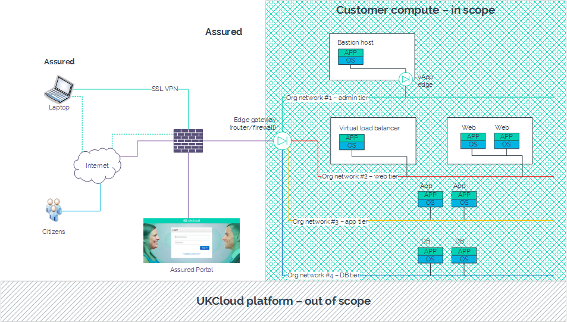

# External security review testing

## Overview

All UKCloud services, and their underlying infrastructure are suitable for supporting OFFICIAL and OFFICIAL-SENSITIVE data. We achieve this via a robust risk management system that meets stringent requirements and best practice industry standards. We also complete a comprehensive IT Security Health Check of the entire infrastructure, undertaken by an external assessment organisation, on a regular basis. UKCloud has implemented all 14 NCSC Cloud Security Principles.

However, to ensure that you are able to meet your own legislative, regulatory and/or contractual requirements, UKCloud provides a service to assist customers in undertaking appropriate security reviews of the services above the underlying platform. In this way, we will co-operate with reasonable requests in arranging, conducting and reviewing the results of such reviews and/or tests.

> [!IMPORTANT]
> Within the terms and conditions of the service (full details included with the application form), you (and any third parties or agents you engage) must treat any results or information of these tests as confidential, safeguard it accordingly and not disclose any confidential information belonging to the other party. Further, any activities or testing performed outside of the agreed scope will be treated as malicious and/or unauthorised activity which may result in a breach of contract, service cessation and legal consequences. If you have any questions relating to UKCloud's policies and procedures in place to mitigate risk within the underlying platform, contact us for further information.
>
> Confidential information includes, but is not limited to all commercial, marketing, financial, technical, security, personnel, operational and similar information, including trade secrets, "know how", brand marks, trademarks and other proprietary information.

This article provides useful information for undertaking appropriate security reviews of your services above the underlying UKCloud platform. It highlights the notice requirement for performing penetration tests, and provides access to the form that you must complete before arrangements can be made.

## Service scope

As above, the underlying technology platform supporting UKCloud's services and customer management tools, for example the UKCloud Portal, are fully tested for our Assured and Elevated security domains. You will therefore be testing from a cloud consumer rather than a cloud management perspective.

Within UKCloud for VMware, the platform extends to the perimeter of the your vCloud organisation with the edge gateway acting as the boundary.

An example of this is depicted in the diagram below and therefore the edge gateway, along with everything to the right, is your responsibility and can be included within the scope of your security test.

## Engagement and operation of tests

UKCloud will cooperate with you to support external penetration testing requirements, subject to four (4) working days' notice being given as long as the following activities have been completed.

To request permission to perform a test, you must:

1. Raise a Service Request within the UKCloud Portal for the test.

2. Complete the External Security Review Test (ESRT) application form (UKC-FRM-231 - available on request) and attach the completed document (**in full**) to your Service Request. If you want to share any other relevant information (for example, a formal scope), you should also attach this to your Service Request.

On receipt of the Service Request and ESRT form, UKCloud will review the submission at the next possible Change Advisory Board (CAB) and provide an update in the Service Request, either:

- Where the request is approved, to convey technical authority to proceed with the test at the date and time specified, and in accordance with the documented testing scope

- Where the request is not approved, to convey the result and the reasons for it, enabling you to decide whether to withdraw or resubmit the request

> [!NOTE]
> If testing is to be conducted in both Assured and Elevated security domains, you must complete separate requests for each system.

> [!IMPORTANT]
> If the resultant ESRT form contains RESTRICTED content and cannot be emailed, contact our support team for alternative communication methods.

## Testing access points

Customers may test from two locations:

**External (from outside the virtual environment)** – Tests are to be carried out external to the UKCloud data centres and offices from the perspective of the internet or government networks. These tests will traverse UKCloud's physical network edge, and enter your vCloud organisation through the edge gateway.

**Internal (from inside the virtual environment)** – Tests are to be carried out external to the UKCloud data centres and offices from the perspective of the internet or government networks. It is expected that you would provision a virtual machine (VM) within your vCloud organisation to act as a launch-pad for testing. Any testers would then upload relevant tools to this VM to execute tests within your organisation.

If you don't have a compute service prior to testing to use for this purpose, you can provision a new compute service, which will be billed under as normal consumption.

## Pricing

For a test to commence, UKCloud must complete a number of administrative tasks to facilitate the activity. This may result in a cost, chargeable as one day's work from the [*SFIA Rate Card*](https://ukcloud.com/wp-content/uploads/2019/06/ukc-gen-759-ukcloud-g-cloud-11-standard-rate-card-and-definitions.pdf) (Level 4 - Enable).

In some circumstances, additional time may be required but this will be outlined prior to tests commencing.

## External Security Review Test (ESRT) application form

To receive a copy of the External Security Review Test (ESRT) application form, contact <support@ukcloud.com>.

## Feedback

If you find an issue with this article, click **Improve this Doc** to suggest a change. If you have an idea for how we could improve any of our services, visit [UKCloud Ideas](https://ideas.ukcloud.com). Alternatively, you can contact us at <products@ukcloud.com>.