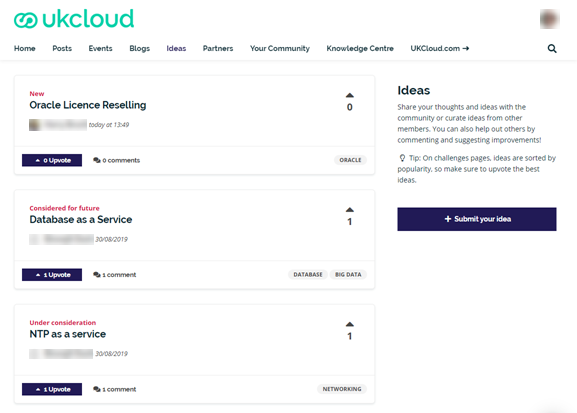
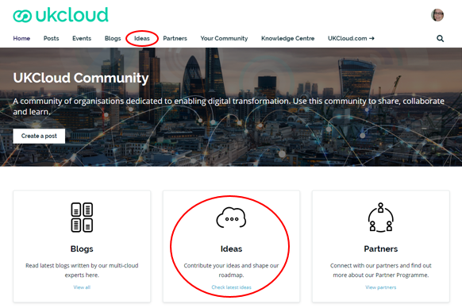
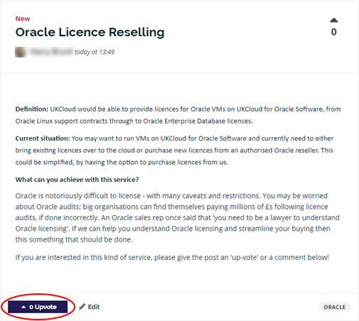
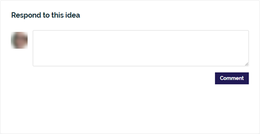
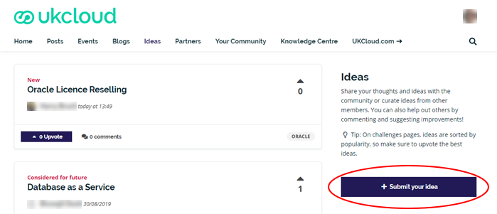
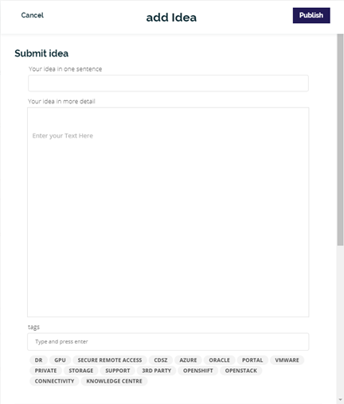
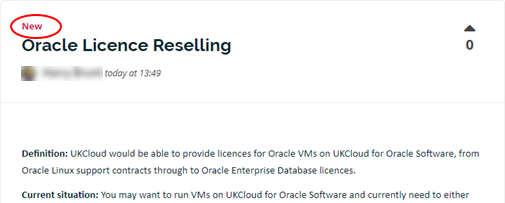
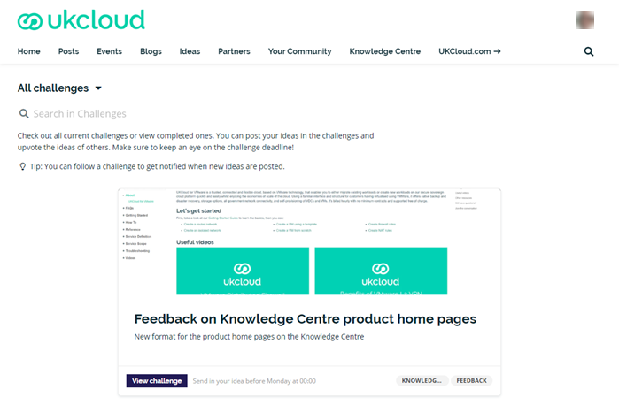

# UKCloud Ideas

## Overview

UKCloud Ideas is the place in our UKCloud Community where you can share your ideas and suggestions with us and help influence our product development. You can submit ideas, vote on your favourite ideas and comment on other member suggestions. Ideas can be big or small; if it will improve your UKCloud experience, we want to know. Each idea is assessed in line with our delivery roadmap. The higher the number of votes, the higher the priority for development.

## Viewing existing ideas

To see what ideas community members have posted:

1. Log in to the [UKCloud Community](https://community.ukcloud.com).

2. Select the **Ideas** tab or (on the *Home* page) click the **Ideas** panel.

    

3. Scroll through the list of ideas to see what other members have suggested.

4. If you see an idea you want to know more about, click it to see further details.

5. If you like the idea, be sure to click the **Upvote** button; the more votes an idea receives, the more attention it will generate and the higher the priority it will have for development.

   

6. If you have additional thoughts on the idea, add a comment to let us, and the rest of the community, know. The more details we have, the better able we are to develop something that delivers what our customers want.

    

## Posting an idea

If you have an idea that you want to share with UKCloud and the community:

1. Log in to the [UKCloud Community](https://community.ukcloud.com).

2. Select the Ideas **Ideas** tab or (on the *Home* page) click the **Ideas** panel.

    

3. Click **Submit your idea**.

    

4. Enter a brief description or title for your idea.

5. Enter the details for your idea.

6. (Optional) Add tags to help categorise your idea, for example if it relates to a specific UKCloud service.

    

7. Click **Publish**.

## What happens to my idea after I post it?

We frequently monitor the Ideas section of the community to see what ideas are being added. When we see a new idea, we'll update it with the **New** status and initiate a conversation with the relevant UKCloud team to see if it is a viable idea. We may comment on the idea if we need more details. As soon as we have some information on your idea, we'll share it via the **Comments** tab and update the status. As and when we have updates on the progress of your idea, we'll add those to the **Comments** tab as well.

In the meantime, other members of the community can vote for your idea if they like it and add their own comments and thoughts. The more votes and comments an idea gets, the higher the priority it will have for development.

## Status of ideas

The status of an idea, displayed at the top of the idea, indicates where it is in relation to our product roadmap.

Status                | Assigned when
----------------------|--------------
New                   | We're gathering information about a new idea
Under consideration   | We've completed our initial information gathering for the idea but require further investigation
On roadmap            | We've added the idea to our product roadmap
Considered for future | We like the idea but don't have immediate plans to add it to the roadmap
Not planned           | We don't plan to proceed with the idea
Delivered             | We've delivered the idea

## What are challenges?

Occasionally, we'll issue challenges within UKCloud Ideas to solicit ideas about a specific topic or service. It could be that we're looking for feedback or ideas for how to improve a particular area or we're considering a new feature and want to see what you think.

You can find the most recent challenges at the bottom of the Community *Home* page or by going directly to the [*Challenges*](https://community.ukcloud.com/challenges) page. Click the **View challenge** button to see more details and then click **Submit your idea**. Unlike regular ideas, ideas for challenges provide a set of questions to gather more targeted information, but there's also an area where you can provide additional information. Challenges usually have a time limit, so watch out for them and be sure to have your say before they're gone.

## Related videos

[*UKCloud Community overview video*](other-vid-community.md)

## Feedback

If you find an issue with this article, click **Improve this Doc** to suggest a change. If you have an idea for how we could improve any of our services, visit the [Ideas](https://community.ukcloud.com/ideas) section of the [UKCloud Community](https://community.ukcloud.com).
