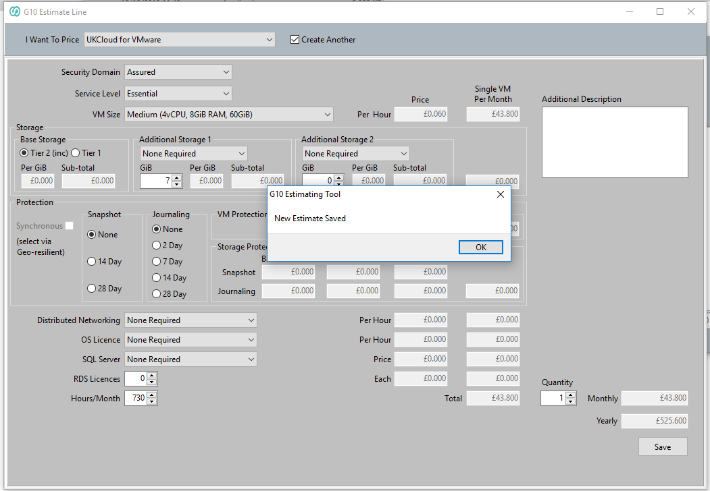
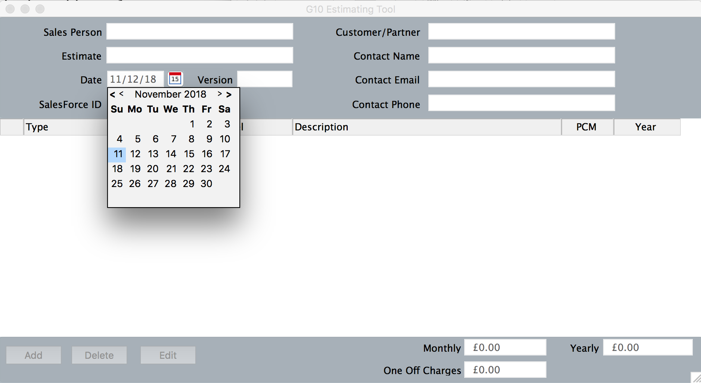
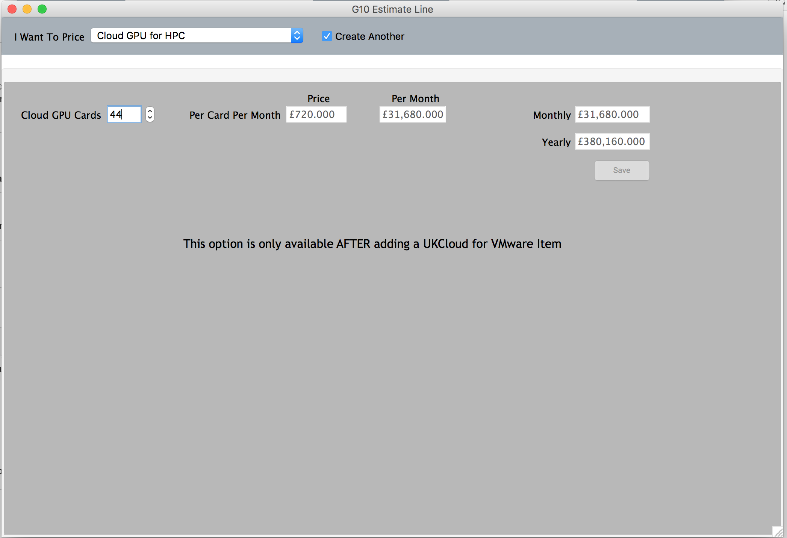
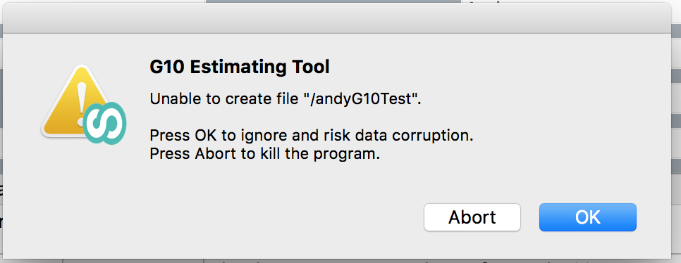

# Known bugs in the Pricing Estimation Tool

This is an accompanying article to [*How to use the UKCloud Pricing Estimation Tool*](other-how-use-pricing-tool.md). We'll update this article to document new bugs and issues as they are discovered and to remove resolved bugs and issues when we update the tool.

## Current version

The current version of the tool:

- **Windows version**: 10.3.1

- **Mac version**: 10.3.1

## Pricing Estimation Tool v10.3.1 Changelog

Fixed all known issues listed below.

- **No known issues with 10.3.1.**

## Known issues with v10.2.8 (Previous Version)

### Windows

1. In the UKCloud for VMware section, entering an amount of additional storage GiB without selecting the Storage type does not display an error message.

If you specify an amount of storage without specify a Storage type, the storage is added to the estimate but the calculation shows the additional storage as being free, which is incorrect.

Workaround: When including additional storage in your estimate, be sure to select the storage type first. If you select a storage type but do not enter a storage amount, an error message is displayed.

### Mac

The following are known issues with the Mac version of the Pricing Estimation Tool.

1. You cannot select a date in the date picker. Instead you must enter the date manually.

    

2. When creating an estimate for **Cloud GPU for HPC**, if you click the increase counter for **Cloud GPU Cards** the number is added twice. You'll need to manually edit the field to remove the duplicated number.

    

3. If you select **Save as** from the main menu, you'll see the following error message:

    

    If you click **Abort**, the tool closes and your estimate will not be saved. Instead, click **OK** to save the estimate successfully.

4. If you minimise the tool's window, there is no way to resize it. You must close the tool and reopen it.

## Related videos

- [*UKCloud Pricing Estimation Tool overview video*](other-vid-pricing-tool-overview.md)

## Feedback

If you find an issue with this article, click **Improve this Doc** to suggest a change. If you have an idea for how we could improve any of our services, visit [UKCloud Ideas](https://ideas.ukcloud.com). Alternatively, you can contact us at <products@ukcloud.com>.
