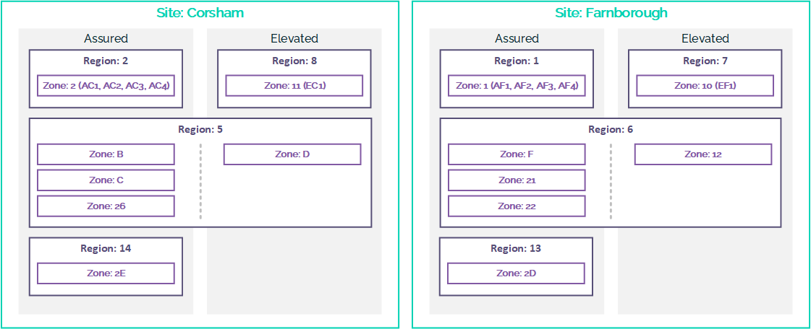

# UKCloud services by region

## Overview

This articles provides a quick reference for which services are available in the different UKCloud regions.

## Sites, regions and zones

The diagram below illustrates the locations of the different regions and zones on the UKCloud platform.

## Services in Farnborough

### Region 1 (00001)

Security domain | Services | Zone
-----------------|---------|-----
Assured | **UKCloud for VMware** *Connectivity:* Internet, PSN, HSCN, Janet, HybridConnect, CrownConnect *VM type:* ESSENTIAL, POWER *Storage:* Tier 1 (partial), Tier 2 *Protection:* Journaling, Snapshot Bring Your Own Firewall | Zone 1 (AF1, AF2, AF3, AF4)
&nbsp; | **Cloud Storage** *Connectivity:* Internet, PSN, HSCN, Janet | All zones

*Enablement services:* Mass Transfer Facility, Data Transfer Facility, Cloud Enablement, Smart Hands 
*Cross Domain Security Zone:* Walled Garden, Secure Remote Access

### Region 7 (00007)

Security domain | Services | Zone
-----------------|---------|-----
Elevated | **UKCloud for VMware** *Connectivity:* PSN, HybridConnect, CrownConnect *VM type:* ESSENTIAL, POWER *Storage:* Tier 1, Tier 2 *Protection:* Journaling, Snapshot Bring Your Own Firewall | Zone 10 (EF1)
&nbsp; | **Cloud Storage** *Connectivity:* PSN | All zones

*Enablement services:* Mass Transfer Facility, Data Transfer Facility, Cloud Enablement, Smart Hands 
*Cross Domain Security Zone:* Walled Garden, Secure Remote Access

### Region 6 (00006)

Security domain | Services | Zone
-----------------|---------|-----
Assured | **UKCloud for VMware** *Connectivity:* Internet, PSN, HSCN, Janet, HybridConnect, CrownConnect *VM type:* ESSENTIAL, POWER, PRIORITY *Storage:* Tier 1, Tier 2 *Protection:* Journaling, Snapshot Bring Your Own Firewall | Zone F
&nbsp; | **Cloud GPU** *Connectivity:* Internet, PSN, HSCN, Janet, HybridConnect *Workloads:* Compute, Visualisation | Zone F
&nbsp; | **UKCloud for Oracle Software** *Connectivity:* Internet, PSN, HSCN, Janet, HybridConnect, CrownConnect *Storage:* Tier 1, Tier 2 | Zone 1A
&nbsp; | **UKCloud for OpenStack** *Connectivity:* Internet, PSN, HSCN, Janet | Zone 21
&nbsp; | **UKCloud for OpenShift** *Connectivity:* Internet, PSN, HSCN, Janet | Zone 21
&nbsp; | **UKCloud for Microsoft Azure** *Connectivity:* Internet IaaS services | Zone 22
&nbsp; | **Cloud Storage** *Connectivity:* Internet, PSN, HSCN, Janet | All zones
Elevated | **UKCloud for VMware** *Connectivity:* PSN, HybridConnect, CrownConnect *VM type:* ESSENTIAL, POWER, PRIORITY *Storage:* Tier 1, Tier 2 *Protection:* Journaling, Snapshot Bring Your Own Firewall | Zone 12
&nbsp; | **Cloud GPU** *Connectivity:* PSN, HybridConnect *Workloads:* Compute, Visualisation | Zone 12
&nbsp; | **Cloud Storage** (All zones) *Connectivity:* PSN | All zones

*Enablement services:* Disaster Recovery as a Service, Migration to the Cloud, Mass Transfer Facility, Cloud Enablement 
*Cross Domain Security Zone:* Walled Garden, Secure Remote Access

## Services in Corsham

### Region 2 (00002)

Security domain | Service | Zone
-----------------|--------|-----
Assured | **UKCloud for VMware** *Connectivity:* Internet, PSN, HSCN, Janet, HybridConnect, CrownConnect *VM type:* ESSENTIAL, POWER *Storage:* Tier 1 (partial), Tier 2 *Protection:* Journaling, Snapshot Bring Your Own Firewall | Zone 2 (AC1, AC2, AC3, AC4)
&nbsp; | **Cloud Storage** *Connectivity:* Internet, PSN, HSCN, Janet | All zones

*Enablement services:* Mass Transfer Facility, Data Transfer Facility (via Farnborough), Cloud Enablement 
*Cross Domain Security Zone:* Walled Garden, Secure Remote Access

### Region 8 (00008)

Security domain | Service | Zone
-----------------|--------|-----
Elevated | **UKCloud for VMware** *Connectivity:* PSN, HybridConnect, CrownConnect *VM type:* ESSENTIAL, POWER *Storage:* Tier 1, Tier 2 *Protection:* Journaling, Snapshot Bring Your Own Firewall | Zone 11 (EC1)
&nbsp; | **Cloud Storage** *Connectivity:* PSN | All zones

*Enablement services:* Mass Transfer Facility, Data Transfer Facility (via Farnborough), Cloud Enablement 
*Cross Domain Security Zone:* Walled Garden, Secure Remote Access

### Region 5 (00005)

Security domain | Service | Zone
-----------------|--------|-----
Assured | **UKCloud for VMware** *Connectivity:* Internet, PSN, HSCN, Janet, HybridConnect, CrownConnect *VM type:* ESSENTIAL, POWER, PRIORITY *Storage:* Tier 1, Tier 2 *Protection:* Journaling, Snapshot Bring Your Own Firewall | Zone B
&nbsp; | **Cloud GPU** *Connectivity:* Internet, PSN, HSCN, Janet, HybridConnect *Workloads:* Compute, Visualisation | Zone B
&nbsp; | **UKCloud for OpenStack** (OSP10) *Connectivity:* Internet, PSN, HSCN, Janet *VM type:* Ephemeral *Storage:* Tier 1, Tier 2 | Zone C
&nbsp; | **UKCloud for OpenStack** (OSP13) *Connectivity:* Internet, PSN, HSCN, Janet *VM type:* Ephemeral *Storage:* Tier 1, Tier 2 | Zone 26
&nbsp; | **UKCloud for OpenShift** *Connectivity:* Internet, PSN, HSCN, Janet | Zone C
&nbsp; | **Cloud Storage** *Connectivity:* Internet, PSN, HSCN, Janet | All zones
Elevated | **UKCloud for VMware** *Connectivity:* PSN, HybridConnect, CrownConnect *VM type:* ESSENTIAL, POWER, PRIORITY *Storage:* Tier 1, Tier 2 *Protection:* Journaling, Snapshot Bring Your Own Firewall | Zone D
&nbsp; | **Cloud GPU** *Connectivity:* PSN, HybridConnect *Workloads:* Compute, Visualisation | Zone D
&nbsp; | **Cloud Storage** *Connectivity:* PSN | All zones

*Enablement services:* Disaster Recovery as a Service, Migration to the Cloud, Mass Transfer Facility, Cloud Enablement 
*Cross Domain Security Zone:* Walled Garden, Secure Remote Access

## Additional services

If you're interested in any of the following services, contact one of our Cloud Architects for further information:

- Dedicated Compute

- High Performance Compute

- Private Cloud

- Private Cloud for Oracle Software

- Private Cloud for Storage

- RLI connectivity

## Feedback

If you find a problem with this article, click **Improve this Doc** to make the change yourself or raise an [issue](https://github.com/UKCloud/documentation/issues) in GitHub. If you have an idea for how we could improve any of our services, send an email to <feedback@ukcloud.com>.
