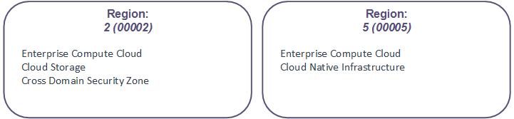

# Understanding sites, regions and zones

## Introduction

This guide explains how we've designed the UKCloud platform using sites, regions and zones to enable you to design a highly-available and disaster-tolerant cloud solution that meets your specific requirements for resilience. The diagram below shows the relationship between sites, regions and zones and provides a broad indication the purpose of each.

We've engineered our cloud platform to tolerate inevitable failures at or below the infrastructure layer (for example, hardware failures and power or cooling interruptions) to ensure that the platform remains available. To ensure your applications and the services they deliver are highly available, we encourage you to design for failure and build disaster recovery capabilities into your applications. Depending on the type of failure you are trying to mitigate, our platform enables you to use sites, regions and zones to implement appropriate resilience into your solution.

For specific services, such as UKCloud for OpenStack or UKCloud for VMware, we provide more detailed design guides and blueprints to explore the design choices you have with our platform. Additionally, you can always engage a Cloud Architect who can work with you to deploy the right architecture on our platform.

## Understanding sites

### What is a site?

A site is a geographically specific location. UKCloud has two UK‑based sites, separated by 100 km, in Farnborough and Corsham (see diagram above). Sites provide:

- Independent power, security, geography and infrastructure

- Independent WAN connections from multiple service providers

- Local maintenance and platform support teams

- Shared UKCloud service support and management teams

### How do sites help me mitigate against failure?

Building your solution across multiple sites provides resilience against scenarios such as natural disasters, targeted terrorist attacks or mass WAN failure. If an event affects a particular site, your system can continue running on the other site. The separation of UKCloud's two sites aligns with CESG's published guidance on architecting for disaster avoidance.

### What else should I consider?

Although we operate secure, high‑bandwidth and low‑latency interconnects between our sites, the latency of transporting data within the same site will always be lower. If you deploy your solution across sites, you should always perform thorough testing to ensure that any increase in latency (particularly storage latency) is within tolerable levels and does not impede the performance of your solution under heavy load.

## Understanding regions

### What is a region?

Within each site, our platform provides a number of independent regions (see diagram above). Each region is a physically segregated part of the platform with its own power infrastructure, management services and networking components. This enables you to design resilient solutions that are contained entirely within a single site.

Each region provides a particular subset of UKCloud services, for example UKCloud for VMware, UKCloud for OpenStack or Cloud Storage, so the regions that you can use for your solution depend on where your selected (and prospective) UKCloud services are available. For example, in the diagram below you can see that UKCloud for VMware is provided in regions 2 and 5, however UKCloud for OpenStack is provided only in region 5.

### How do regions help me mitigate against failure?

By architecting for separate regions, you can improve resilience to outages that affect:

- The control and management of your VMs

- Network connectivity to your VMs

- The power infrastructure within the data centre.

The impact of an outage on your environment depends on the services you consume and how you have architected your environment at the region level. For example, the impact of a region‑affecting outage for UKCloud for VMware may be different than for UKCloud for OpenStack.

### What else should I consider?

Certain product features --- such as on-platform protection technologies like snapshot protection or journaling --- may be available only in certain regions. Check [*UKCloud services by region*](other-ref-services-by-region.md) for further details.

In addition, some common service features --- such as VM image catalogues, access to storage pools, and so on --- may be available only to solutions running within that region, and not replicated by UKCloud across multiple regions. This may require you to duplicate some of your management tools and services. You should consider which services are available across multiple regions when designing your solutions.

## Understanding zones

### What is a zone?

A zone is a distinct hardware installation within a region (Figure 5), utilising common networking infrastructure but having independent server and storage infrastructure.

Ordinarily, each zone hosts only one UKCloud service, but each service, for example UKCloud for VMware or UKCloud for OpenStack, may be provided in multiple zones in each site (see diagram below).

Each zone is part of a particular security domain: either Assured OFFICIAL or Elevated OFFICIAL (see diagram below).

### How do zones help me mitigate against failure?

You can utilise zones to provide additional confidence in your ability to tolerate outages and mitigate against:

- Cluster-wide component outages caused by logical configuration errors

- Significant hardware failures

- Issues occurring within the hypervisor or virtual SAN

For example, you can load-balance across two zones to ensure that your service stays online in the event of a zone outage.

### What else should I consider?

Designing your solutions to make use of zones rather than regions and sites achieves the lowest latency, helping to reduce the risk of data inconsistency while optimising the IO performance across your solution.

Depending on the services you consume, each zone may have its own management interface, so the complexity of managing your environment potentially increases with each additional zone. You should also be aware that the zones within a region operate on a shared network, therefore any issues on that network affect all the zones in the region. If you want to mitigate against potential network outages, you should consider designing your solution across multiple regions, but you should carefully assess the risk that the highly unlikely event of a loss of region or site presents and how this may influence your overall solution.

## Feedback

If you have any comments on this document or any other aspect of your UKCloud experience, send them to <products@ukcloud.com>.
