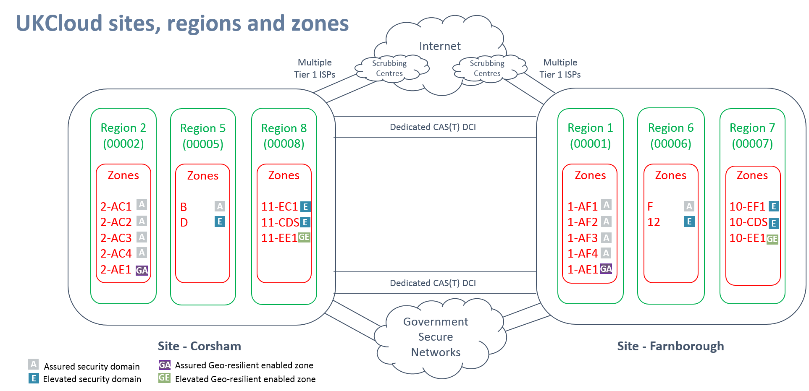
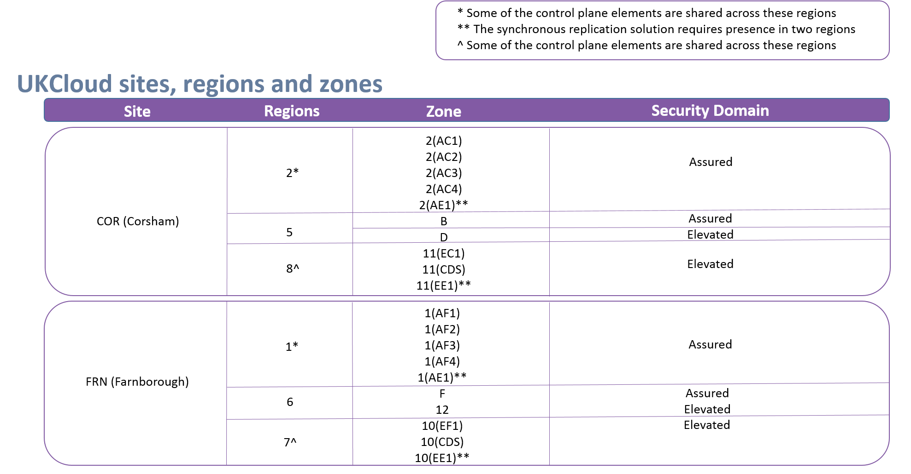

# Sites, regions and zones map and reference table

To assist you in understanding the concept of sites, regions and zones within the UKCloud platform, this article identifes which zones exist in each region, and which site each region resides in.

There are also two other articles in the Knowledge Centre that accompany this article and assist in explaining the Sites, regions and zones concept:

- [*Understanding Sites, regions and zones*](other-ref-sites-regions-zones.md)
- [*UKCloud services by region*](other-ref-services-by-region.md)

## Sites, regions and zones map

## Sites, regions and zones reference table

## Feedback

If you have any comments on this document or any other aspect of your UKCloud experience, send them to <products@ukcloud.com>.