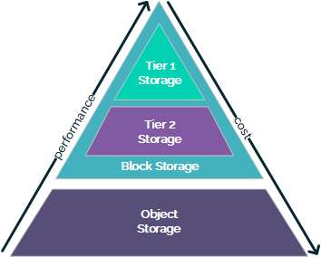

# Storage options on the UKCloud platform

## Overview

It's important to understand the differences between the various storage options available on the UKCloud platform to ensure you're using the most appropriate and cost-effective option for your requirements.

The following diagram shows the different storage options, which are explained in more detail in the rest of this article.

It's important to note that, as the UKCloud platform is a multi-tenant environment, its storage solutions are shared by all consumers within the boundary of the security domain. This means we can't provide a guaranteed minimum IOPs or throughput; however, the performance of individual datastores is actively monitored. Our Cloud Operations team regularly reviews datastore usage metrics and perform migrations of virtual machines to less populated datastores to alleviate contention if necessary.

## Block storage

Block storage exposes raw storage devices to hosts, providing efficient, low latency access to data. This is useful for computational and transactional workloads, such as:

- Databases

- Web servers

- Monitoring systems

The performance that you can expect from block storage will depend on many factors, such as the application's read/write ratio, and whether the IO will be random or sequential in nature.

UKCloud provides two tiers of block storage &ndash; Tier 2 and Tier 1 &ndash; which use different underlying technologies to meet the requirements of different scenarios.

### Tier 2 block storage

Tier 2 storage is our standard block storage option, suitable for workloads with typical performance requirements. We recommend using Tier 2 storage by default unless there is a specific requirement for a higher level of performance.

#### Good candidate workloads for Tier 2 storage

UKCloud recommends using Tier 2 storage by default as it offers excellent performance at a low price. Applicable use cases include:

- Applications that don't need consistent performance

- Low performance applications

- Applications with a high read-to-write ratio (+50% r/w)

### Tier 1 block storage

Tier 1 storage, our most performant block storage, is available for workloads requiring consistently higher disk throughput.

All media used by Tier 1 storage is quick-access, so even workloads that are accessed infrequently are serviced by faster media and workload IO is serviced a lot quicker.

Consider Tier 1 storage for:

- Applications that require improved performance when accessing stored data, such as high activity databases

- Applications that have irregular usage patterns that require a consistent performance such as data warehouses or batch process applications

#### Good candidate workloads for Tier 1 storage

UKCloud recommends considering Tier 1 storage for the following use cases:

- Applications that need consistent performance. The nature of multi-tenant environments means that data can sometimes be pushed down storage tiers, even if it's hot. This is because other customers' application data may be hotter. Using Tier 1 storage ensures that customer data has a more predictable performance for both reads and writes.

- Applications with a high write-to-read ratio (+50% w/r). Some applications will have a large amount of data creation or change, which will involve a lot of write IO to the storage. Tier 1 storage reduces the latency of cache flushing to disk.

- High-performance applications. High performance applications are generally databases or virtual desktops, which require high read and write performance.

- Data warehousing. There are two data warehousing use cases:

  - Occasionally, data may be loaded onto the UKCloud platform but not accessed for a period of time. This data would normally be de-staged to slower media, but Tier 1 provides good performance of both reads and writes, even if the data has been cold for a long time.

  - Alternatively, data can be stored in UKCloud's Cloud Storage and loaded into Tier 1 storage when needed. This maintains high performance for active data, without the associated cost of storing infrequently accessed data.

- Small block, random-write databases. Data with a high volume of small random writes will benefit from the enhanced performance that Tier 1 storage provides. Tier 1 storage write performance is much better for small block writes.

- Large data sets. In Tier 1 storage there's a higher chance that data within a given dataset will be in quick-access media, accelerating database performance.

If your application isn't currently running (on UKCloud's platform or on another environment), we'd recommend building it on the standard Tier 2 storage pool initially. You can then assess its performance once it's been set up and is running under load, and decide whether the workload should be moved to Tier 1 storage.

If the workload is currently running, you can run a performance assessment on the application to understand its characteristics, enabling you to make an informed decision on where it's best placed. You can carry out this performance assessment yourself, or request support from one of our Cloud Architects.

## Object storage

With object storage, files and their metadata are stored as objects in a flat, unstructured storage pool. Containers, or buckets, provide a method to logically group objects, which is similar to folders, but cannot be nested. Objects additionally support extended metadata enabling them to be indexed and cross-referenced in complex ways.

Each object is assigned an object identifier, which enables the object to be retrieved without needing to know exactly where it is stored.

UKCloud provides object storage via our Cloud Storage product, based on Dell EMC Elastic Cloud Storage (ECS). Access is via a RESTful API, which also provides support for Amazon's S3 API. For more information, see the [Getting Started Guide for Cloud Storage](../cloud-storage/cs-gs.md).

### Use cases

Some common use cases for object storage include:

- Medical imaging

- Video, audio, image storage

- YouTube, LinkedIn, DropBox, Wikipedia (images), eBay, Instagram

- VM backups

Object storage is typically high-latency, low-performance and is used for archiving static content that will not change. The metadata is stored separately from the data and can be modified and re-written as needed.

## For more help

If you need more help designing storage solutions for your applications, contact UKCloud Support or engage with our Professional Services team.

## Feedback

If you find a problem with this article, click **Improve this Doc** to make the change yourself or raise an [issue](https://github.com/UKCloud/documentation/issues) in GitHub. If you have an idea for how we could improve any of our services, send an email to <feedback@ukcloud.com>.
