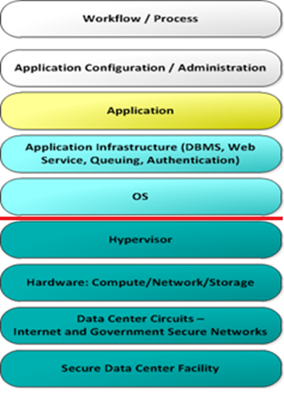

# Monitoring the UKCloud platform

## Overview

This article helps you understand what UKCloud monitors, and how we manage alerts created by the monitoring system.

## Areas of monitoring responsibility

The diagram below shows a typical application stack and identifies the areas that can be monitored. The services below the red line on the diagram are monitored by us for both availability and performance (at a platform level).

Incoming data is scanned and assessed, and any results outside of a defined threshold generates an alert inside our monitoring platform.

Additional monitoring above the red line is the responsibility of the customer organisation.

## How does UKCloud monitor platform availability?

We use a mixture of availability checks and synthetic transactions to monitor the availability of our platform. The platform level monitoring is provided at an aggregate level and does not check the availability of individual customer solutions.

## Technologies used

We use single pane views of multiple technologies to monitor our platform. These include best of breed monitoring applications to:

- Monitor our cloud estate, including all core services and underlying hosts (in summary, all non-network devices).

- Monitor the underlying internal UKCloud infrastructure and core network devices.

- Monitor for potential Security Incidents 24 hours a day (Protective Monitoring, or ProMon), enabling us to benefit from industry leading detection and protection against security related incidents. This service is fully GPG13 (Good Practice Guide 13) compliant and is UK Government recommended.

## Details of systems and services monitored

We monitor each individual component of the platform and then roll this data up into a single concise dashboard. This provides us with both RED and GREEN alerting systems at the component level and enables us to understand the overall health of a system.

The list below provides a quick overview of how some of the key components of the UKCloud platform are monitored, which takes place across all services and both security domains (Assured and Elevated).

### UKCloud Portal

- UKCloud Portal (including transaction and performance tests)

  - Synthetic login tests through the GUI and the Portal API.

  - In depth monitoring of the web application layer, including page render and database access times.

### Multi-cloud services

- Cloud estate (including all core services and underlying hosts)

  - Host CPU/memory stats

  - Host connectivity status

  - Host bandwidth throughput

  - Host storage connectivity and throughput

  - Core service status

- Underlying storage (including storage pools and storage performance)

  - LUN capacity

  - LUN status

  - Data store connectivity

  - Data store throughput

- Cloud management platform (including transaction and performance tests)

  - Creation/deletion/modification of instances or groups of instances

### Multi-cloud enabling services

- Cloud Storage

  - Infrastructure (including transaction and performance tests)

## What UKCloud monitors in your environment

We do not monitor any individual component inside your environment.

The table below outlines what we monitor inside and outside your environment, and what you can and should monitor:

&nbsp; | External connectivity (internet, PSN, HSCN, etc.) | Network gateway | Instance | Storage
-------|---------------------------------------------------|-----------------|----------|--------
**Customer monitors** | Application performance | Gateway state Gateway rules and activity VPN | Instance management Instance performance Instance state | Storage profiles
**UKCloud monitors** | Connection availability Bandwidth throughput | Customer gateway availability and responsiveness Network availability Platform bandwidth | Host availability Platform availability Platform performance Management plane availability *Some* management plane performance | Platform availability Platform responsiveness and performance

## What can UKCloud provide, and what can you gain yourself?

Our platform can also provide you with several real-time and retrospective reporting tools so that you can manage and monitor your estate. These are listed below:

### Multi-cloud services

Feature | Instance attributes | Self-service tools | &nbsp;          | &nbsp;          | On request via My Calls | What you can monitor
--------|---------------------|--------------------|-----------------|-----------------|-------------------------|---------------------
&nbsp;  | &nbsp;              | **UKCloud Portal** | **Cloud management UI** | **API** | &nbsp;                  | &nbsp;
**Billing metrics** | &nbsp; | Y | &nbsp; | Y | &nbsp; | Y
Licence usage | &nbsp; | &nbsp; | &nbsp; | &nbsp; | &nbsp; | Y
**Instance details** | CPU | &nbsp; | Y | Y | &nbsp; | Y
&nbsp; | Memory | &nbsp; | Y | Y | &nbsp; | Y
&nbsp; | Storage usage | &nbsp; | Y | Y | &nbsp; | y
&nbsp; | OS | &nbsp; | Y | Y | &nbsp; | Y
**Instance utilisation stats** | Real time | &nbsp; | &nbsp; | Y | &nbsp; | Y
&nbsp; | Historical | &nbsp; | &nbsp; | &nbsp; | &nbsp; | Y
**Network gateway** | NAT rules | Y | &nbsp; | &nbsp; | &nbsp; | Y
&nbsp; | Syslog | &nbsp; | &nbsp; | &nbsp; | Y | Y
&nbsp; | Config | Y | &nbsp; | &nbsp; | &nbsp; | Y
&nbsp; | VPN connections | Y | &nbsp; | &nbsp; | &nbsp; | Y
**Backups** | Success/Fail 14/28 day record | Y | &nbsp; | Y | &nbsp; | Y
**Storage** | Storage profiles | &nbsp; | Y | Y | &nbsp; | Y
**Bandwidth usage** | Internet | Y | &nbsp; | &nbsp; | &nbsp; | Y
&nbsp; | PSN | Y | &nbsp; | &nbsp; | &nbsp; | Y
&nbsp; | HybridConnect | &nbsp; | &nbsp; | &nbsp; | &nbsp; | Y
&nbsp; | HSCN | &nbsp; | &nbsp; | &nbsp; | &nbsp; | Y

## Cloud Storage

Element | Self-service tools | &nbsp; | What you can monitor
--------|--------------------|--------|---------------------
&nbsp;  | Portal | API       | &nbsp;
**Billing metrics** | &nbsp; | &nbsp; | Y
**Usage** | Y | Y | Y

## Continual improvement

We have a team dedicated to ensuring our monitoring systems are accurately and concisely reporting the status of the UKCloud platform. The monitoring team works closely with both the Technical and Operations teams to ensure all monitoring requirements are captured, and alerts are correctly tuned.

## Keeping you informed

We strive to provide a highly available, performant and stable platform to our customers.

In the event of a service performance or availability outage, we'll provide updates via our [Status Page](https://status.ukcloud.com), as well as posting updates in the UKCloud Portal (<https://portal.ukcloud.com>).

## Feedback

If you find an issue with this article, click **Improve this Doc** to suggest a change. If you have an idea for how we could improve any of our services, visit [UKCloud Ideas](https://ideas.ukcloud.com). Alternatively, you can contact us at <products@ukcloud.com>.
