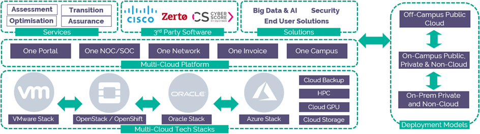

# Multi-Cloud for TIER 2 (UKCloudX) Service Definition

## Why UKCloud?

UKCloud is dedicated to helping the UK Public Sector and UK citizens by delivering more choice and flexibility through safe and trusted cloud technology. We own and operate a UK-sovereign, industry-leading, multi-cloud platform for SECRET (Above OFFICIAL) workloads, located within the Government’s Crown Campus, offering multiple cloud technologies, including VMware, Azure, OpenStack, OpenShift and Oracle. This enables customers to choose the right technology for creating new workloads or migrating existing applications to the cloud.

We recognise the importance of government services in making the country run smoothly, which is why we include the highest level of support to all our customers at no extra cost. This includes a dedicated 24/7 UK telephone and ticket support, and Network and Security Operations Centre (NOC/SOC) utilising protective and proactive monitoring tools, and access to UKCloud’s technical experts.

## What is Multi-Cloud for TIER 2 (UKCloudX)?

Multi-Cloud for TIER 2 (UKCloudX) provides you with the most trusted, connected and flexible multi-cloud platform you need in order for you to deliver your most critical and sensitive systems and solutions. Our platform harnesses genuine cloud technologies which can help you achieve your mission, by enabling faster innovation, tighter collaboration and reducing risks of technology obsolescence. You can use each cloud technology individually or blend different technologies to suite your workloads, and you have various options around location and tenancy for your cloud – enabling you to deploy applications onto a cloud infrastructure that is tailored to your needs.

The Multi-Cloud for Tier 2 (UKCloudX) product portfolio consists of the following services:

- **UKCloudX for VMware** – Proven VMware-based technologies, helping you transition existing enterprise applications to a highly secure cloud, whilst harnessing your investment in skills and tools that already support these workloads

- **UKCloudX for Microsoft Azure** – This service harnesses the innovation of Microsoft’s Azure platform, delivering this service from within our government-grade TIER 2 platform

- **UKCloudX for OpenStack** – Our OpenStack service allows you to embrace digital transformation and build true cloud native applications in a highly secure environment. You can automate deployment and control of  services using your existing continuous integration tools such as Jenkins and Ansible, leveraging the benefits of the software-defined data centre and infrastructure-as-code

- **UKCloudX for OpenShift** – For use cases such as container management and continuous integration to improve the pace and agility of your TIER 2 solutions. OpenShift deploys, scales and monitors the platform, which frees up your DevOps resources to focus on adding value further up the stack

- **UKCloudX for Oracle Software** – Provides a proven Oracle cloud service that's tailor-made for running your Oracle workloads in the cloud. This service enables you to move technologies such as Oracle Database, Oracle WebLogic Server, Oracle Fusion Applications, E-Business Suite and more to our TIER 2 cloud platform

- **Cloud Storage** – Our Cloud Storage is a secure and highly adaptable storage platform designed to address a wide variety of use cases

We also have enablement services which help you optimise our multi-cloud platform, such as:

- **Disaster Recovery as a Service** - Makes it easy to replicate and recover virtual machines to the cloud, by failing over from your own data centre to the Multi-Cloud for Tier 2 (UKCloudX) platform. This service supports and facilitates your own business continuity plan or disaster recovery processes

- **Secure Hosting** – We understand not all infrastructure and appliances can be virtualised, so we offer secure hosting services enabling you to have the physical hardware resources of your solution in close proximity to your cloud workloads

- **TIER 2 CrownConnect** – Connectivity to Crown Hosting Data Centres (CHDC) so you can connect your infrastructure in Crown Hosting to your Multi-Cloud for Tier 2 (UKCloudX) workloads

- **Cross Domain Connectivity** – Provides you with a way to connect your OFFICIAL workloads to Multi-Cloud for Tier 2 (UKCloudX) workloads, and gives you the flexibility to design and manage the security that is required for your specific use cases

- **Secure Transfer Facility** – Enables you to bring your virtual machines and data on secure devices and upload into your Multi-Cloud for Tier 2 (UKCloudX) cloud environment through an ingestion process

For full information regarding this product, we have Service Scopes, FAQs and other relevant documents on our [Knowledge Centre](https://docs.ukcloud.com).

## What the service can help you achieve

- Collaborate with other departments, government agencies and industry providers to solve your most sensitive and complex challenges at TIER 2

- Share threat/intelligence products directly with front line teams to deliver better outcomes

- Reduce costs by increasing operational efficiency and shifting up-front capital expenditure (CAPEX) to consumption-based operating expenditure (OPEX)

- Add operational resilience to existing facilities or extend your estate with hybrid cloud solutions to cope with growing workloads

- Prolong the life of existing applications by removing the tight coupling with ageing hardware and the risks of technology obsolescence

- Deliver digital transition projects that require high levels of security and assurance

- Build new operating models enabled by the proximity of the Multi-Cloud for Tier 2 (UKCloudX) platform to Crown Hosting workloads

## Product options

Multi-Cloud for Tier 2 (UKCloudX) has many product options; the diagram below gives you an idea of how to pick the options that best suit you. More information can be found in the [Pricing Guide](https://ukcloud.com/wp-content/uploads/2019/06/ukcloud-pricing-guide-11.0.pdf).

### Security domain

Choose the security domain in which you want to run your application

- Assured OFFICIAL - Internet, HCSN, Janet, PSN

- Elevated OFFICIAL - PSN and RLI

- UKCloudX TIER 2 - SLI & Crypto

### Workload location

Choose the cloud location that suits you

- Multi-Cloud for Tier 2 (UKCloudX)

- Crown Hosting Data Centres (CHDC)

- On premises/other data centre

### Tenancy

Choose the tenancy type that best suits your needs

- Community of Interest (COI) - Per hour or per month pricing

- Private (managed by UKCX Master Zone) - Per month pricing

- Private (managed by private managed zone) - Per month pricing

### Multi-cloud options

Define the technologies required to support your workloads. Multiple technologies may be used. More information and options can be found in the pricing guide and service scope

- VMware - Service level, VM & storage options (optional licensing, advanced networking and protection)

- Azure - Machine type, size & storage options

- OpenStack - Instance type, flavour & storage options (optional licensing)

- OpenShift - Runtime pack & storage options (optional enhanced storage, logging & networking)

- Oracle- CPU, RAM and storage options (optional licensing)

- Cloud Storage - Object storage with an S3 API; different service level options

### Enablement options

Choose the enablement options that will help you better utilise the multi-cloud technologies

- Secure Hosting

- TIER 2 CrownConnect

- Disaster Recovery as a Service

- Cross Domain Connectivity

- Secure Transfer Facility

- VDI

### UKCloud X Connectivity

Choose the external connectivity you want to connect into UKCloudX. You are responsible for procuring the connectivity and UKCloudX are responsible for connecting it into your cloud environment

- SLI

- Cryptographic Overlay - You'll need to supply crypto devices; option for private connectivity

## Pricing and packaging

Multi-Cloud for Tier 2 (UKCloudX) pricing with all options including licensing is available in the [*UKCloud Pricing Guide*](https://ukcloud.com/wp-content/uploads/2019/06/ukcloud-pricing-guide-11.0.pdf).

## Accreditation and information assurance

The security of our platform is our number one priority. We’ve always been committed to adhering to exacting standards, frameworks and best practice. Everything we do is subject to regular independent validation by government accreditors, sector auditors, and management system assessors. Details are available on the [UKCloud website](https://ukcloud.com/governance/).

## Connectivity options

Multi-Cloud for Tier 2 (UKCloudX) enables customers to bring secure connections that support TIER 2 data transfer such as SLI and secure private connections. For more information see the [*UKCloud Pricing Guide*](https://ukcloud.com/wp-content/uploads/2019/06/ukcloud-pricing-guide-11.0.pdf).

## An SLA you can trust

We understand that TIER 2 workloads need a dependable service that underpins the reliability of the application to users and other systems, which is why we offer one of the best SLAs on G-Cloud. For full details on the service SLA including measurements and service credits, please view the [*SLA defintion article*](../other/other-ref-sla-definition.md) on the UKCloud Knowledge Centre.

## The small print

For full terms and conditions including onboarding and responsibilities, please refer to the [*Terms and conditions documents*](../other/other-ref-terms-and-conditions.md).

## Feedback

If you find an issue with this article, click **Improve this Doc** to suggest a change. If you have an idea for how we could improve any of our services, visit [UKCloud Ideas](https://ideas.ukcloud.com). Alternatively, you can contact us at <products@ukcloud.com>.
