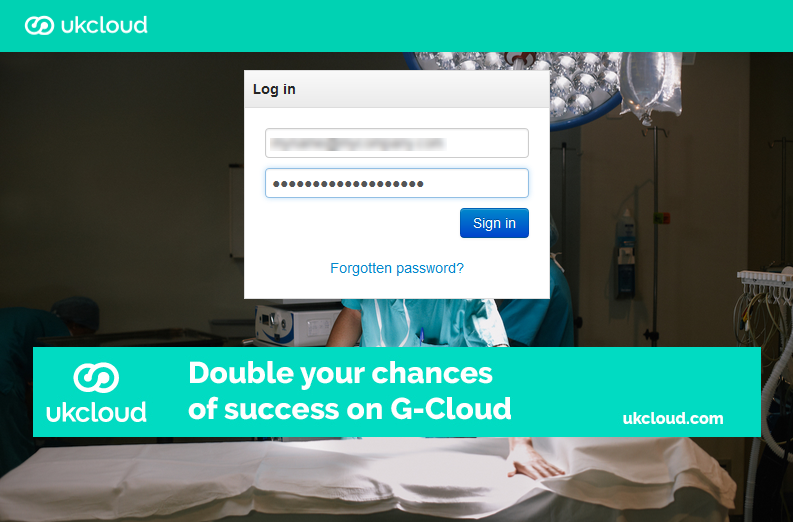
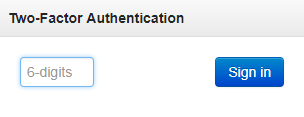
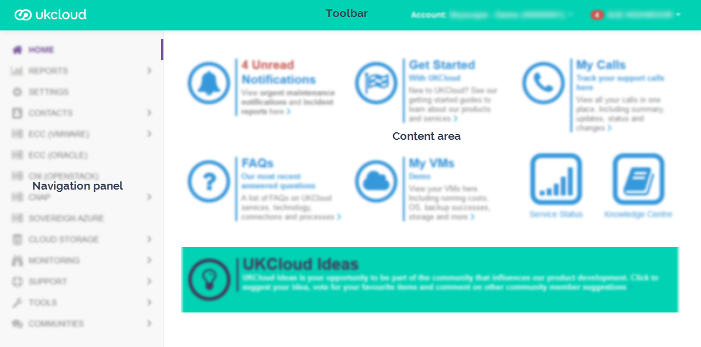
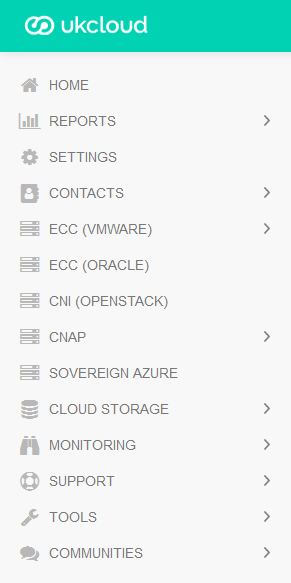

# Getting Started Guide for the UKCloud Portal

## Overview

The UKCloud Portal is the gateway to your UKCloud services. In the Portal, you can:

- View information about your UKCloud services, including UKCloud for VMware, UKCloud for OpenStack, UKCloud for Microsoft Azure and Cloud Storage

- View notifications relating to the UKCloud platform

- Create compute services, virtual data centres (VDCs) and edge gateways within your UKCloud for VMware environment

- Access vCloud Director to work with your UKCloud for VMware environment, for example to create and manage virtual machines (VMs), build VDC networks or configure your firewall

- Raise and monitor support tickets

- Access Knowledge Centre articles to help you understand and work with the UKCloud platform

This Getting Started Guide provides an overview of the functionality available within the Portal.

## Intended audience

This Getting Started Guide is intended for any user with access to the Portal.

> [!NOTE]
> The options you can see and tasks you can perform within the Portal depend on the permissions you've been granted by your Portal administrator.

## Before you begin

You should have received your Portal login credentials from your Portal administrator. If you're the Portal administrator, your Service Delivery Manager (SDM) will have provided you with your login credentials.

The Portal works with Google Chrome, Microsoft Edge and Mozilla Firefox.

## Logging in to the UKCloud Portal

The first thing you need to do is log in.

1. Go to the appropriate URL, depending on the security domain in which your service is located:

    - **Assured OFFICIAL:** <https://portal.ukcloud.com>

    - **Elevated OFFICIAL:** Contact your Portal administrator or SDM

2. On the *Log in* page, enter your credentials and click **Sign in**.

    

    > [!TIP]
    > If you've forgotten your password, click the **Forgotten password?** link to request a password reset.

    If this is the first time you've logged in, use the temporary password you were given by your Portal administrator or SDM. You'll be prompted to change this temporary password.

    > [!NOTE]
    > If you incorrectly enter your password three times, you'll be prompted to enter a captcha code until you successfully log in. If you incorrectly enter the captcha code or your password another three times, a seventh unsuccessful login attempt will result in your account being locked. You'll need to contact your Portal administrator to unlock your account.

3. If your Portal administrator has enabled two-factor authentication (2FA), you'll be prompted to enter a six digit code. Use your 2FA app to generate the code and enter it here. (If this is the first time you've logged in, you'll be prompted to set up 2FA).

    

## Getting to know the UKCloud Portal

After you log in, you'll see the Portal *Home* page. A Portal page is made up of three main areas:

- Toolbar

- Navigation panel

- Content area

### Toolbar

Each user account is associated with one or more customer accounts. Within the Portal, you can work within any customer account to which you have access. From the toolbar, you can switch between different customer accounts.

> [!NOTE]
> When you switch between accounts, you may be prompted to enter a 2FA code again if this additional security measure has been enabled by your Portal administrator.

In the toolbar, you can also click your username to access the following options:

- **Notifications** - List all Portal notifications. Unread notifications are displayed in bold. Click the **View** button next to a notification to see more details. When you've finished reading a notification, select the **Notifications** tab to return to the list. If you want to quickly mark all your unread notifications as read, click the **Mark all as Read** button at the top of the page.

    > [!TIP]
    > The number next to the **Notifications** menu option (and next to your username in the toolbar) shows how many unread notifications you have.

- **Update contact details** - Change your name, email address and telephone numbers. You can also opt to have Portal notifications sent to your email address.

- **Change Password** - Change your password or memorable word. We recommend that you change your password at least every 90 days (see [*How to reset your UKCloud Portal password or memorable word*](ptl-how-reset-password.md)).

    > [!NOTE]
    > Your Portal administrator may have implemented a password expiration period; in which case, you'll be prompted to change your password after the specified number of days.

- **Two-Factor Auth** - Set up two-factor authentication (2FA) for your user account (see [*How to set up two-factor authentication for a user account*](ptl-how-setup-2fa.md)).

- **API** - View the information you need to use the vCloud API (see [*How to access vCloud Director through the vCloud API*](../vmware/vmw-how-access-vcloud-api.md)).

- **Feedback** - Send an email to UKCloud with feedback on the Portal or any other aspect of your UKCloud experience.

- **Log out** - Log out of the Portal.

> [!TIP]
> Click the UKCloud logo in the toolbar on any page to return to the *Home* page. If you hover your mouse over the UKCloud logo, a tooltip displays the current Portal version.

### Navigation panel

The Portal navigation panel provides access to all the functionality available in the Portal.

> [!NOTE]
> The options you can see in the navigation panel depend on your Portal permissions and the services associated with your account.

- **Home** - Return to the Portal *Home* page. You can also return to the *Home* page by clicking the UKCloud icon in the toolbar.

- **Reports** - Provides access to the following reports:

  - **Login History** - Lists everyone who has logged in to the Portal over the last 30 days (see [*Viewing login information*](ptl-how-view-login-info.md)).

  - **VMware Cloud Build History** - Lists recent compute service, VDC and edge gateway builds initiated from the Portal and the Portal API (see the [*Getting Started Guide for UKCloud for VMware*](../vmware/vmw-gs.md) and [*How to build an edge gateway*](../vmware/vmw-how-build-edge.md)).

  - **Backup Summary** - Provides access to summary reports of Snapshot Protection status for each of the account's compute services (see [*How to manage Snapshot Protection for your VMs*](../vmware/vmw-how-manage-snapshot-protection.md)).

- **Settings** - Change various Portal settings, including key contacts, password expiration period, two factor authentication and IP address restrictions (Portal administrators only).

- **Contacts** - Lists the user accounts with access to the current customer account. You can view a list of all user accounts (**All Contacts**) or just those with administration permissions (**Admin Contacts**). Portal administrators can create new users, reset other users' passwords and change other users' Portal permissions (see [*An Overview of Portal Permissions*](ptl-ref-overview-permissions.md)).

- **VMware Cloud** - Provides access to UKCloud for VMware compute services. Expand this option and then select the compute service with which you want to work (see the [*Getting Started Guide for UKCloud for VMware*](../vmware/vmw-gs.md)).

- **Oracle Cloud** - Provides access to the OEM Cloud Control console for UKCloud for Oracle Software (see the [*Getting Started Guide for UKCloud for Oracle Software*](../oracle/orcl-gs.md)).

- **OpenStack Cloud** - Provides access to the OpenStack Horizon dashboard for UKCloud for OpenStack (see the [*Getting Started Guide for UKCloud for OpenStack*](../openstack/ostack-gs.md)).

- **OpenShift** - Provides information about UKCloud for OpenShift (see the [*Getting Started Guide for UKCloud for OpenShift*](../openshift/oshift-gs.md)).

- **Azure Cloud** - Provides access to the Azure Stack Hub portal for UKCloud for Microsoft Azure (see the [*Getting Started Guide for UKCloud for Microsoft Azure*](../azure/azs-gs.md)).

- **Cloud Storage** - View information about your Cloud Storage service, including secret keys and storage consumption (see the [*Getting Started Guide for Cloud Storage*](../cloud-storage/cs-gs.md)).

- **Monitoring** - Provides access to:

  - **Cyber Security News**, where you can view general threat briefs and security news

  - **Security Events**, which displays security events specific to your environment

  For more information, see [*Protective Monitoring from UKCloud*](../other/other-ref-promon.md).

- **Support** - Provides access to:

  - The Knowledge Centre

  - My Calls (see [*How to use My Calls in the UKCloud Portal*](ptl-how-use-my-calls.md))

  - Service status information (see [*How to view the UKCloud Service Status page*](../other/other-how-view-status-info.md))

- **Tools** - Provides access to:

  - Self-service creation of compute services (see [*Getting Started Guide for UKCloud for VMware*](../vmware/vmw-gs.md)).

  - The Zerto Self-Service Portal (ZSSP) where you can manage Journaling Protection, Disaster Recovery to the Cloud and Workload Migration to the Cloud (see [*How to perform a failover*](../vmware/vmw-how-zerto-perform-failover.md)).

- **Communities** - Access the UKCloud site on GitHub, the UKCloud Community and UKCloud Ideas.

### Content area

The content area displays the main content of the page. While the toolbar and navigation panel remain the same in most Portal pages, the content area changes depending on what task you're performing in the Portal. For example, the content area of the *Home* page contains a dashboard that provides quick access to various areas of the Portal, including notifications, My Calls and the Knowledge Centre.

## Logging out of the UKCloud Portal

When you've finished working in the Portal, we recommend that you log out to prevent unauthorised access.

> [!TIP]
> After 15 minutes of inactivity, you'll be automatically logged out.

1. In the toolbar, click your username.

2. From the menu, select **Log out**.

## Using the UKCloud Portal API

The Portal also provides an API to enable you to interact programmatically with your UKCloud environment. For example, you can use the Portal API to view information about the components of your environment and create compute services, virtual data centres and edge gateways.

The entry point URL for the Portal API is:

`https://portal.skyscapecloud.com/api`

For reference information about the various endpoints offered by the Portal API, see the [*UKCloud Portal API Reference Guide*](ptl-ref-portal-api.md).

For more information about how to use the API, including examples showing how to use the API to create a VDC and edge gateway, see [*How to use the UKCloud Portal API*](ptl-how-use-api.md).

## Next steps

In this Getting Started Guide, you've learned the basics about the Portal and the functionality it provides to help you interact with your UKCloud environment. For more details about a specific service, see the appropriate Getting Started Guide.

## Related videos

- [*UKCloud Portal overview video*](ptl-vid-portal.md)

## Glossary

This section provides a glossary of terms specific to the UKCloud Portal.

### account

Within the UKCloud VMware environment there are two types of account:

- **customer account** - A collection of related compute services associated with a particular customer or partner.

- **user account** - The account you use to log in to the Portal or authenticate with the Portal API. Your user account determines which customer accounts you have access to. Each user account can be associated with multiple customer accounts.

### compute service

A UKCloud for VMware top-level container within a customer account that includes a vCloud Director organization and its VDCs, catalogs, users and resources.

### Knowledge Centre

UKCloud's repository of articles created in collaboration with subject matter experts to provide information about how to use our products and services.

### My Calls

A service where you can raise and monitor support tickets.

### navigation panel

An area on the left side of the Portal that provides access to Portal functionality.

### toolbar

An area along the top of the Portal that enables you to switch accounts, access notifications, change your password or contact details and log out of the Portal.

### two-factor authentication (2FA)

An optional second level of authentication to provide an additional layer of security for the Portal. Users are prompted to enter a one-time code generated by registered device, such as an iPhone or Android Phone.

## Feedback

If you find a problem with this article, click **Improve this Doc** to make the change yourself or raise an [issue](https://github.com/UKCloud/documentation/issues) in GitHub. If you have an idea for how we could improve any of our services, send an email to <feedback@ukcloud.com>.
