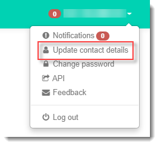
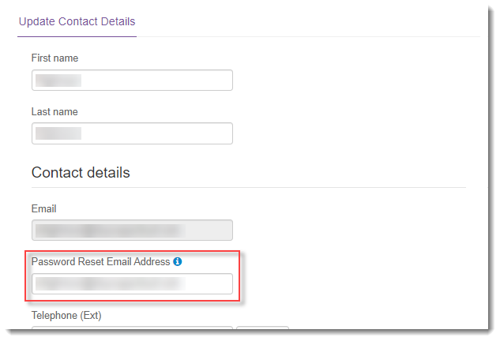

# How to set your password reset email address

## Overview

Your Portal account has two associated email addresses:

- Your login email address is the one you use to log in to the UKCloud Portal. You cannot change this email address yourself. If you need to change your login email address for any reason, you must raise a Service Request to ensure that the correct permissions are associated with the new email address and that single sign-on continues to work correctly. For help with raising a Service Request, see [*How to use My Calls to raise and monitor support tickets*](ptl-how-use-my-calls.md).

- Your password reset email address is the one that password reset links are sent to if you forget your password and request to reset it. By default this the same as your login email address. However, if you prefer you can change this to be a different email address as described in this article.

## Setting your password reset email address

To ensure that you can still access your Portal account if you forget your password, it's important that you set your password reset email address to one that you can readily access.

> [!NOTE]
> Changing your password reset email address does not affect the email address you use to log in to the Portal.

To set your password reset email address:

1. [*Log in to the UKCloud Portal*](ptl-gs.md#logging-in-to-the-ukcloud-portal) using your login email address.

2. In the toolbar, click your username and select **Update contact details**.

   

3. In the **Password Reset Email Address** field, enter the email address that you want to use for password reset requests, then click **Save**.

   

4. An email will be sent to both the old and new email addresses providing information about the change.

5. If you encounter any problems, contact UKCloud Support.

## Related articles

- [*How to reset your UKCloud Portal password or memorable word*](ptl-how-reset-password.md)

## Feedback

If you find a problem with this article, click **Improve this Doc** to make the change yourself or raise an [issue](https://github.com/UKCloud/documentation/issues) in GitHub. If you have an idea for how we could improve any of our services, send an email to <feedback@ukcloud.com>.
