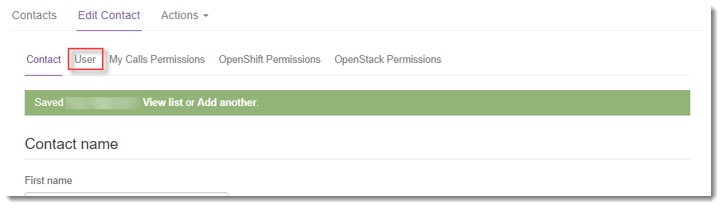
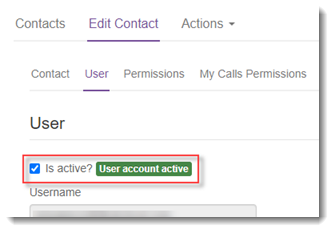

# How to create a new user in the UKCloud Portal

## Overview

You can create users in the UKCloud Portal to enable them to work with UKCloud services.

### Intended audience

To create Portal users, you must be a Portal administrator.

## Creating a new user

To create a new user:

1. [*Log in to the UKCloud Portal*](ptl-gs.md#logging-in-to-the-ukcloud-portal) as an administrator.

2. If necessary, [*switch to the account*](ptl-how-switch-account.md) that contains the services you want the user to be able to access.

3. In the navigation panel, expand **Contacts**, then select **All Contacts**.

   

4. From the **Actions** menu, select **Add new contact**.

   

5. On the **New Contact** tab, provide the user's name and contact information, then click **Save**.

   

   The **Email** address is used to identify the new user when they log in to the Portal and to contact them in various situations. By default, this address is also used to send a password reset code if the user requests to reset a forgotten password. If necessary, the user can change their **Password Reset Email Address** to a different email address (for more information, see [*How to change your email address in the UKCloud Portal*](ptl-how-change-email-address.md)).

6. Select the **User** tab.

   

7. A newly created user account is initially locked, preventing the user from logging in. Select the **Is active?** check box to activate the account.

   

8. Enter and confirm an initial password for the user, then click **Save**.

   > [!TIP]
   > The password must contain a minimum of 12 characters and must include at least one upper case letter, one lower case letter, a number and a special character.

9. After you've created the user account, you can grant the user access to the different services available in the account. This process varies depending on the service.

   > [!IMPORTANT]
   > If you're setting permissions across multiple services, be sure to click the **Save** button before moving between tabs.

   - [*Portal permissions*](ptl-ref-overview-permissions.md)

   - [*How to manage permissions for VMware Cloud Director*](../vmware/vmw-how-manage-vcd-permissions.md)

   - [*How to manage My Calls users*](ptl-how-manage-my-calls.md)

   - [*How to manage OpenShift access in the UKCloud Portal*](../openshift/oshift-how-manage-user-access.md)

   - [*How to manage UKCloud for OpenStack accounts in the UKCloud Portal*](../openstack/ostack-how-manage-accounts-portal.md)

   > [!NOTE]
   > It may take up to 15 minutes for permissions to replicate. If the user attempts to access VMware Cloud Director before the permissions have replicated, they may see an error message and should try again a little later.

10. If you want to grant the user access to another customer account, first switch to the account that you want to grant access to, then raise a Service Request via [My Calls](https://portal.skyscapecloud.com/support/ivanti).

## Related articles

- [*Portal user access*](ptl-ref-user-access.md)

- [*How to change your email address in the UKCloud Portal*](ptl-how-change-email-address.md)

- [*How to reset your UKCloud Portal password or memorable word*](ptl-how-reset-password.md)

- [*How to use My Calls to raise and monitor support tickets*](ptl-how-use-my-calls.md)

## Feedback

If you find a problem with this article, click **Improve this Doc** to make the change yourself or raise an [issue](https://github.com/UKCloud/documentation/issues) in GitHub. If you have an idea for how we could improve any of our services, send an email to <feedback@ukcloud.com>.
