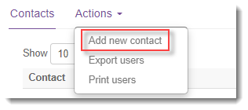
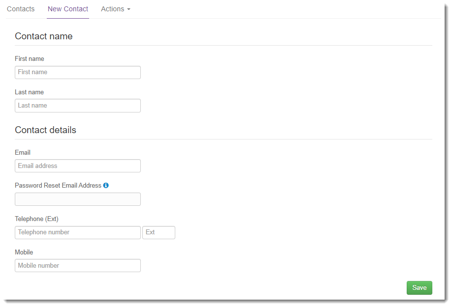

# How to create a new user in the UKCloud Portal

## Overview

You can create users in the UKCloud Portal to enable them to work with UKCloud services.

## Creating a new user

To create a new user:

1. Log in to the UKCloud Portal

    For more detailed instructions, see the [*Getting Started Guide for the UKCloud Portal*](ptl-gs.md).

    > [!NOTE]
    > You must log in as a Portal administrator.

2. If necessary, switch to the account that creates the services you want the user to be able to access.

3. In the navigation panel, expand **Contacts**, then select **All Contacts**.

    

4. From the **Actions** menu, select **Add new contact**.

    

5. On the *New Contact* page, provide the user's name and contact information, then click **Save**.

    

6. After you've created the user account, you can grant the user access to the different services available in the account. This process varies depending on the service:

    - [*How to manage My Calls users*](ptl-how-manage-my-calls.md)

    - [*How to manage permissions for vCloud Director*](../vmware/vmw-how-manage-vcd-permissions.md)

    - [*How to manage UKCloud for OpenStack accounts in the UKCloud Portal*](../openstack/ostack-how-manage-accounts-portal.md)

    - [*How to create new UKCloud for OpenShift users in the UKCloud Portal*](../openshift/oshift-how-create-users.md)

    - [*Portal permissions*](ptl-ref-overview-permissions.md)

## Feedback

If you find a problem with this article, click **Improve this Doc** to make the change yourself or raise an [issue](https://github.com/UKCloud/documentation/issues) in GitHub. If you have an idea for how we could improve any of our services, send an email to <feedback@ukcloud.com>.
