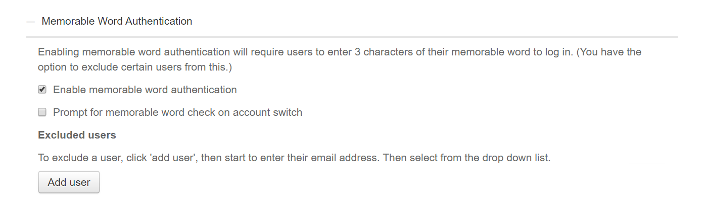
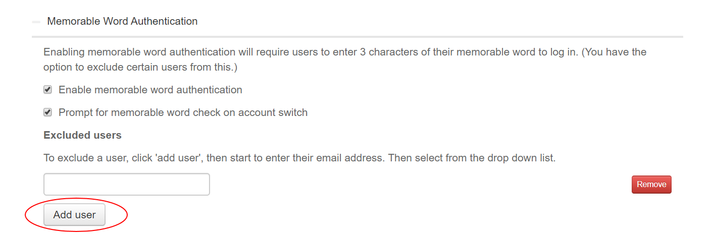

# How to enable memorable word authentication

## Overview

The UKCloud Portal login process offers an additional level of authentication through a memorable word. If you enable this feature, when users login to the Portal, after entering their password they are also prompted for a random combination of letters from their memorable word.

## Enabling memorable word authentication

To enable memorable word authentication:

1. Log in to the UKCloud Portal as an administrator

    For more detailed instructions, see the [*Getting Started Guide for the UKCloud Portal*](ptl-gs.md).

2. If necessary, switch to the account for which you want to change the security settings.

3. In the navigation panel, select **Settings**.

    

4. On the *Settings* page, select the **Security Settings** tab.

    

5. Click **Memorable word authentication** to expand the section.

6. Select **Enable memorable word authentication**.

    

7. When you're done, click **Save**.

8. To disable memorable word authentication, deselect the **Enable memorable word** check box.

## Enabling memorable word on account switch

You can extend your use of the memorable word feature to also prompt users for letters from their memorable word when they switch to a different account within the Portal.

1. Select the **Prompt for memorable word check on account switch** check box.

    

    > [!NOTE]
    > If you cannot see the **Prompt for memorable word check on account switch** check box, this means that you have not yet enabled memorable word authentication for the account (see [*Enabling memorable word authentication*](#enabling-memorable-word-authentication)).

2. When you're done, click **Save**.

3. To disable memorable word authentication on account switch, deselect the **Prompt for memorable word check on account switch** check box.

## Excluding users from memorable word authentication

You can disable memorable word authentication for specific users if required.

1. In the *Excluded users* section, click **Add user**.

2. Enter the email address of the user you want to exclude from memorable word authentication.

    > [!TIP]
    > As soon as you enter a few characters, you'll be presented with a list of users to select from.

    

3. Add more users, as required and when you're done, click **Save**.

4. To remove a user from the excluded users list, click **Remove** next to their email address.

## Feedback

If you find an issue with this article, click **Improve this Doc** to suggest a change. If you have an idea for how we could improve any of our services, visit the [Ideas](https://community.ukcloud.com/ideas) section of the [UKCloud Community](https://community.ukcloud.com).
