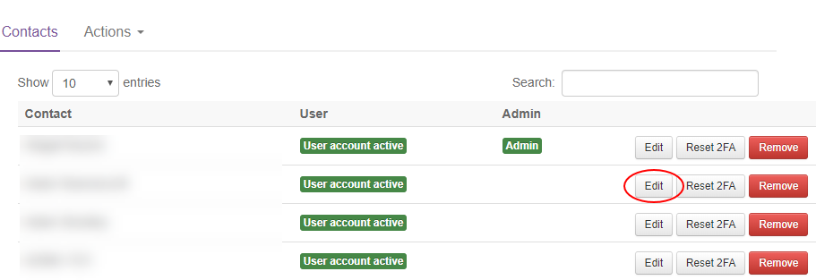
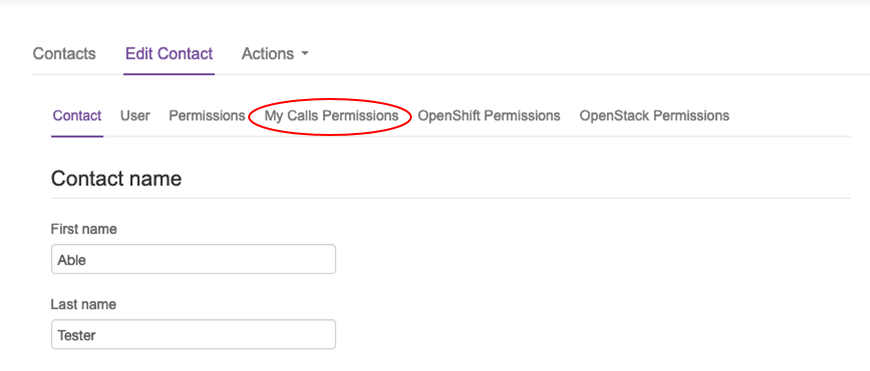
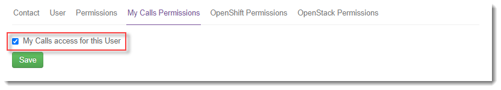
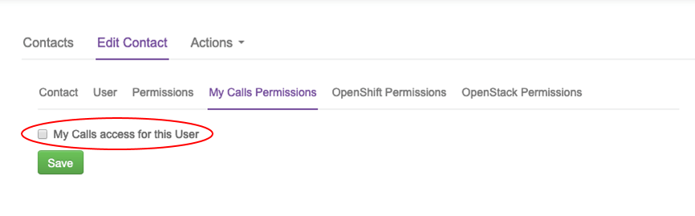

# How to manage My Calls users

## Overview

My Calls is a one‑stop place, accessed via the UKCloud Portal, to raise new support tickets (incidents and requests) with UKCloud and monitor existing tickets.

This article shows how to create new My Calls users and how to manage My Calls permissions for those users.

### Intended audience

This article is intended for Portal administrators who want to provide Portal users with access to My Calls and manage the permission levels of those users. To perform the tasks in this article you must have access to the UKCloud Portal with the *My Calls Admin* My Calls permission.

## Setting up a new My Calls user

You can grant an existing Portal user access to My Calls.

> [!TIP]
> To create a new Portal user, see [*How to create a new user*](ptl-how-create-users.md).

1. In the UKCloud Portal navigation panel, expand the **Contacts** option and select **All Contacts**.

    

2. Locate the user to whom you want to grant My Calls permissions and click the **Edit** button.

    

3. Select the **My Calls Permissions** tab.

    

    > [!NOTE]
    > If you receive an error message, contact UKCloud Support at <support@ukcloud.com>.

4. Select **My Calls Access for this User** and click **Save**.

    

    > [!NOTE]
    > To be able to access My Calls, the user must have logged into the Portal previously.

The user should now be able to access My Calls with the permission level *My Tickets*. To change their permission level, see [Managing My Calls user permissions](#managing-my-calls-user-permissions).

## Managing My Calls user permissions

You can manage the My Calls permission level for Portal users across your account.

&nbsp; | Create | Read | Update | All | Manage My Calls
-------|--------|------|--------|-----|---------------------------------
**My Tickets** | Log your own support tickets in your name | View your own support tickets | Update your own support tickets | All Create, Read and Update privileges on your own tickets | N/A
**Account Tickets** | Log your own support tickets | View all tickets logged by users across the account | Update any support ticket across the account | All Create, Read and Update privileges on tickets across the account | N/A
**My Calls Admin** | Log your own support tickets | View all tickets logged by users across the account | Update any support ticket across the account | All Create, Read and Update privileges on tickets across the account | Ability to update user permissions in My Calls across the account

1. In My Calls, select the **Role Administration** tab.

    

2. From the list of users, select the user that you want to edit.

    

    > [!TIP]
    > You can filter the list of users or use the search field to find a specific user.

3. Select the permission level you want to apply to the user: *My Tickets*, *Account Tickets* or *My Calls Admin*.

     The options offered will depend on the current role assigned to the user. Each user can have only one permission level, so the role you select here replaces any previous permissions.

    

    > [!NOTE]
    > For details of what the different permission levels mean, see the table in the [Intended audience](#intended-audience) section.

4. When you're done, click **Save**.

## Disabling a new My Calls user

If you need to disable a user on your account from accessing My Calls:

1. In the UKCloud Portal navigation panel, expand the **Contacts** option and select **All Contacts**.

    

2. Locate the user for whom you want to disable My Calls access and click the **Edit** button.

    

3. Select the **My Calls Permissions** tab.

    

    > [!NOTE]
    > If you receive an error message, contact UKCloud Support at <support@ukcloud.com>.

4. Deselect **My Calls Access for this User** and click **Save**.

    

The user will no longer be able to access My Calls.

## Next steps

- For information about raising support tickets for incidents and service requests, see [*How to use My Calls in the UKCloud Portal*](ptl-how-use-my-calls.md)

- For more information about the UKCloud support process, see [*How to raise and escalate incidents and service requests*](ptl-how-raise-escalate-service-request.md)

- For more information about what you can do in the UKCloud Portal, see the [*Getting Started Guide for the UKCloud Portal*](ptl-gs.md)

## Feedback

If you find an issue with this article, click **Improve this Doc** to suggest a change. If you have an idea for how we could improve any of our services, visit the [Ideas](https://community.ukcloud.com/ideas) section of the [UKCloud Community](https://community.ukcloud.com).
