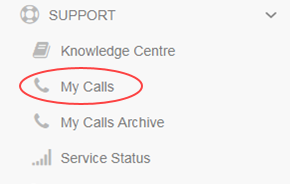

#### UKCloud Limited (“UKC”) and Virtual Infrastructure Group Limited (“VIG”) (together “the Companies”) – in Compulsory Liquidation

On 25 October 2022, the Companies were placed into Liquidation with the Official Receiver appointed as Liquidator and J Robinson and A M Hudson simultaneously appointed as Special Managers to manage the liquidation process on behalf of the Official Receiver.

Further information regarding the Liquidations can be found here: <https://www.gov.uk/government/news/virtual-infrastructure-group-limited-and-ukcloud-limited-information-for-creditors-and-interested-parties>

Contact details: 
For any general queries relating to the Liquidations please email <ukcloud@uk.ey.com> 
For customer related queries please email <ukcloudcustomers@uk.ey.com> 
For supplier related queries please email <ukcloudsuppliers@uk.ey.com>

# How to manage My Calls users

## Overview

My Calls is the one‑stop place, accessed via the UKCloud Portal, to raise new support tickets (incidents and requests) with UKCloud and monitor existing tickets.

This article shows how to create new My Calls users and how to manage permissions for those users.

### Intended audience

This article is intended for Portal administrators who want to provide Portal users with access to My Calls and manage the permission levels of those users. To perform the tasks in this article you must be able to log in to the UKCloud Portal with the *My Calls Admin* My Calls permission.

## Setting up a new My Calls user

You can grant an existing Portal user access to My Calls.

> [!TIP]
> To create a new Portal user, see [*How to create a new user in the UKCloud Portal*](ptl-how-create-users.md).

1. [*Log in to the UKCloud Portal*](ptl-gs.md#logging-in-to-the-ukcloud-portal).

2. If necessary, [*switch to the account*](ptl-how-switch-account.md) in which you want to work.

3. In the navigation panel, expand the **Contacts** option and select **All Contacts**.

   

4. Locate the user to whom you want to grant My Calls permissions and click the **Edit** button.

   

5. Select the **My Calls Permissions** tab.

   

    > [!NOTE]
    > If you receive an error message, contact UKCloud Support at <support@ukcloud.com>.

6. Select **My Calls access for this User**, then click **Save**.

   

   > [!NOTE]
   > To be able to access My Calls, the user must have logged into the Portal previously.

The user should now be able to access My Calls with the permission level *My Tickets*. To change their permission level, see [*Managing My Calls user permissions*](#managing-my-calls-user-permissions).

## Managing My Calls user permissions

You can manage the My Calls permission level for Portal users across your account.

- *My Tickets* - Users with this permission level can raise support tickets and view and update the tickets that they have raised

- *Account Tickets* - Users with this permission level can raise support tickets and view and update any ticket raised against the account (including those raised by other users)

- *My Calls Admin* - Users with this permission level can raise support tickets, view and update any ticket raised against the account (including those raised by other users) and manage the My Calls permission levels of other users

1. In the navigation panel, expand the **Support** option and select **My Calls**.

   

2. On the *UKCloud Support* page, click **Go to My Calls Portal**.

   

3. In the toolbar at the top of the page, click **Role Administration**.

   

   > [!TIP]
   > You may need to click **More** to access the **Role Administration** option.

4. From the list of users, select the user that you want to edit.

   

   > [!TIP]
   > You can filter the list of users or use the search field to find a specific user.

5. Select the permission level you want to apply to the user: *My Tickets*, *Account Tickets* or *My Calls Admin*.

   The options offered will depend on the current role assigned to the user. Each user can have only one permission level, so the option you select here replaces any previous permissions.

   

6. When you're done, click **Save**.

## Disabling a new My Calls user

If you need to disable a user on your account from accessing My Calls:

1. In the navigation panel, expand the **Contacts** option and select **All Contacts**.

   

2. Locate the user for whom you want to disable My Calls access and click the **Edit** button.

   

3. Select the **My Calls Permissions** tab.

   

   > [!NOTE]
   > If you receive an error message, contact UKCloud Support at <support@ukcloud.com>.

4. Deselect **My Calls access for this User**, then click **Save**.

   

The user will no longer be able to access My Calls.

## Next steps

- For information about raising support tickets for incidents and service requests, see [*How to use My Calls in the UKCloud Portal*](ptl-how-use-my-calls.md)

- For more information about the UKCloud support process, see [*Raising and escalating support tickets with customer support*](ptl-ref-raise-escalate-service-request.md)

- For information about what else you can do in the UKCloud Portal, see the [*Getting Started Guide for the UKCloud Portal*](ptl-gs.md)

## Feedback

If you find a problem with this article, click **Improve this Doc** to make the change yourself or raise an [issue](https://github.com/UKCloud/documentation/issues) in GitHub. If you have an idea for how we could improve any of our services, send an email to <feedback@ukcloud.com>.
