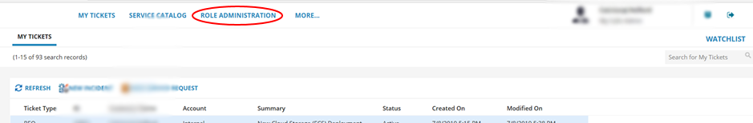

# How to use My Calls in the UKCloud Portal

## Overview

The *My Calls* area of the UKCloud Portal is a one‑stop place for users to raise new support tickets (incidents and requests) with UKCloud and monitor existing tickets.

This article shows you how to manage the My Calls permissions of Portal users and how to create new My Calls users.

### Intended audience

To perform the tasks in this you must have the *My Calls Admin* My Calls permission.

## Setting up a new My Calls user

You can grant an existing Portal user access to My Calls.

1. In the UKCloud Portal navigation panel, expand the **Contacts** option and select **All Contacts**.

    

2. Locate the user to whom you want to grant My Calls permissions and click the **Edit** button.

    

3. Select the **My Calls Permissions** tab.

    

    > [!NOTE]
    > If you receive an error message, contact UKCloud Support at <support@ukcloud.com>.

4. Select **My Calls Access for this User** and click **Save**.

    

    > [!NOTE]
    > This user must have logged into the Portal previously in order to access My Calls.

The user should now be able to access My Calls with the permission level *My Tickets*. To change their permission level, see [Managing My Calls user permissions](#managing-my-calls-user-permissions).

## Managing My Calls user permissions

If you have the *My Calls Admin* My Calls permission, you can manage the My Calls permissions level for other Portal users across your account.

1. In *My Calls*, select the **Role Administration** tab.

    

2. From the list of users, select the user that you want to edit.

    

    > [!TIP]
    > You can filter the list of users or use the search field to find a specific user.

3. Select the permission level you want to apply to the user: My Tickets, Account Tickets or My Calls Admin.

     The options offered will depend on the current role assigned to the user. Each user can have only one permission level, so the role you select here replaces any previous permissions.

    

    > [!NOTE]
    > For details of what the different permission levels mean, see the table in the [Intended audience](#intended-audience) section.

4. When you're done, click **Save**.

## Disabling a new My Calls user

If you need to disable a user on your account from accessing My Calls, raise a generic service request.

For detailed steps, see [*Raising a service request ticket*](#raising-a-service-request-ticket).

## Next steps

- For more information about the UKCloud support process, see [*How to raise and escalate incidents and service requests*](ptl-how-raise-escalate-service-request.md).

- For more information about what you can do in the UKCloud Portal, see the [*Getting Started Guide for the UKCloud Portal*](ptl-gs.md).

## Related videos

- [*UKCloud Portal overview video*](ptl-vid-portal.md)

## Feedback

If you find an issue with this article, click **Improve this Doc** to suggest a change. If you have an idea for how we could improve any of our services, visit the [Ideas](https://community.ukcloud.com/ideas) section of the [UKCloud Community](https://community.ukcloud.com).
