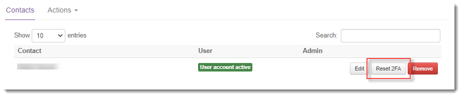

# How to reset two-factor authentication for a user account

## Overview

If two-factor authentication (2FA) is enabled for the UKCloud Portal, users must use an authenticator app to generate a code to enter, as well as their user name and password, when logging in to the Portal.

If a user loses or replaces the device where their authenticator app is installed, they will be unable to generate the required code and therefore be unable to log in to the Portal. In this situation, an administrator must reset the user's 2FA so that they can set up 2FA on a different device.

### Intended audience

This article is intended for Portal administrators who need to reset a Portal user's 2FA. The administrator must have set up 2FA on their own account to be able to carry out the steps in this article.

## Resetting 2FA for a user account

1. Log in to the UKCloud Portal as a Portal administrator.

    For more detailed instructions, see the [*Getting Started Guide for the UKCloud Portal*](ptl-gs.md).

2. If necessary, switch to the account to which the user belongs.

3. In the navigation panel, expand **Contacts**, then select **All Contacts**.

    

4. Locate the user account and click the **Reset 2FA** button.

    

5. In the *Confirm* dialog box, click **Yes** to continue.

6. The next time the user attempts to log in, they'll be prompted to set up their 2FA again. For more information, see [*How to set up two-factor authentication for a user account*](ptl-how-setup-2fa.md).

## Feedback

If you find a problem with this article, click **Improve this Doc** to make the change yourself or raise an [issue](https://github.com/UKCloud/documentation/issues) in GitHub. If you have an idea for how we could improve any of our services, send an email to <feedback@ukcloud.com>.
