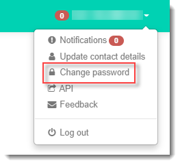
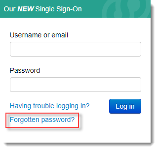
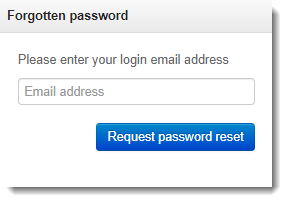
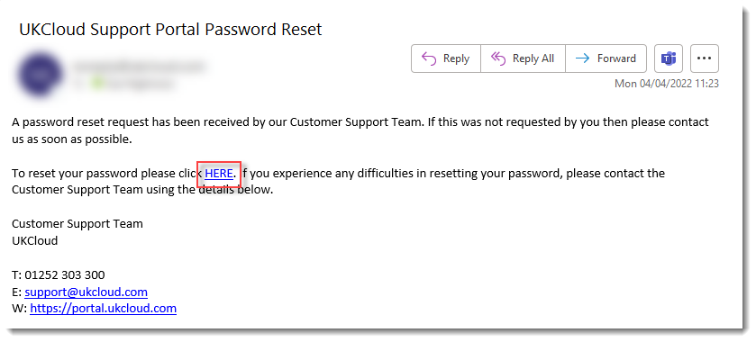
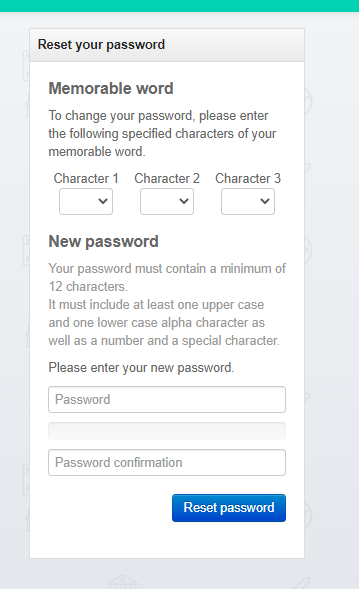

# How to change or reset your UKCloud Portal password or memorable word

## Overview

Any Portal user can change their own password at any time. If you forget your password, you can request for it to be reset and an email with a reset link will be sent to your password reset email address.

When you contact UKCloud Support or when you perform certain tasks in the Portal, you may be asked to provide letters from a memorable word to further identify yourself. You can change your memorable word at any time. Portal administrator's can also reset another user's memorable word.

> [!NOTE]
> In the event that an administrator requires a password reset, or memorable word reset with no other administrator available, contact UKCloud Support on 01252 303300 and select option 2.

### Intended audience

This article is intended for Portal users who need to change or reset their password or memorable word.

To change your own password or memorable word, you must have access to your Portal account. To change another user's memorable word, you must be a Portal administrator.

## Changing your own password or memorable word

You may want to change your password or memorable word if:

- You've been using the same one for a while (we recommend that you change your password at least every 90 days)

- You want to make it more robust

- You believe it may have been compromised

To change your password or memorable word:

1. [*Log in to the UKCloud Portal*](ptl-gs.md#logging-in-to-the-ukcloud-portal) as usual.

2. In the toolbar, click your username, and select **Change password**.

   

3. Enter your **Current password** to confirm your identity.

4. Enter your new password or memorable word as required then click **Save**.

   

## Resetting a forgotten password

If you forget your password and cannot log in to the Portal, you can request a link to reset your password.

The reset link will be sent to your password reset email address. By default, this is the same as the email address you use to log in to the Portal. If you want to send password reset links to a different email address, you can change your password reset email address. For more information, see [*How to set your password reset email address*](ptl-how-change-email-address.md).

To request a password reset link:

1. On the Portal *Log in* page, click the **Forgotten password?** link.

   

2. On the *Forgotten password* page, enter the email address that you use to log in to the Portal, then click **Request password reset**.

   

3. Check your email account for a message from UKCloud Support, and click the link to reset your password.

   

4. On the *Reset your password* page, you'll first need to enter characters from your memorable word to confirm your identity.

   

   > [!NOTE]
   > If you enter your memorable word characters incorrectly too many times your account will be locked. If this happens, you'll need to contact your administrator or UKCloud Customer Support to unlock your account.

5. Enter and confirm your new password then click **Reset password**.

   

6. Return to the Portal log in page to log in using your new password.

## Resetting another user's memorable word

If a user forgets their memorable word and is unable to reset it themselves, a Portal administrator can reset it:

1. [*Log in to the UKCloud Portal*](ptl-gs.md#logging-in-to-the-ukcloud-portal) as an administrator.

2. In the navigation panel, expand **Contacts** then select **All contacts**.

   

3. Locate the user and click the **Edit** button for that user.

   

4. On the **Edit contact** tab, select the **User** tab.

5. Update the memorable word as required then click **Save**.

## Related articles

- [*How to set your password reset email address*](ptl-how-change-email-address.md)

- [*How to unlock a user account*](ptl-how-unlock-account.md)

## Feedback

If you find a problem with this article, click **Improve this Doc** to make the change yourself or raise an [issue](https://github.com/UKCloud/documentation/issues) in GitHub. If you have an idea for how we could improve any of our services, send an email to <feedback@ukcloud.com>.
